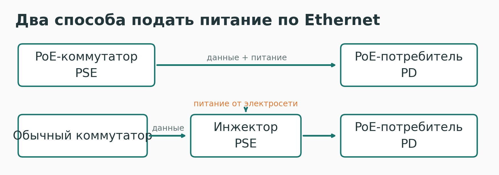
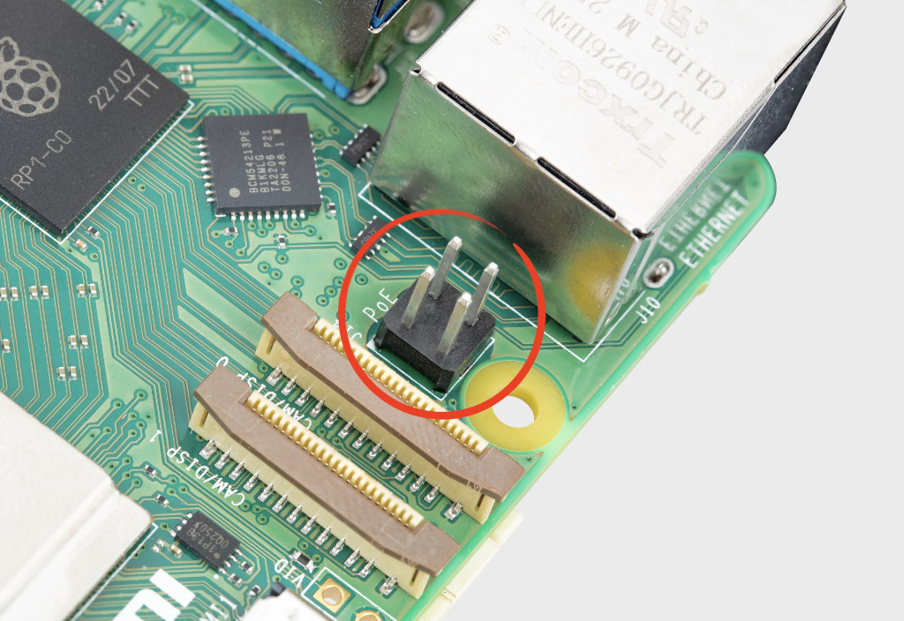
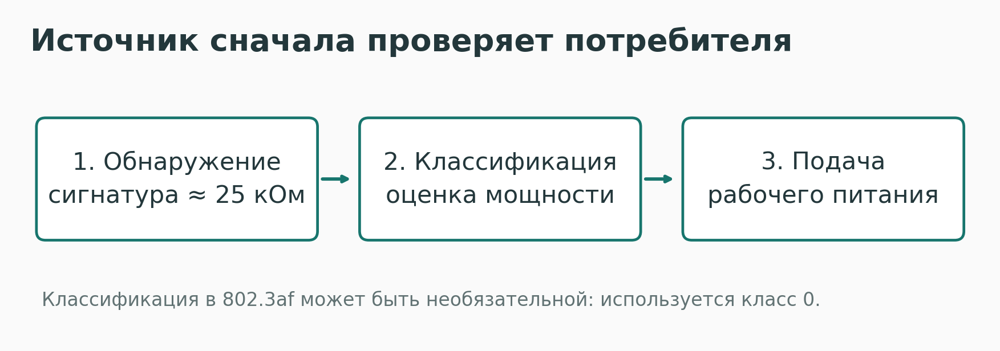
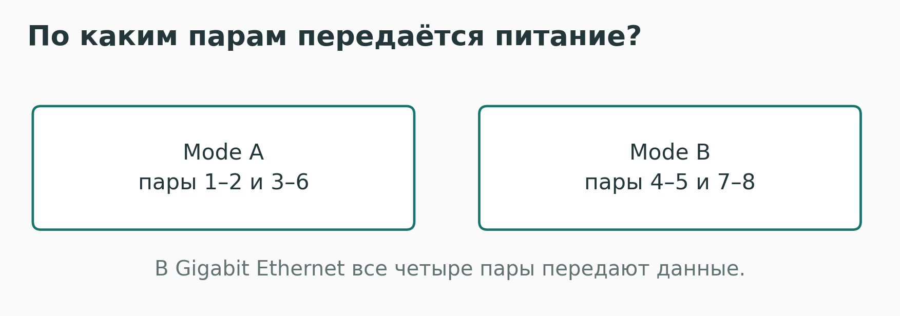
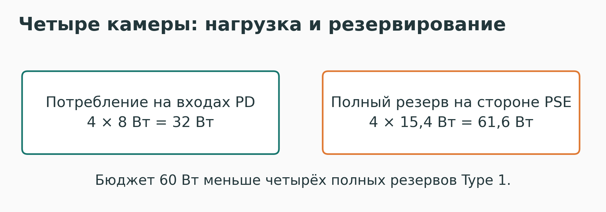

---
author:
  name: Баранов Никита Дмитриевич
title: 'Power over Ethernet: IEEE 802.3af-2003'
subtitle: Сетевые технологии
license: CC BY
lang: ru-RU
date: '2026-10-06'
date-format: DD.MM.YYYY
format:
  beamer:
    latex-auto-install: false
    pdf-engine: xelatex
    mainfont: DejaVuSerif
    mainfontoptions:
    - Path=../resources/fonts/
    - Extension=.ttf
    - UprightFont=*
    - BoldFont=*-Bold
    - ItalicFont=*-Italic
    - BoldItalicFont=*-BoldItalic
    sansfont: DejaVuSans
    sansfontoptions:
    - Path=../resources/fonts/
    - Extension=.ttf
    - UprightFont=*
    - BoldFont=*-Bold
    - ItalicFont=*-Oblique
    - BoldItalicFont=*-BoldOblique
    monofont: DejaVuSansMono
    monofontoptions:
    - Path=../resources/fonts/
    - Extension=.ttf
    - UprightFont=*
    - BoldFont=*-Bold
    - ItalicFont=*-Oblique
    - BoldItalicFont=*-BoldOblique
    toc: false
    number-sections: false
    colorlinks: false
    slide-level: 2
    aspectratio: 169
    section-titles: false
    theme: metropolis
    themeoptions:
    - progressbar=frametitle
    - sectionpage=progressbar
    - numbering=fraction
    incremental: false
    include-in-header: _resources/tex/slides.tex
  revealjs:
    transition: slide
    margin: 0.06
    smaller: false
    theme: beige
    width: 1280
    height: 720
    slide-number: c/t
    logo: _resources/image/logo_rudn.png
    css: _resources/style.css
---

# Информация

## Докладчик

:::::::::::::: {.columns align=center}
::: {.column width="70%"}

- Баранов Никита Дмитриевич
- Группа НПИбд-02-24
- Российский университет дружбы народов
- [1132242977@pfur.ru](mailto:1132242977@pfur.ru)

:::
::: {.column width="30%"}

{width=90%}

:::
::::::::::::::

::: {.notes}
Тема доклада — Power over Ethernet на основе IEEE 802.3af-2003. Я объясню, как по сетевому кабелю передаются питание и данные и что необходимо проверить при выборе оборудования.
:::

# Вводная часть

## Один кабель вместо двух подключений

{height=62%}

Ethernet передаёт данные и обеспечивает питание устройства.

::: {.notes}
На фотографии из документации SparkFun кабель подключается к порту с поддержкой PoE. Для камеры, точки доступа или телефона идея та же: вместо сетевого кабеля и отдельного блока питания используется одно проводное подключение. Это удобно там, где поблизости нет розетки.
:::

## Для чего нужен IEEE 802.3af?

- Единый способ подачи питания через Ethernet.
- Проверка совместимого потребителя перед включением.
- До **12,95 Вт** на стороне устройства.
- Типичные применения: камеры, точки доступа, IP-телефоны.

::: {.notes}
IEEE 802.3af был утверждён в июне 2003 года. Он стандартизует не просто напряжение на проводах, а процедуру совместимого включения питания. Для потребителя Type 1 доступно до 12,95 ватта. Этого хватает для многих устройств небольшой мощности.
:::

# Основная часть

## Кто подаёт и кто получает питание?

{width=100%}

**PSE** — источник. **PD** — потребитель.

::: {.notes}
PSE — это PoE-коммутатор или отдельный инжектор. Коммутатор сразу выдаёт данные вместе с питанием. Инжектор добавляет питание к линии после обычного коммутатора. PD — устройство, которое получает питание: например камера или точка доступа.
:::

## Разъём Ethernet ещё не означает поддержку PoE

{height=62%}

Raspberry Pi использует отдельную плату PoE HAT.

::: {.notes}
На фотографии показаны контакты Raspberry Pi, к которым подключается PoE HAT. Сам компьютер без соответствующей платы не превращает входящее питание PoE в нужное питание системы. Это наглядный пример: наличие Ethernet-разъёма не гарантирует готовность устройства получать питание через него.
:::

## Питание включается после проверки

{width=100%}

Обнаружение → оценка мощности → рабочее питание.

::: {.notes}
Сначала источник ищет электрическую сигнатуру совместимого потребителя — сопротивление около 25 килоом. Затем может выполняться классификация мощности. Для IEEE 802.3af классификация не обязательна во всех случаях: возможно поведение класса 0. После проверки источник включает питание. При отключении потребителя питание прекращается.
:::

## Основные цифры стандарта

| Параметр | IEEE 802.3af |
|:--|:--|
| На выходе источника | До **15,4 Вт** |
| На входе потребителя | До **12,95 Вт** |
| Напряжение источника | **44–57 В** |
| Кабельный канал | До **100 м** |
| Питание | По **двум парам** |

::: {.notes}
Нужно различать мощность источника и мощность потребителя. Из 15,4 ватта на стороне источника до потребителя гарантируется до 12,95 ватта с учётом потерь кабеля. Поэтому устройство на 20 ватт нельзя выбрать для одного только 802.3af. Длина стандартного Ethernet-канала — до 100 метров.
:::

## Данные и питание идут совместно

{width=100%}

PoE само по себе не ограничивает Ethernet скоростью 100 Мбит/с.

::: {.notes}
Mode A использует пары 1–2 и 3–6, Mode B — 4–5 и 7–8. Для 10/100BASE-T во втором случае это пары, свободные от данных. Но в Gigabit Ethernet данные передаются по всем четырём парам. Поэтому нельзя всегда объяснять PoE как питание только по свободным проводам. Совместную передачу обеспечивает способ включения питания через Ethernet-трансформаторы.
:::

## Проверяем общий бюджет коммутатора

{width=100%}

Количество PoE-портов и доступная суммарная мощность — разные характеристики.

::: {.notes}
У четырёх камер по 8 ватт суммарное фактическое потребление составляет 32 ватта на стороне устройств. Но если коммутатор резервирует максимальные 15,4 ватта на каждый порт Type 1, нужно 61,6 ватта бюджета. Коммутатор на 60 ватт не обеспечивает четыре полных резерва. Поэтому нужно знать не только потребление, но и способ распределения мощности.
:::

## Совместимость важнее формы разъёма

- На обеих сторонах должен быть совместимый стандарт.
- Пассивное PoE не равнозначно IEEE 802.3af.
- IEEE 802.3at, или PoE+, даёт до 25,5 Вт потребителю.
- Проверяются кабель, суммарный бюджет и пиковая нагрузка.

::: {.notes}
Пассивное PoE может постоянно подавать напряжение без стандартной процедуры обнаружения. Поэтому похожий разъём ещё не означает совместимость. Если устройству нужно больше мощности, выбирают подходящий более мощный стандарт. Для PoE+ на стороне потребителя доступно до 25,5 ватта.
:::

# Результаты

## Источники

- IEEE: [IEEE 802.3af-2003](https://www.ieee802.org/3/af/).
- Texas Instruments: [PoE Type 1 и Type 2](https://www.ti.com/document-viewer/lit/html/SSZT530/GUID-C380D019-4CB4-409D-8526-06DF8E0F00BF), [контроллер PD](https://www.ti.com/product/TPS2370).
- Ethernet Alliance: [основы PoE](https://ethernetalliance.org/blog/2020/07/22/the-abcs-and-123s-of-poe/).
- Фотографии: [SparkFun](https://github.com/sparkfun/SparkFun_RTK_mosaic-X5/blob/main/docs/hardware_assembly.md), [Raspberry Pi Documentation](https://www.raspberrypi.com/documentation/computers/raspberry-pi.html).

::: {.notes}
Основные характеристики проверены по материалам IEEE, Texas Instruments и Ethernet Alliance. Фотографии взяты из документации SparkFun и Raspberry Pi. Они показывают реальные разъёмы и подключение оборудования.
:::

## Четыре проверки перед подключением

**Стандарт → мощность устройства → бюджет PSE → кабель.**

PoE упрощает монтаж, если оборудование и питание подобраны совместно.

::: {.notes}
Главный вывод: PoE делает подключение удобнее, но правильный выбор включает четыре проверки. Сначала стандарт, затем мощность конкретного потребителя, общий бюджет источника и качество кабельного канала. Для 802.3af запоминаем два предела: 15,4 ватта у источника и 12,95 ватта у потребителя.
:::
