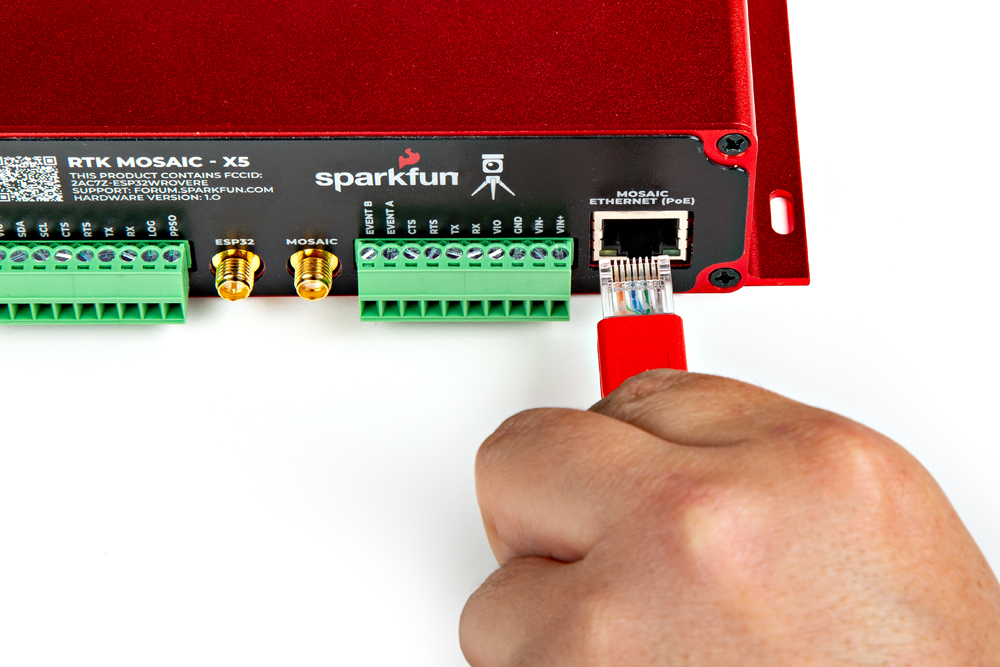

---
author:
  name: Баранов Никита Дмитриевич
title: 'Power over Ethernet: IEEE 802.3af-2003'
subtitle: Сетевые технологии
license: CC BY
lang: ru-RU
date: '2026-10-06'
date-format: DD.MM.YYYY
number-sections: true
toc: true
toc-title: Содержание
toc-depth: 2
bibliography: bib/cite.bib
csl: _resources/csl/gost-r-7-0-5-2008-numeric.csl
crossref:
  fig-title: Рисунок
  tbl-title: Таблица
format:
  pdf:
    pdf-engine: xelatex
    latex-auto-install: false
    documentclass: scrreprt
    top-level-division: section
    papersize: a4
    fontsize: 14pt
    linestretch: 1.5
    mainfont: DejaVuSerif
    mainfontoptions:
    - Path=../resources/fonts/
    - Extension=.ttf
    - UprightFont=*
    - BoldFont=*-Bold
    - ItalicFont=*-Italic
    - BoldItalicFont=*-BoldItalic
    sansfont: DejaVuSans
    sansfontoptions:
    - Path=../resources/fonts/
    - Extension=.ttf
    - UprightFont=*
    - BoldFont=*-Bold
    - ItalicFont=*-Oblique
    - BoldItalicFont=*-BoldOblique
    monofont: DejaVuSansMono
    monofontoptions:
    - Path=../resources/fonts/
    - Extension=.ttf
    - UprightFont=*
    - BoldFont=*-Bold
    - ItalicFont=*-Oblique
    - BoldItalicFont=*-BoldOblique
    geometry:
    - left=30mm
    - right=15mm
    - top=20mm
    - bottom=20mm
    - includefoot
    - footskip=10mm
    colorlinks: false
    indent: true
    cite-method: citeproc
    include-in-header: _resources/tex/preamble.tex
  docx:
    reference-doc: _resources/reference.docx
    toc: true
    number-sections: true
filters:
- _resources/table-widths.lua
---

# Введение

Камеру наблюдения, точку доступа или IP-телефон необходимо подключить к сети и обеспечить электропитанием. Отдельная розетка рядом с устройством увеличивает объём монтажных работ. Power over Ethernet, или PoE, позволяет передавать данные и питание по одному Ethernet-кабелю.

Цель доклада — объяснить работу PoE на основе IEEE 802.3af-2003, рассмотреть основные характеристики и показать, что нужно проверить при подключении оборудования. Стандарт был утверждён в июне 2003 года и стал основой стандартизованного питания устройств через Ethernet [@ieee].

# Для чего используется PoE

Главное удобство технологии — один кабель до устройства. Сетевое оборудование можно установить там, где есть кабельная линия, но нет удобной розетки: под потолком, на стене или рядом с рабочим местом.

Типичные потребители — IP-камеры, точки доступа Wi-Fi и IP-телефоны. PoE применяется и в специализированных устройствах. На рисунке [-@fig-connection] показано подключение Ethernet-кабеля к PoE-порту приёмника SparkFun RTK mosaic-X5 [@sparkfun].

{#fig-connection width=68%}

При централизованном питании достаточно подключить PoE-коммутатор к источнику бесперебойного питания, чтобы резервировать питание совместимых устройств. Такая схема удобна для связи и наблюдения, однако её надёжность зависит и от самого коммутатора, кабелей и ИБП.

# Источник питания и потребитель

Стандарт различает две роли. **PSE** — оборудование, подающее питание, например PoE-коммутатор или отдельный инжектор. **PD** — устройство, получающее питание, например камера или точка доступа.

PoE-коммутатор объединяет передачу данных и подачу питания на своих портах. Инжектор добавляет питание к линии после обычного коммутатора. У него есть вход данных, питание от электросети и выход, по которому к потребителю поступают данные вместе с питанием.

{#fig-paths width=100%}

Наличие Ethernet-разъёма не означает автоматической совместимости с PoE. Устройство должно иметь соответствующий вход и схему питания. Например, Raspberry Pi использует отдельную плату PoE HAT; рядом с Ethernet-разъёмом находятся специальные контакты для её подключения [@raspberry].

{#fig-hat width=68%}

# Как включается питание

В стандартизованном PoE питание не подаётся на любой подключённый разъём без проверки. Сначала PSE выполняет обнаружение совместимого потребителя. Для этого PD предъявляет электрическую сигнатуру — сопротивление около 25 кОм [@ti-controller].

Затем может выполняться классификация потребителя по необходимой мощности. Для IEEE 802.3af она не является обязательной во всех случаях: оборудование может использовать поведение класса 0. После обнаружения и определения доступной мощности источник включает рабочее питание.

{#fig-detection width=100%}

Если потребитель отключается, источник прекращает питание порта. Это принципиальное отличие от пассивных инжекторов, которые могут постоянно подавать заданное напряжение без стандартной процедуры обнаружения.

# Основные параметры IEEE 802.3af

IEEE 802.3af соответствует PoE Type 1. Основные параметры представлены в таблице [-@tbl-af] [@ti-power; @ea].

| Параметр | Значение |
|:--|:--|
| Мощность на выходе PSE | До 15,4 Вт на порт |
| Мощность, доступная PD | До 12,95 Вт |
| Рабочее напряжение PSE | 44–57 В постоянного тока |
| Длина стандартного канала Ethernet | До 100 м |
| Подача питания | По двум парам проводников |

: Характеристики PoE Type 1 {#tbl-af}

Разница между 15,4 и 12,95 Вт учитывает потери в кабеле. При подборе потребителя нельзя считать, что все 15,4 Вт гарантированно доступны на его входе. Камера с потребностью 10 Вт укладывается в предел 12,95 Вт; устройству, которому требуется 20 Вт, одного IEEE 802.3af недостаточно.

Существуют два варианта подачи питания. В Mode A оно передаётся по парам 1–2 и 3–6; в Mode B — по парам 4–5 и 7–8. В 10/100BASE-T второй вариант использует пары, не занятые данными. В Gigabit Ethernet все четыре пары участвуют в передаче данных, поэтому выражение «питание по свободным парам» нельзя распространять на все скорости.

Данные и постоянное питание могут передаваться по одной паре без конфликта благодаря способу включения питания и трансформаторной развязке Ethernet. Само наличие PoE не ограничивает линию скоростью 100 Мбит/с: скорость определяется сетевыми интерфейсами и кабельным каналом.

# Мощность порта и общий бюджет

При выборе коммутатора проверяют не только предел одного порта, но и **общий бюджет PoE**. Восемь портов с поддержкой 15,4 Вт не означают, что устройство может одновременно выдать 123,2 Вт: суммарная мощность определяется источником питания коммутатора.

Рассмотрим четыре камеры, каждая из которых потребляет 8 Вт. Их суммарная потребность на входах — 32 Вт. Но при резервировании полной мощности Type 1 на каждый порт потребуется бюджет до 4 × 15,4 = 61,6 Вт на стороне PSE. Поэтому коммутатор с бюджетом 60 Вт не обеспечивает четыре таких полных резерва, хотя фактическое потребление камер ниже.

{#fig-budget width=100%}

Результат зависит от механизма распределения мощности: по классу, настройке администратора или фактической нагрузке. В проекте учитывают пиковое потребление устройств, кабельные потери и запас. Пусковые режимы, подсветка камер и дополнительное оборудование могут увеличить нагрузку.

# Совместимость и ограничения

При подключении следует проверить стандарт на обеих сторонах: PSE и PD. Более мощный стандарт IEEE 802.3at, называемый PoE+, предусматривает до 30 Вт на PSE и до 25,5 Вт на PD. Он нужен там, где возможностей 802.3af недостаточно [@ti-power].

Пассивное PoE нельзя считать эквивалентом IEEE 802.3af. Совпадение формы разъёма не гарантирует совпадения напряжения, распиновки и процедуры включения. В характеристиках оборудования должно быть явно указано соответствие стандарту.

Качество кабеля и соединителей влияет на потери и нагрев. Ограничение 100 м относится к стандартному кабельному каналу Ethernet; удлинители и специальные решения требуют отдельной проверки. Дополнительно учитывают общий бюджет, вентиляцию коммутатора и мощность ИБП.

# Заключение

PoE упрощает монтаж: питание и данные идут к устройству по одному кабелю, а электропитание можно организовать централизованно. IEEE 802.3af стандартизует обнаружение потребителя и подачу питания для устройств небольшой мощности.

Для правильного выбора достаточно последовательно проверить четыре условия: совместимый стандарт, потребление устройства, общий бюджет коммутатора и кабельный канал. Предел 15,4 Вт относится к стороне источника, а на входе потребителя доступно до 12,95 Вт.

# Список литературы {.unnumbered}

::: {#refs}
:::
