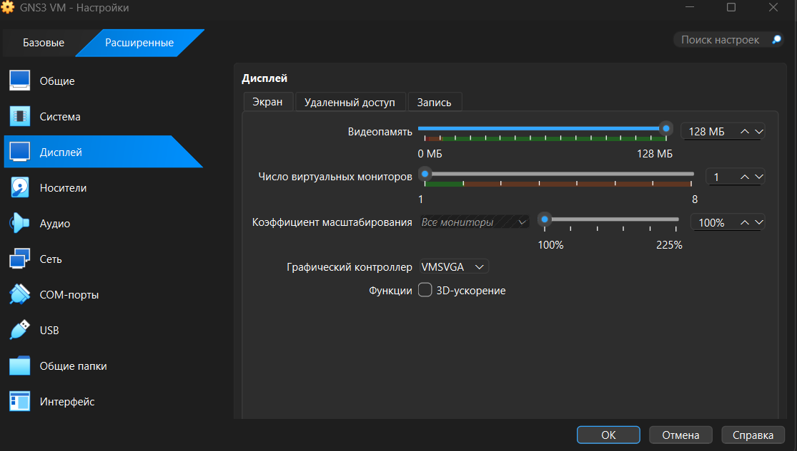
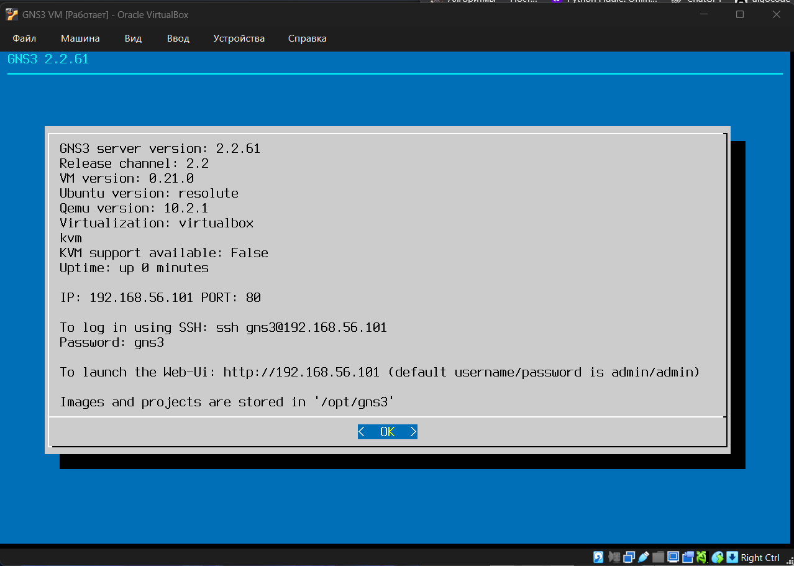
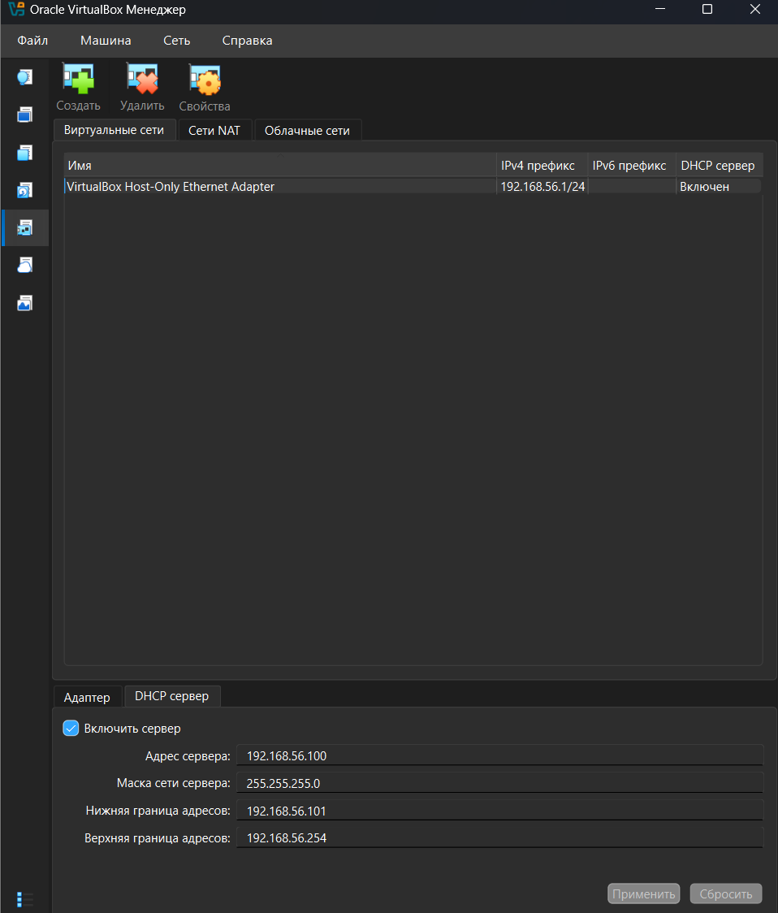
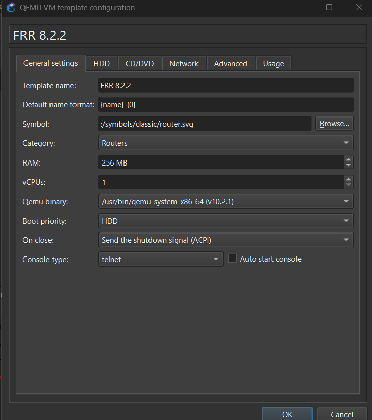
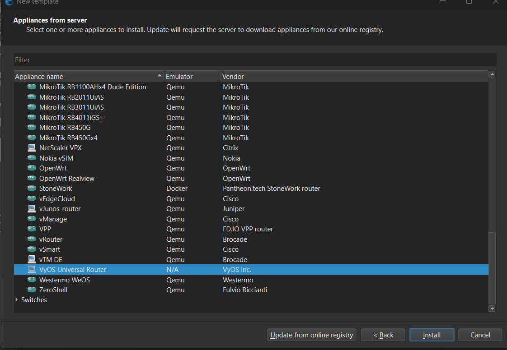
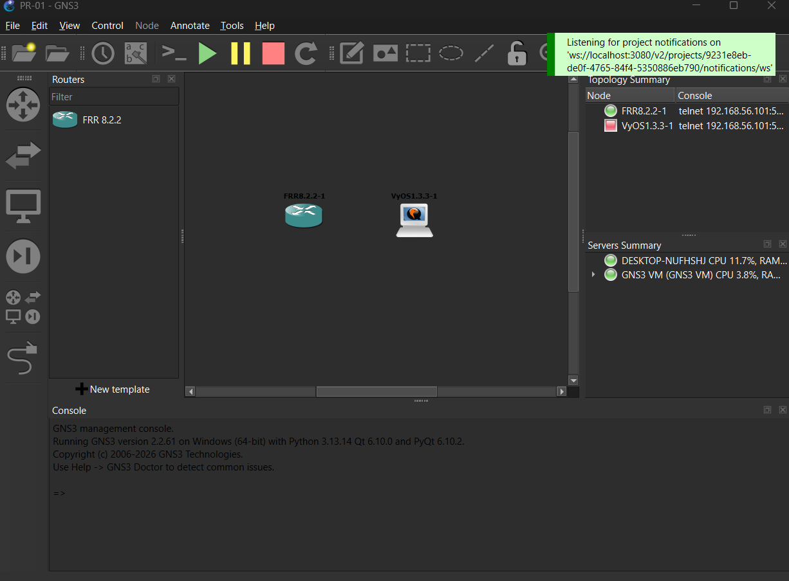
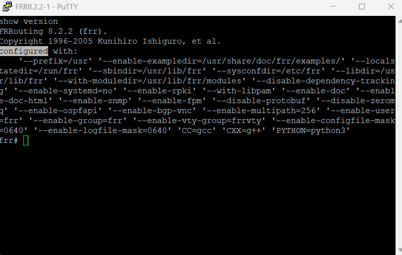
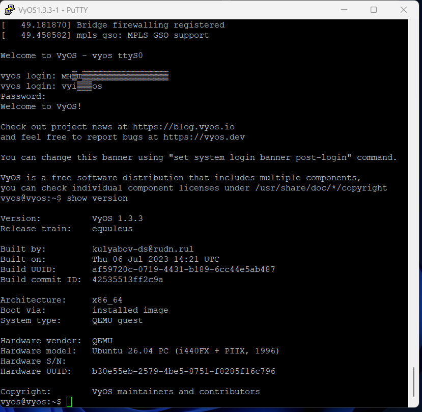

---
author:
  name: Баранов Никита Дмитриевич
  email: 1132242977@rudn.ru
  affiliation:
    - name: Российский университет дружбы народов им. Патриса Лумумбы
      city: Москва
      country: Российская Федерация
title: "Лабораторная работа № 1"
subtitle: "Подготовка среды моделирования GNS3"
license: CC BY
date: today
date-format: "YYYY-MM-DD"
---

# Информация

## Докладчик

:::::::::::::: {.columns align=center}
::: {.column width="70%"}

- Баранов Никита Дмитриевич
- Студент РУДН
- [1132242977@rudn.ru](mailto:1132242977@rudn.ru)

:::
::: {.column width="30%"}

:::
::::::::::::::

# Цель и задачи

## Цель работы

- Освоить установку и базовую настройку GNS3, подключение GNS3 VM и сетевых устройств.

## Основные этапы

- Проверена виртуализация VirtualBox и параметры виртуальной машины GNS3 VM.
- В сетевых настройках виртуальной машины выбран Host-Only адаптер для связи с локальным GNS3.
- Запущена GNS3 VM; в консоли получен адрес веб-интерфейса и подтверждена готовность сервера.
- В GNS3 указан локальный сервер и активировано использование GNS3 VM.
- Добавлены шаблоны программных маршрутизаторов FRR и VyOS.
- Создан тестовый проект, устройства запущены, доступ к их консоли проверен.

# Ход работы

## В свойствах виртуальной машины GNS3 VM открыт раздел «Дисплей»

- Проверены видеопараметры служебной ВМ: 128 МБ и VMSVGA.

{width=88%}

## На вкладке первого сетевого адаптера GNS3 VM включён режим Host-Only Ethernet Adapter и выбран эмулируемый контроллер Intel PRO/1000 MT Desktop

- Для связи с GNS3 выбран изолированный Host-Only адаптер.

{width=88%}

## После загрузки GNS3 VM её консоль вывела версию сервера 2

- На экране показан результат соответствующего этапа настройки.

{width=88%}

## В настройках GNS3 активирована опция Enable the GNS3 VM, выбран движок VirtualBox и указана машина GNS3 VM

- Клиент GNS3 подключён к VirtualBox-машине с 4096 МБ памяти.

{width=88%}

## Повторно проверены параметры сетевого интерфейса виртуальной машины перед подключением клиента GNS3

- Сетевой интерфейс ВМ оставлен в локальном host-only сегменте.

{width=88%}

## В менеджере Host Network показана сеть VirtualBox с адресом хоста 192

- На экране показан результат соответствующего этапа настройки.

{width=88%}

## Консоль запущенной GNS3 VM ещё раз фиксирует адрес 192

- Сервер GNS3 доступен в виртуальной сети по адресу 192.168.56.101.

{width=88%}

## В файле /etc/netplan/00-installer-config

- Для eth0 прописаны 10.10.10.2/24, шлюз и публичные DNS.

{width=88%}

## Открыт мастер создания шаблона устройства GNS3 со списком доступных appliances

- На экране показан результат соответствующего этапа настройки.

{width=88%}

## В параметрах QEMU-шаблона FRR 8

- Шаблон FRR запускается в QEMU с 256 МБ и консолью Telnet.

{width=88%}

## В каталоге appliances выделен универсальный маршрутизатор VyOS

- В стенд добавлен образ маршрутизатора VyOS.

{width=88%}

## На рабочем поле GNS3 размещены и запущены узлы FRR и VyOS; зелёные индикаторы интерфейсов показывают активные соединения

- На экране показан результат соответствующего этапа настройки.

{width=88%}

## В консоли FRR выполнена команда show version

- CLI подтверждает запуск FRRouting версии 8.2.2.

{width=88%}

## После входа в VyOS команда show version вывела версию 1

- Вторая консоль показывает корректную загрузку VyOS 1.3.3.

{width=88%}

# Результаты

## Итоги работы

- Цель работы достигнута. Освоить установку и базовую настройку GNS3, подключение GNS3 VM и сетевых устройств Полученные результаты подтверждают работоспособность собранной схемы и корректность выполненной настройки.

## Спасибо за внимание
