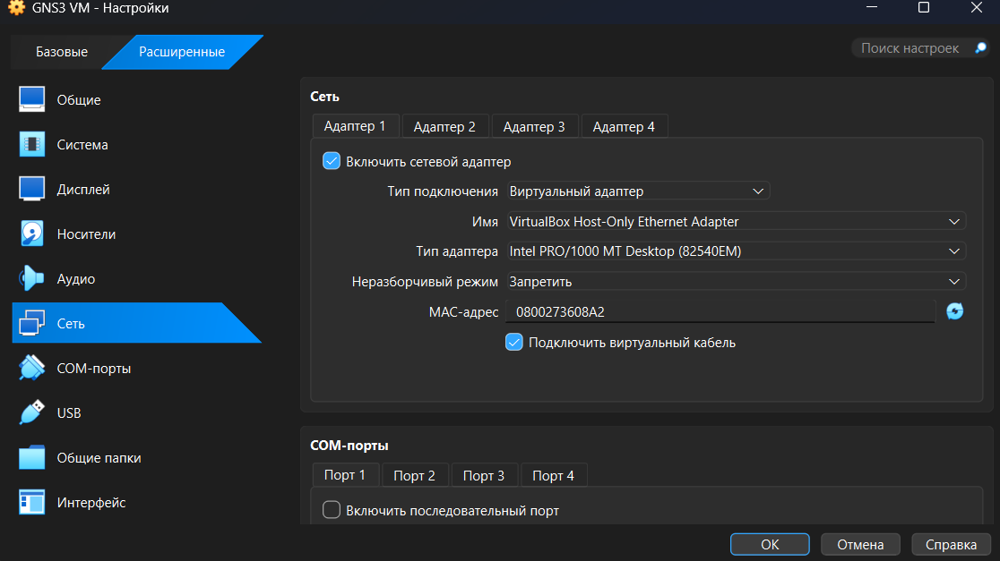
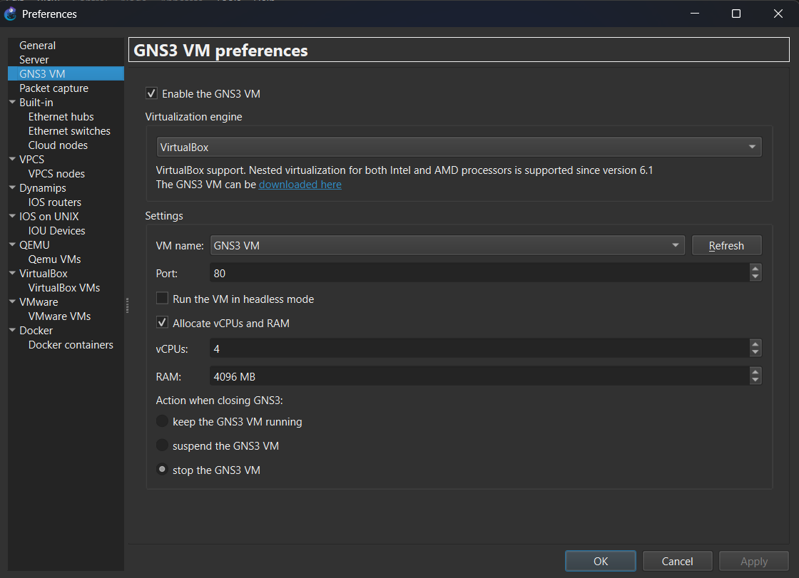
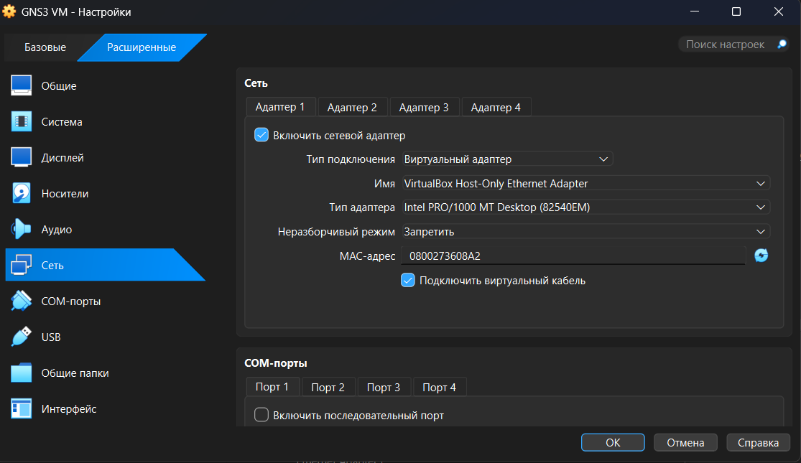
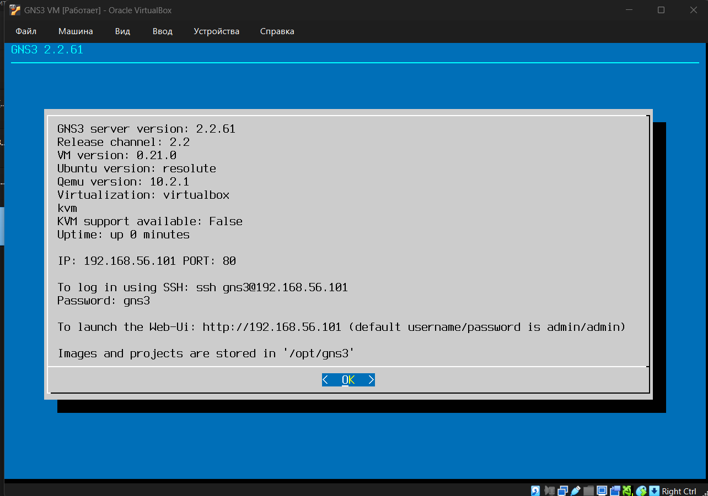
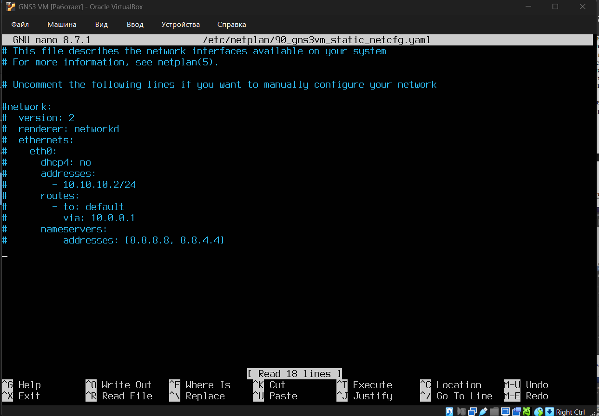
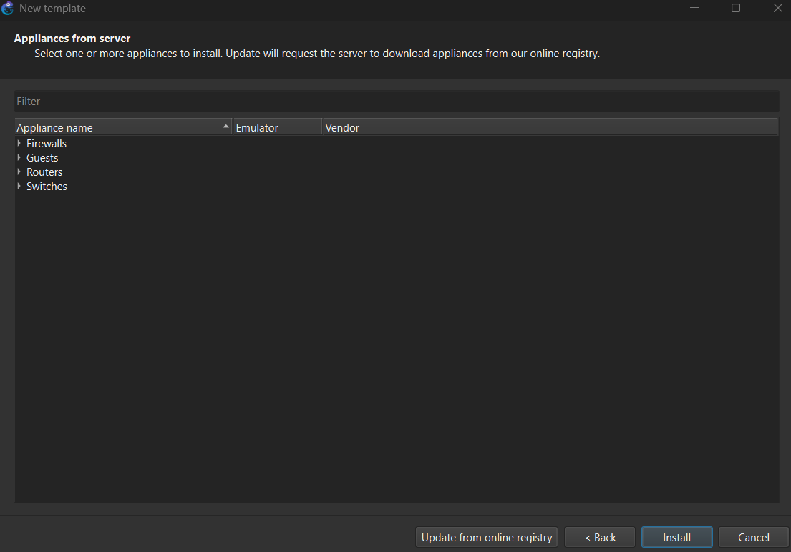

---
author:
  name: Баранов Никита Дмитриевич
  email: 1132242977@rudn.ru
  affiliation:
    - name: Российский университет дружбы народов им. Патриса Лумумбы
      city: Москва
      country: Российская Федерация
title: "Отчёт по лабораторной работе № 1"
subtitle: "Подготовка среды моделирования GNS3"
license: CC BY
date: today
date-format: "YYYY-MM-DD"
---

# Цель работы

Освоить установку и базовую настройку GNS3, подключение GNS3 VM и сетевых устройств.

# Задание

1. Проверена виртуализация VirtualBox и параметры виртуальной машины GNS3 VM.
2. В сетевых настройках виртуальной машины выбран Host-Only адаптер для связи с локальным GNS3.
3. Запущена GNS3 VM; в консоли получен адрес веб-интерфейса и подтверждена готовность сервера.
4. В GNS3 указан локальный сервер и активировано использование GNS3 VM.
5. Добавлены шаблоны программных маршрутизаторов FRR и VyOS.
6. Создан тестовый проект, устройства запущены, доступ к их консоли проверен.

# Теоретические сведения

GNS3 объединяет в одном проекте виртуальные маршрутизаторы, коммутаторы и конечные узлы. GNS3 VM выполняет роль вычислительного сервера для сетевых апплайансов.

# Выполнение работы

## В свойствах виртуальной машины GNS3 VM открыт раздел «Дисплей»

В свойствах виртуальной машины GNS3 VM открыт раздел «Дисплей». Видеопамять установлена в 128 МБ, а в качестве графического контроллера выбран VMSVGA; эти параметры обеспечивают штатный запуск консоли служебной ВМ.

{#fig-01-001 width=95%}

## На вкладке первого сетевого адаптера GNS3 VM включён режим Host-Only Ethernet Adapter и выбран эмулируемый контроллер Intel PRO/1000 MT Desktop

На вкладке первого сетевого адаптера GNS3 VM включён режим Host-Only Ethernet Adapter и выбран эмулируемый контроллер Intel PRO/1000 MT Desktop. Такое подключение создаёт отдельный канал между Windows и серверной частью GNS3.

{#fig-01-002 width=95%}

## После загрузки GNS3 VM её консоль вывела версию сервера 2

После загрузки GNS3 VM её консоль вывела версию сервера 2.2.52 и адрес 192.168.56.101. Наличие URL веб-интерфейса и приглашения для SSH показывает, что виртуальная машина получила адрес в host-only сети и готова принимать подключения.

{#fig-01-003 width=95%}

## В настройках GNS3 активирована опция Enable the GNS3 VM, выбран движок VirtualBox и указана машина GNS3 VM

В настройках GNS3 активирована опция Enable the GNS3 VM, выбран движок VirtualBox и указана машина GNS3 VM. Для неё выделено 4096 МБ оперативной памяти, после чего клиент может переносить вычисление QEMU-узлов на виртуальный сервер.

{#fig-01-004 width=95%}

## Повторно проверены параметры сетевого интерфейса виртуальной машины перед подключением клиента GNS3

Повторно проверены параметры сетевого интерфейса виртуальной машины перед подключением клиента GNS3. Адаптер оставлен во внутреннем Host-Only сегменте, поэтому адрес 192.168.56.101 доступен с рабочей станции.

{#fig-01-005 width=95%}

## В менеджере Host Network показана сеть VirtualBox с адресом хоста 192

В менеджере Host Network показана сеть VirtualBox с адресом хоста 192.168.56.1 и маской /24. В соседнем блоке видны параметры встроенного DHCP, из которого GNS3 VM получила адрес того же диапазона.

{#fig-01-006 width=95%}

## Консоль запущенной GNS3 VM ещё раз фиксирует адрес 192

Консоль запущенной GNS3 VM ещё раз фиксирует адрес 192.168.56.101 и состояние серверных служб. Этот кадр сделан после настройки виртуального адаптера и подтверждает сохранение сетевой доступности ВМ.

{#fig-01-007 width=95%}

## В файле /etc/netplan/00-installer-config

В файле /etc/netplan/00-installer-config.yaml для eth0 задан статический адрес 10.10.10.2/24, шлюз 10.10.10.1 и DNS-серверы 8.8.8.8 и 8.8.4.4. На экране видна именно итоговая структура YAML, которую затем применяет netplan.

{#fig-01-008 width=95%}

## Открыт мастер создания шаблона устройства GNS3 со списком доступных appliances

Открыт мастер создания шаблона устройства GNS3 со списком доступных appliances. На этом этапе выбиралась категория маршрутизаторов, чтобы добавить готовый образ сетевой ОС, а не создавать каждую QEMU-машину вручную.

{#fig-01-009 width=95%}

## В параметрах QEMU-шаблона FRR 8

В параметрах QEMU-шаблона FRR 8.2.2 указаны имя устройства, объём памяти 256 МБ, исполняемый файл QEMU и консоль Telnet. Эти значения определяют ресурсы экземпляра и способ дальнейшего доступа к CLI маршрутизатора.

{#fig-01-010 width=95%}

## В каталоге appliances выделен универсальный маршрутизатор VyOS

В каталоге appliances выделен универсальный маршрутизатор VyOS. Выбор этого шаблона дополняет стенд второй сетевой ОС и позволяет сравнивать команды VyOS с интерфейсом FRRouting.

{#fig-01-011 width=95%}

## На рабочем поле GNS3 размещены и запущены узлы FRR и VyOS; зелёные индикаторы интерфейсов показывают активные соединения

На рабочем поле GNS3 размещены и запущены узлы FRR и VyOS; зелёные индикаторы интерфейсов показывают активные соединения. В правой части интерфейса также виден запущенный сервер проекта и список устройств.

{#fig-01-012 width=95%}

## В консоли FRR выполнена команда show version

В консоли FRR выполнена команда show version. Вывод содержит версию FRRouting 8.2.2 и сведения о сборке, поэтому установленный образ однозначно идентифицирован перед выполнением следующих лабораторных работ.

{#fig-01-013 width=95%}

## После входа в VyOS команда show version вывела версию 1

После входа в VyOS команда show version вывела версию 1.3.3 и данные платформы. Тем самым проверены учётная запись, работа консоли и корректная загрузка второго маршрутизатора.

{#fig-01-014 width=95%}

# Выводы

Цель работы достигнута. Освоить установку и базовую настройку GNS3, подключение GNS3 VM и сетевых устройств Полученные результаты подтверждают работоспособность собранной схемы и корректность выполненной настройки.
