---
author:
  name: Баранов Никита Дмитриевич
  email: 1132242977@rudn.ru
  affiliation:
    - name: Российский университет дружбы народов им. Патриса Лумумбы
      city: Москва
      country: Российская Федерация
title: "Лабораторная работа № 2"
subtitle: "Моделирование канального уровня и анализ трафика"
license: CC BY
date: today
date-format: "YYYY-MM-DD"
---

# Информация

## Докладчик

:::::::::::::: {.columns align=center}
::: {.column width="70%"}

- Баранов Никита Дмитриевич
- Студент РУДН
- [1132242977@rudn.ru](mailto:1132242977@rudn.ru)

:::
::: {.column width="30%"}

:::
::::::::::::::

# Цель и задачи

## Цель работы

- Построить простые модели сети на базе коммутатора и маршрутизатора и исследовать Ethernet, ARP и ICMP в Wireshark.

## Основные этапы

- Создана топология из двух VPCS и Ethernet-коммутатора.
- Узлам назначены адреса 192.168.1.11/24 и 192.168.1.12/24.
- Командой ping проверен обмен между конечными узлами.
- Захват Wireshark показал ARP-запрос и ARP-ответ, после которых передаются ICMP Echo.
- В топологию добавлен маршрутизатор, его интерфейсу назначен адрес 192.168.1.1/24.
- Маршрутизация и адреса шлюзов проверены ping; кадры рассмотрены по уровням Ethernet и IP.

# Ход работы

## В GNS3 собрана минимальная локальная сеть: два узла VPCS подключены к одному Ethernet-коммутатору

- Два VPCS образуют один Ethernet-сегмент через коммутатор.

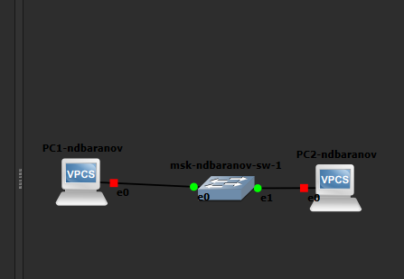{width=88%}

## На PC1 командой ip задан адрес 192

- На экране показан результат соответствующего этапа настройки.

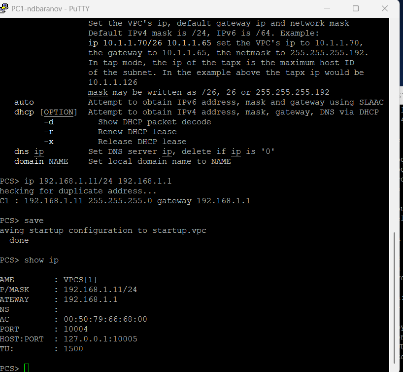{width=88%}

## В консоли PC2 установлен адрес 192

- PC2 использует 192.168.1.12/24 и отличается собственным MAC.

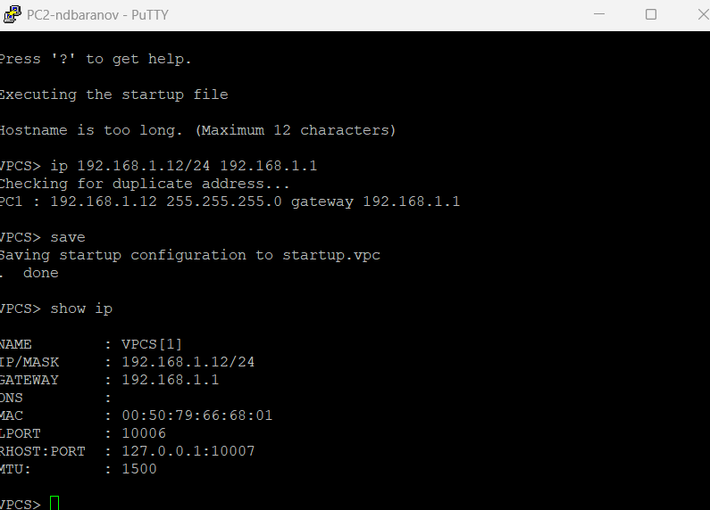{width=88%}

## С PC1 отправлены ICMP Echo-запросы на 192

- На экране показан результат соответствующего этапа настройки.

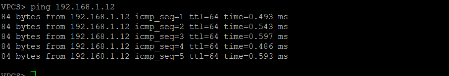{width=88%}

## На линии между PC1 и коммутатором включён захват пакетов

- На экране показан результат соответствующего этапа настройки.

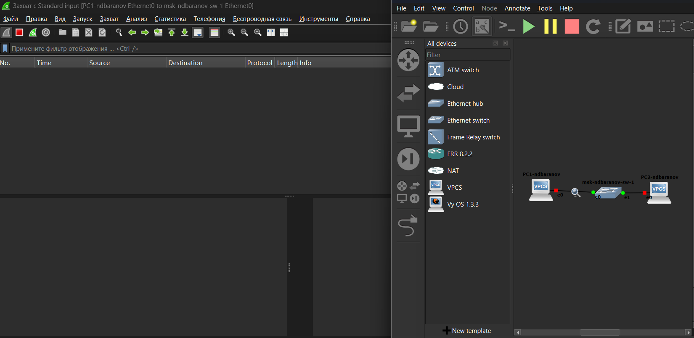{width=88%}

## В списке Wireshark видны широковещательные ARP-запросы о владельце 192

- Широковещательный ARP ищет MAC узла 192.168.1.11.

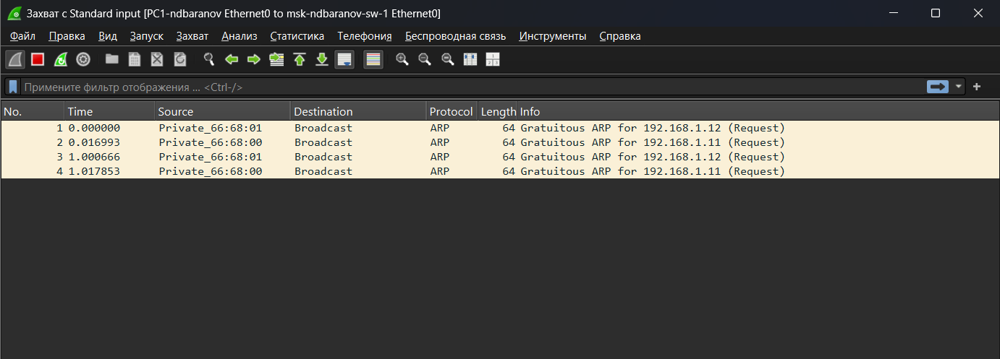{width=88%}

## Выбран отдельный ICMP Echo Request

- На экране показан результат соответствующего этапа настройки.

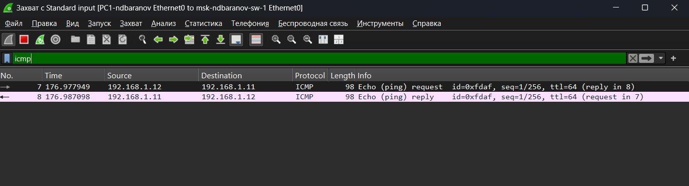{width=88%}

## Захват показывает пару ARP Request/Reply: сначала узел запрашивает аппаратный адрес владельца IPv4, затем получает одноадресный ответ

- Пара Request/Reply завершает разрешение IPv4-адреса в MAC.

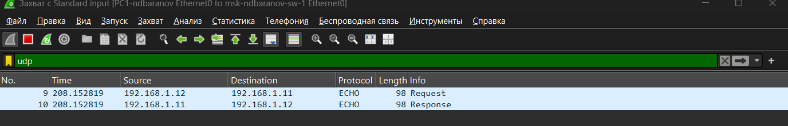{width=88%}

## В Wireshark последовательно отображаются ICMP Echo Request и Echo Reply между 192

- На экране показан результат соответствующего этапа настройки.

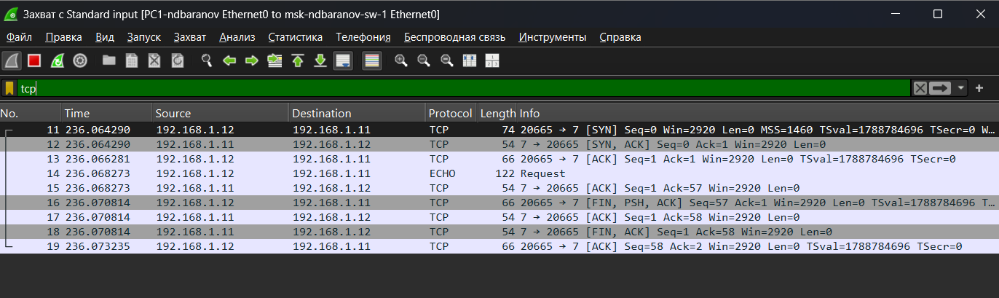{width=88%}

## Топология изменена: второй VPCS заменён программным маршрутизатором FRR

- Вместо второго ПК к коммутатору подключён FRR.

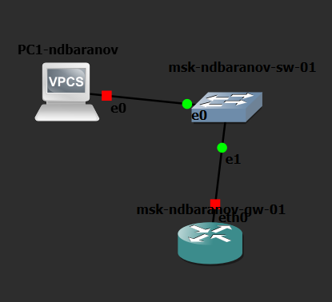{width=88%}

## PC1 перенастроен на адрес 192

- На экране показан результат соответствующего этапа настройки.

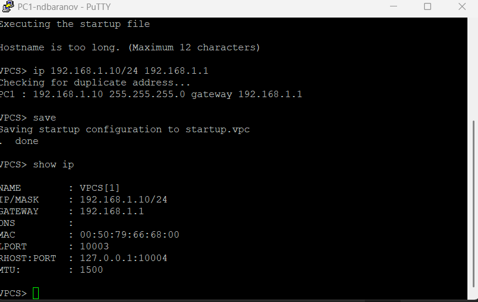{width=88%}

## В running-config FRR задано имя msk-ndbaranov-gw-01, а интерфейсу eth0 назначен 192

- На экране показан результат соответствующего этапа настройки.

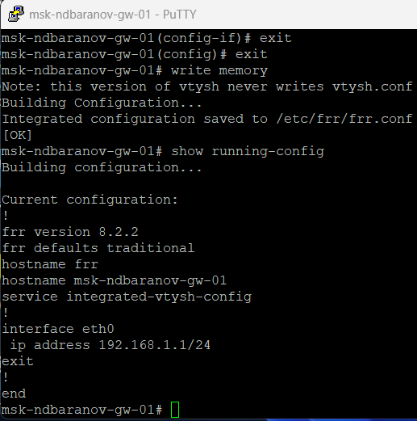{width=88%}

## Команда show interface brief вывела eth0 в состоянии up с адресом 192

- Краткий вывод FRR подтверждает eth0 up и 192.168.1.1/24.

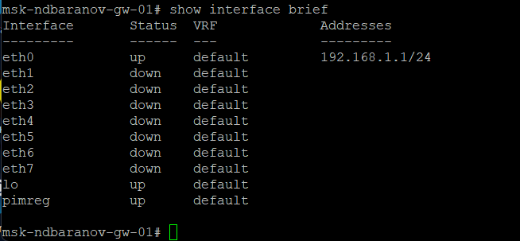{width=88%}

## С PC1 выполнен ping адреса шлюза 192

- На экране показан результат соответствующего этапа настройки.

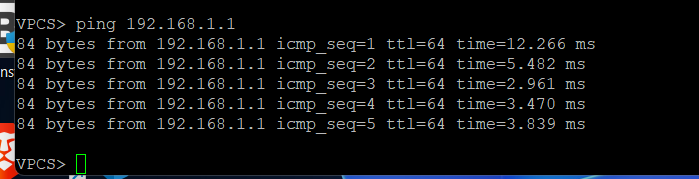{width=88%}

## В захвате на линии к FRR видны ICMP-запросы от 192

- ICMP между 192.168.1.10 и шлюзом виден непосредственно в захвате.

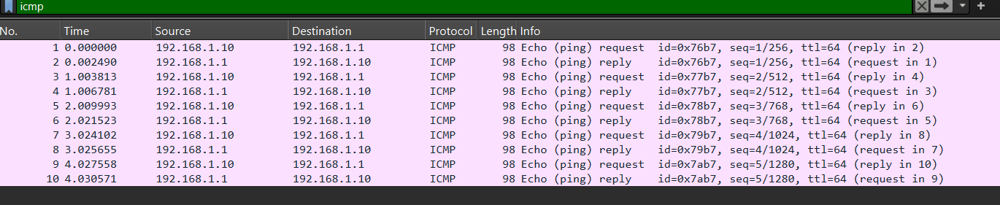{width=88%}

## Схема с PC1, Ethernet-коммутатором и FRR показана в рабочем состоянии

- На экране показан результат соответствующего этапа настройки.

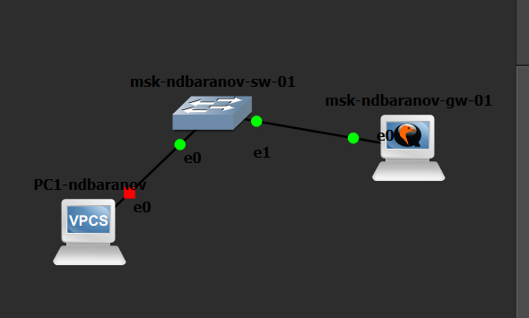{width=88%}

## Повторный show ip на PC1 фиксирует адрес 192

- Перед сравнением маршрутизаторов параметры PC1 не изменялись.

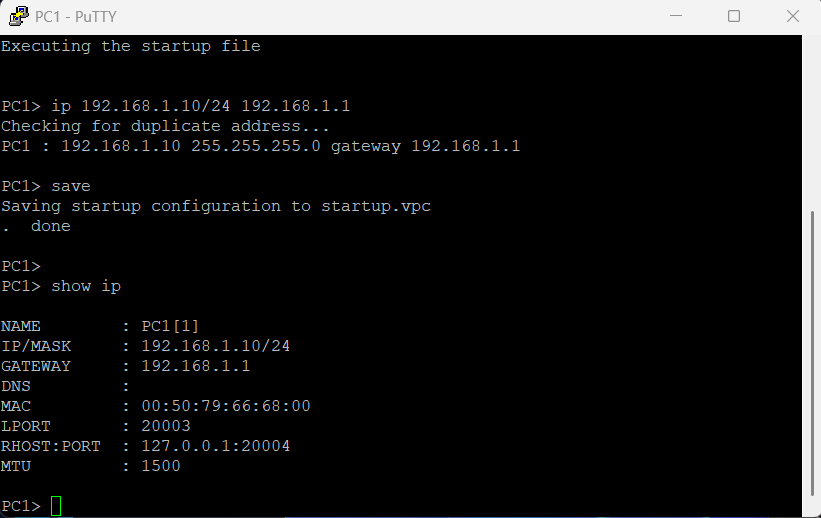{width=88%}

## В конфигурационном режиме VyOS удалён адрес, получаемый по DHCP, задано имя узла и установлен статический 192

- На экране показан результат соответствующего этапа настройки.

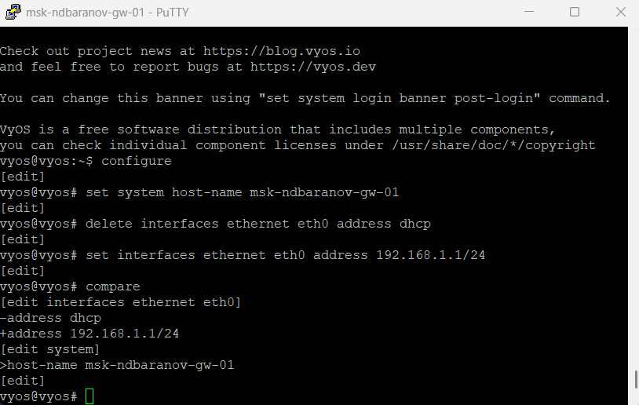{width=88%}

## После commit и save команда show interfaces выводит eth0 в состоянии up с адресом 192

- На экране показан результат соответствующего этапа настройки.

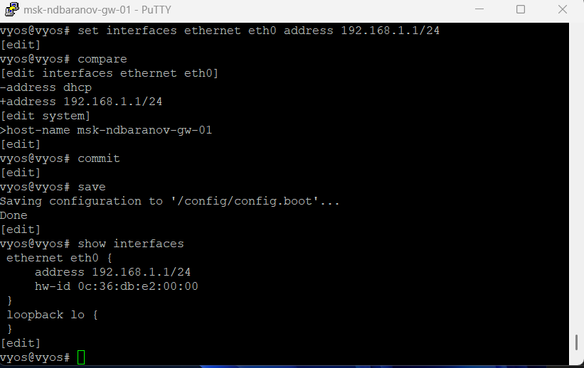{width=88%}

## PC1 успешно отвечает на ping к 192

- После замены FRR на VyOS шлюз по-прежнему отвечает на ping.

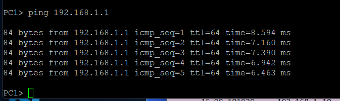{width=88%}

## Wireshark зарегистрировал ICMP Echo между PC1 и интерфейсом VyOS

- На экране показан результат соответствующего этапа настройки.

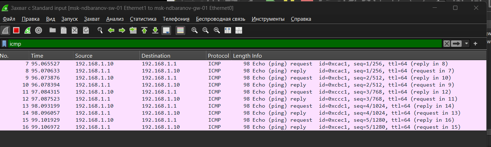{width=88%}

## В нижней панели раскрыты заголовки Ethernet II, Internet Protocol Version 4 и Internet Control Message Protocol

- Развёрнуты три уровня пакета: Ethernet II, IPv4 и ICMP.

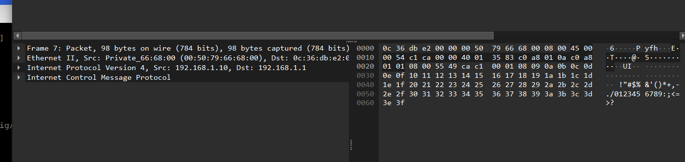{width=88%}

# Результаты

## Итоги работы

- Цель работы достигнута. Построить простые модели сети на базе коммутатора и маршрутизатора и исследовать Ethernet, ARP и ICMP в Wireshark Полученные результаты подтверждают работоспособность собранной схемы и корректность выполненной настройки.

## Спасибо за внимание
