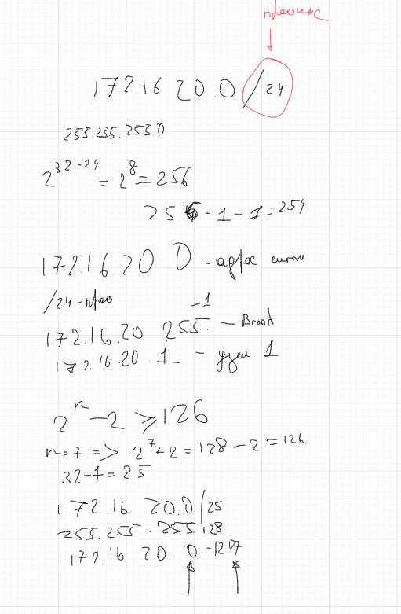
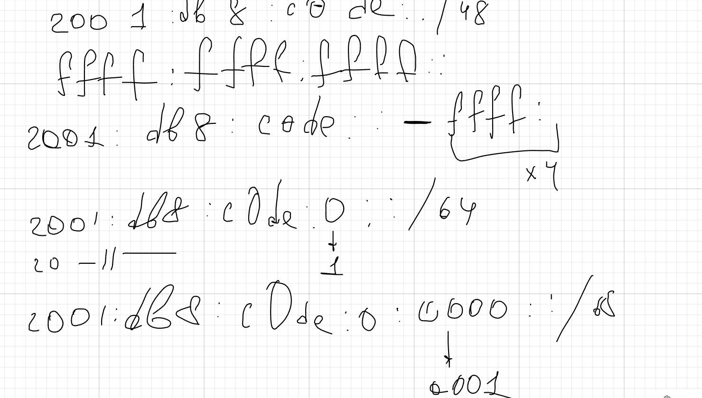

---
author:
  name: Баранов Никита Дмитриевич
  email: 1132242977@rudn.ru
  affiliation:
    - name: Российский университет дружбы народов им. Патриса Лумумбы
      city: Москва
      country: Российская Федерация
title: "Лабораторная работа № 3"
subtitle: "Адресация IPv4 и IPv6"
license: CC BY
date: today
date-format: "YYYY-MM-DD"
---

# Информация

## Докладчик

:::::::::::::: {.columns align=center}
::: {.column width="70%"}

- Баранов Никита Дмитриевич
- Студент РУДН
- [1132242977@rudn.ru](mailto:1132242977@rudn.ru)

:::
::: {.column width="30%"}

:::
::::::::::::::

# Цель и задачи

## Цель работы

- Изучить организацию адресного пространства IPv4/IPv6 и научиться рассчитывать параметры подсетей.

## Основные этапы

- Для сети 172.16.20.0/24 определены адрес сети, широковещательный адрес и допустимый диапазон узлов.
- Переход к префиксу /25 даёт две подсети по 126 пригодных адресов.
- Для 10.10.1.64/26 определены границы 10.10.1.64–10.10.1.127 и broadcast 10.10.1.127.
- Для IPv6 разобрана структура префикса /48 и формирование подсетей /64.
- Результаты расчётов использованы далее при настройке двойного стека.

# Ход работы

## На листе выполнен расчёт сети 172

- Сеть /24 разделена на две части /25 по 126 узлов.

{width=88%}

## Для подсети 10

- Для 10.10.1.64/26 получен диапазон .65–.126 и broadcast .127.

{width=88%}

## В части IPv6 полный адрес сокращён удалением ведущих нулей и самой длинной последовательности нулевых групп

- Показаны правила сокращения IPv6 и выделения подсетей /64.

{width=88%}

# Результаты

## Итоги работы

- Цель работы достигнута. Изучить организацию адресного пространства IPv4/IPv6 и научиться рассчитывать параметры подсетей Полученные результаты подтверждают работоспособность собранной схемы и корректность выполненной настройки.

## Спасибо за внимание
