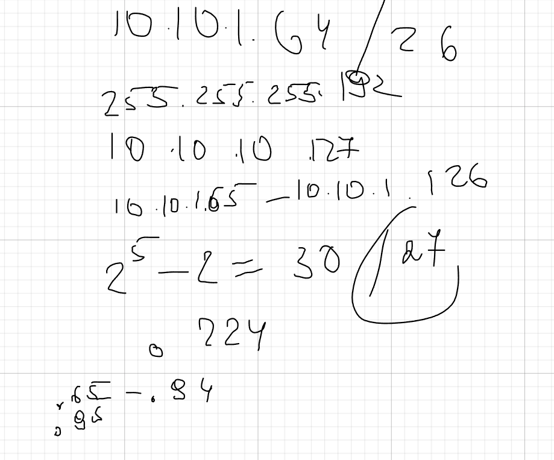

---
author:
  name: Баранов Никита Дмитриевич
  email: 1132242977@rudn.ru
  affiliation:
    - name: Российский университет дружбы народов им. Патриса Лумумбы
      city: Москва
      country: Российская Федерация
title: "Отчёт по лабораторной работе № 3"
subtitle: "Адресация IPv4 и IPv6"
license: CC BY
date: today
date-format: "YYYY-MM-DD"
---

# Цель работы

Изучить организацию адресного пространства IPv4/IPv6 и научиться рассчитывать параметры подсетей.

# Задание

1. Для сети 172.16.20.0/24 определены адрес сети, широковещательный адрес и допустимый диапазон узлов.
2. Переход к префиксу /25 даёт две подсети по 126 пригодных адресов.
3. Для 10.10.1.64/26 определены границы 10.10.1.64–10.10.1.127 и broadcast 10.10.1.127.
4. Для IPv6 разобрана структура префикса /48 и формирование подсетей /64.
5. Результаты расчётов использованы далее при настройке двойного стека.

# Теоретические сведения

Таблица маршрутизации сопоставляет адрес назначения с наиболее длинным подходящим префиксом и передаёт пакет следующему узлу или в подключённую сеть.

# Выполнение работы

## На листе выполнен расчёт сети 172

На листе выполнен расчёт сети 172.16.20.0/24 и её деления на /25. Записаны маска 255.255.255.128, широковещательные адреса и по 126 допустимых адресов узлов в каждой половине.

{#fig-03-001 width=95%}

## Для подсети 10

Для подсети 10.10.1.64/26 определены границы: первый узел 10.10.1.65, последний 10.10.1.126, broadcast 10.10.1.127. Ниже показано дальнейшее деление диапазона на блоки /27.

{#fig-03-002 width=95%}

## В части IPv6 полный адрес сокращён удалением ведущих нулей и самой длинной последовательности нулевых групп

В части IPv6 полный адрес сокращён удалением ведущих нулей и самой длинной последовательности нулевых групп. Также отмечено, как из исходного префикса формируются отдельные подсети /64.

{#fig-03-003 width=95%}

# Выводы

Цель работы достигнута. Изучить организацию адресного пространства IPv4/IPv6 и научиться рассчитывать параметры подсетей Полученные результаты подтверждают работоспособность собранной схемы и корректность выполненной настройки.
