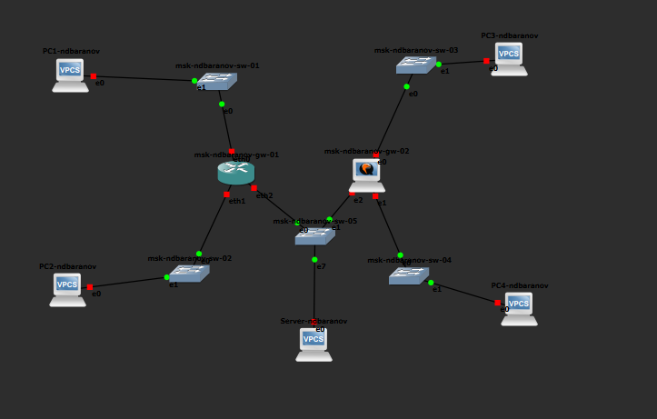
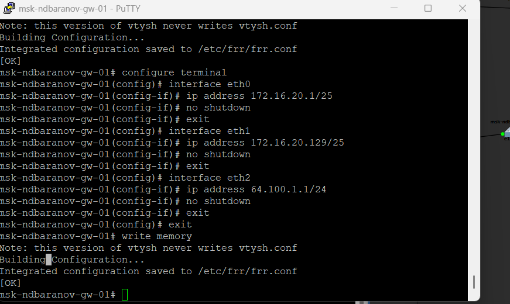
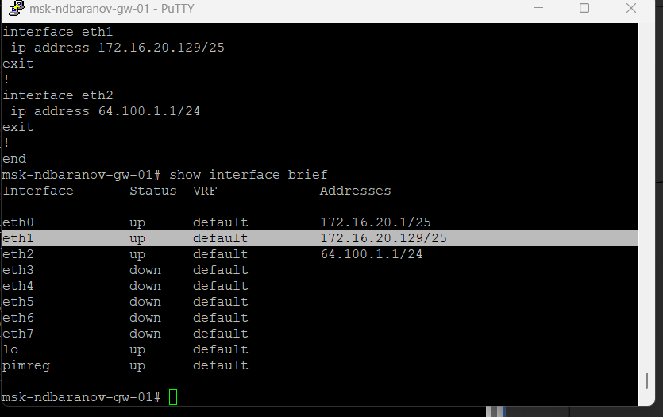
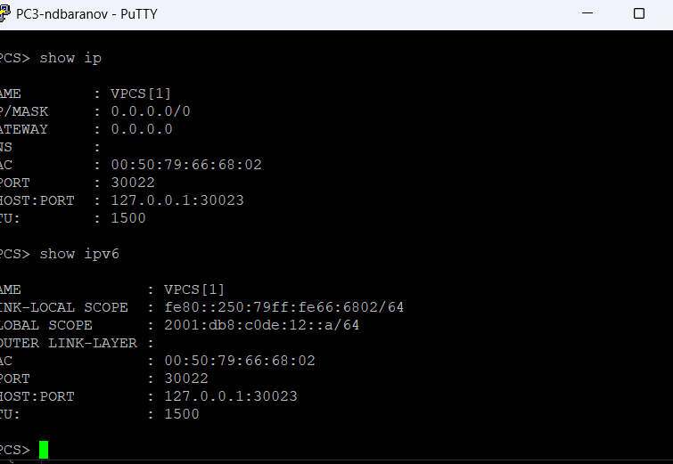
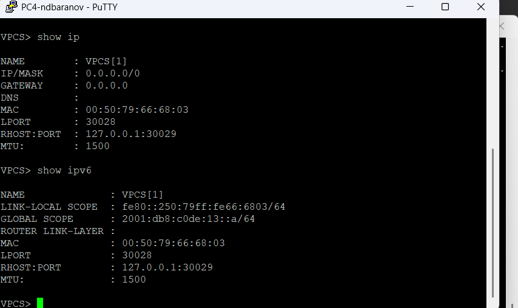
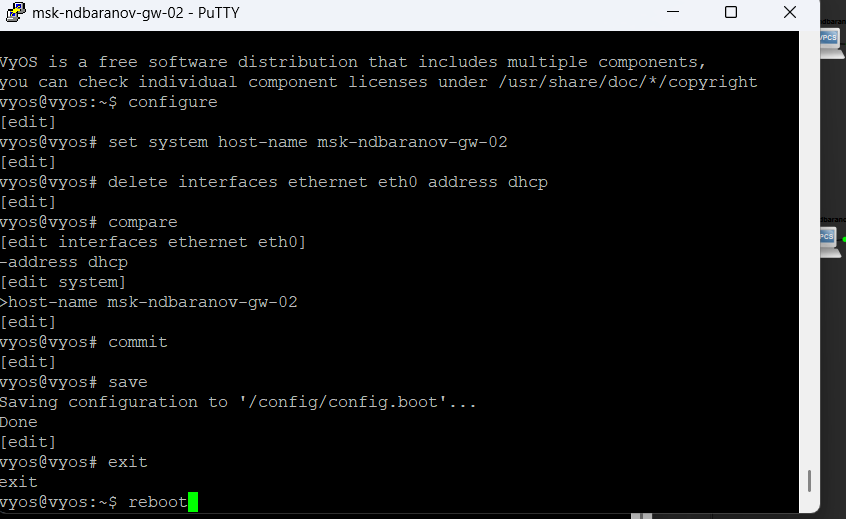
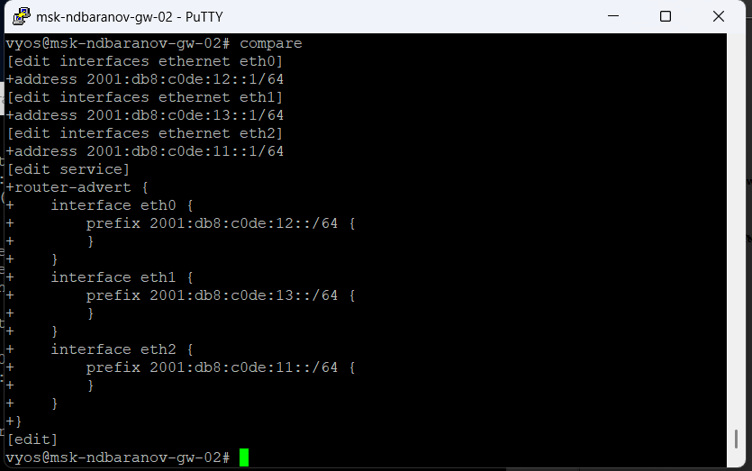
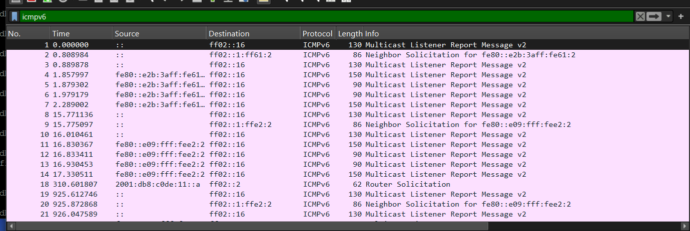
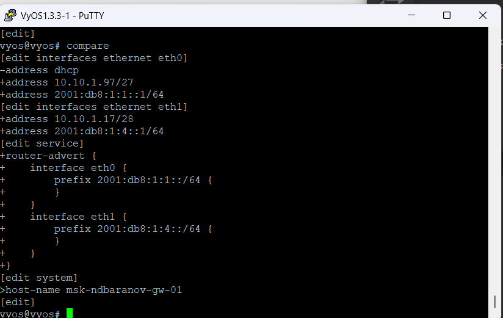

---
author:
  name: Баранов Никита Дмитриевич
  email: 1132242977@rudn.ru
  affiliation:
    - name: Российский университет дружбы народов им. Патриса Лумумбы
      city: Москва
      country: Российская Федерация
title: "Лабораторная работа № 4"
subtitle: "Двойной стек IPv4 и IPv6"
license: CC BY
date: today
date-format: "YYYY-MM-DD"
---

# Информация

## Докладчик

:::::::::::::: {.columns align=center}
::: {.column width="70%"}

- Баранов Никита Дмитриевич
- Студент РУДН
- [1132242977@rudn.ru](mailto:1132242977@rudn.ru)

:::
::: {.column width="30%"}

:::
::::::::::::::

# Цель и задачи

## Цель работы

- Распределить адресное пространство и настроить маршрутизацию IPv4/IPv6 между локальными подсетями.

## Основные этапы

- Собрана топология с двумя пользовательскими сегментами и маршрутизатором.
- Интерфейсам назначены IPv4-адреса 172.16.20.1/25, 172.16.20.129/25 и транзитный адрес 64.100.1.1/24.
- На узлах настроены адреса и шлюзы; show ip подтверждает параметры.
- Интерфейсы VyOS получили IPv6-префиксы /64; конфигурация сохранена.
- Wireshark фиксирует ARP, ICMP и ICMPv6 Neighbor Discovery.
- Самостоятельное задание решено для 10.10.1.96/27 и 10.10.1.16/28, а также 2001:db8:1:1::/64 и 2001:db8:1:4::/64.
- Для первой IPv4-подсети: сеть 10.10.1.96, узлы .97–.126, broadcast .127; для второй: сеть 10.10.1.16, узлы .17–.30, broadcast .31.

# Ход работы

## На общей схеме размещены два пользовательских сегмента, серверный узел и два маршрутизатора

- Общая схема объединяет два пользовательских и серверный сегменты.

{width=88%}

## На PC1 показаны IPv4 172

- На экране показан результат соответствующего этапа настройки.

{width=88%}

## PC2 находится во второй IPv4-подсети и использует 172

- PC2 помещён во вторую половину IPv4-сети и отдельный IPv6-префикс.

{width=88%}

## Серверному VPCS назначен 64

- На экране показан результат соответствующего этапа настройки.

{width=88%}

## На FRR интерфейсы eth0 и eth1 получили адреса 172

- Три интерфейса FRR получили адреса своих подсетей.

{width=88%}

## Команда show running-config перечисляет три настроенных интерфейса FRR и имя msk-ndbaranov-gw-01

- На экране показан результат соответствующего этапа настройки.

{width=88%}

## В show interface brief рабочие eth0, eth1 и eth2 имеют состояние up и ожидаемые IPv4-адреса

- На экране показан результат соответствующего этапа настройки.

{width=88%}

## С PC1 проверена доступность PC2 и серверного узла

- Ping и traceroute подтверждают пересылку между разными сегментами.

{width=88%}

## До настройки самостоятельного варианта PC3 не имеет назначенного IPv4-адреса, а в IPv6 присутствует только link-local

- На экране показан результат соответствующего этапа настройки.

{width=88%}

## На PC4 также показано отсутствие IPv4 и наличие только локального IPv6-адреса

- PC4 показан до назначения адресов самостоятельного варианта.

{width=88%}

## Сервер настроен адресами 64

- На экране показан результат соответствующего этапа настройки.

{width=88%}

## В VyOS удалена автоматическая IPv4-конфигурация eth0, задано имя маршрутизатора и выполнены commit/save

- VyOS подготовлен к настройке двойного стека.

{width=88%}

## Команда compare отображает добавление трёх IPv6-префиксов на eth0–eth2

- На экране показан результат соответствующего этапа настройки.

{width=88%}

## После сохранения show interfaces перечисляет IPv6-адреса на каждом Ethernet-интерфейсе VyOS

- После сохранения все IPv6-интерфейсы VyOS подняты.

{width=88%}

## В Wireshark выделен ARP-обмен в одном из IPv4-сегментов

- На экране показан результат соответствующего этапа настройки.

{width=88%}

## Отдельный захват содержит служебные ICMPv6-сообщения: Neighbor Solicitation, Neighbor Advertisement и Router Solicitation/Advertisement

- На экране показан результат соответствующего этапа настройки.

{width=88%}

## Для самостоятельной части построена схема с двумя коммутаторами, двумя VPCS и маршрутизатором VyOS

- Самостоятельная схема связывает подсети /27 и /28.

{width=88%}

## PC1 получил 10

- На экране показан результат соответствующего этапа настройки.

{width=88%}

## PC2 настроен как 10

- PC2 использует 10.10.1.18/28 и префикс 2001:db8:1:4::/64.

{width=88%}

## Команда compare в VyOS показывает адреса шлюзов 10

- На экране показан результат соответствующего этапа настройки.

{width=88%}

## После commit/save show interfaces подтверждает адреса на eth0 и eth1 и их состояние up

- Итоговая таблица VyOS содержит оба адреса шлюзов.

{width=88%}

# Результаты

## Итоги работы

- Цель работы достигнута. Распределить адресное пространство и настроить маршрутизацию IPv4/IPv6 между локальными подсетями Полученные результаты подтверждают работоспособность собранной схемы и корректность выполненной настройки.

## Спасибо за внимание
