---
author:
  name: Баранов Никита Дмитриевич
  email: 1132242977@rudn.ru
  affiliation:
    - name: Российский университет дружбы народов им. Патриса Лумумбы
      city: Москва
      country: Российская Федерация
title: "Отчёт по лабораторной работе № 4"
subtitle: "Двойной стек IPv4 и IPv6"
license: CC BY
date: today
date-format: "YYYY-MM-DD"
---

# Цель работы

Распределить адресное пространство и настроить маршрутизацию IPv4/IPv6 между локальными подсетями.

# Задание

1. Собрана топология с двумя пользовательскими сегментами и маршрутизатором.
2. Интерфейсам назначены IPv4-адреса 172.16.20.1/25, 172.16.20.129/25 и транзитный адрес 64.100.1.1/24.
3. На узлах настроены адреса и шлюзы; show ip подтверждает параметры.
4. Интерфейсы VyOS получили IPv6-префиксы /64; конфигурация сохранена.
5. Wireshark фиксирует ARP, ICMP и ICMPv6 Neighbor Discovery.
6. Самостоятельное задание решено для 10.10.1.96/27 и 10.10.1.16/28, а также 2001:db8:1:1::/64 и 2001:db8:1:4::/64.
7. Для первой IPv4-подсети: сеть 10.10.1.96, узлы .97–.126, broadcast .127; для второй: сеть 10.10.1.16, узлы .17–.30, broadcast .31.

# Теоретические сведения

Статические маршруты задаются администратором. Каждая запись содержит сеть назначения и адрес следующего маршрутизатора.

# Выполнение работы

## На общей схеме размещены два пользовательских сегмента, серверный узел и два маршрутизатора

На общей схеме размещены два пользовательских сегмента, серверный узел и два маршрутизатора. Подписи устройств и соединений позволяют сопоставить дальнейшие адреса с конкретными интерфейсами.

{#fig-04-001 width=95%}

## На PC1 показаны IPv4 172

На PC1 показаны IPv4 172.16.20.10/25 и глобальный IPv6 2001:db8:c0de:12::a/64. Шлюз 172.16.20.1 относится к первой половине сети /24.

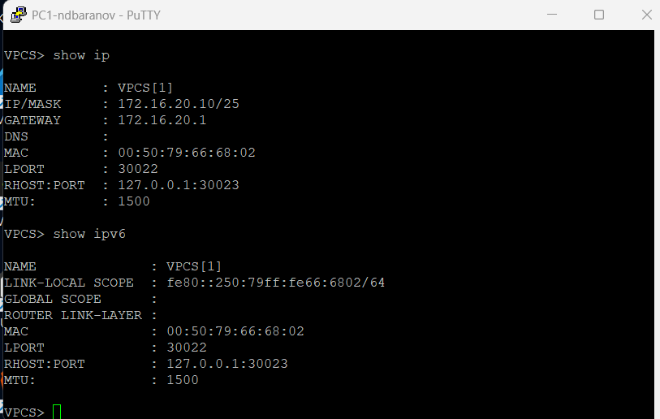{#fig-04-002 width=95%}

## PC2 находится во второй IPv4-подсети и использует 172

PC2 находится во второй IPv4-подсети и использует 172.16.20.138/25 со шлюзом 172.16.20.129. Глобальный IPv6-адрес сформирован уже из другого /64-префикса.

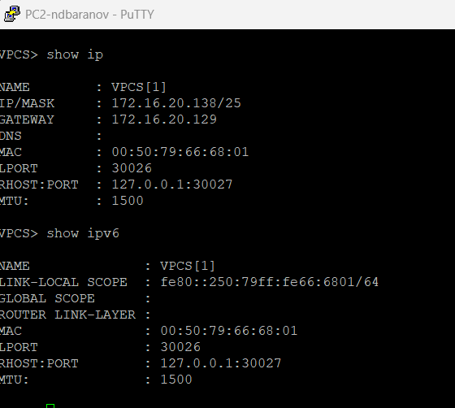{#fig-04-003 width=95%}

## Серверному VPCS назначен 64

Серверному VPCS назначен 64.100.1.10/24, а 64.100.1.1 указан как шлюз. Вывод show ip сохраняет параметры отдельного транзитного/серверного сегмента.

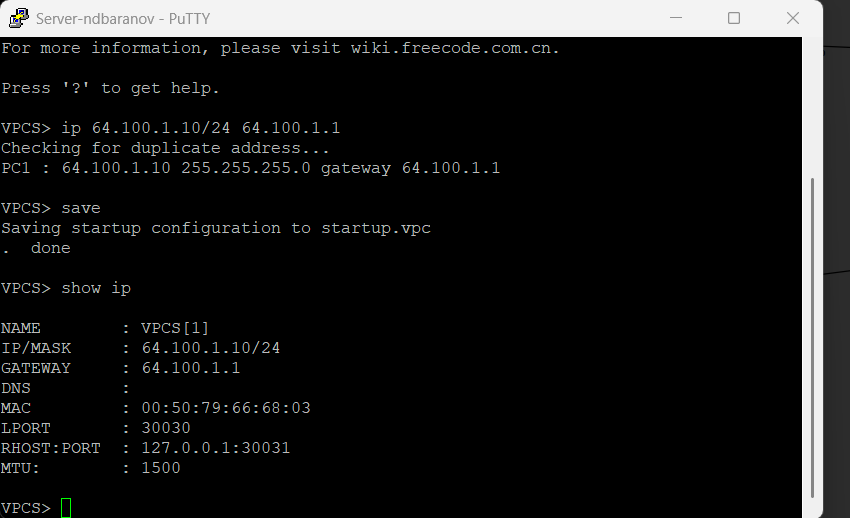{#fig-04-004 width=95%}

## На FRR интерфейсы eth0 и eth1 получили адреса 172

На FRR интерфейсы eth0 и eth1 получили адреса 172.16.20.1/25 и 172.16.20.129/25, а eth2 — 64.100.1.1/24. После write memory конфигурация записана в /etc/frr/frr.conf.

{#fig-04-005 width=95%}

## Команда show running-config перечисляет три настроенных интерфейса FRR и имя msk-ndbaranov-gw-01

Команда show running-config перечисляет три настроенных интерфейса FRR и имя msk-ndbaranov-gw-01. По этому выводу проверено, что каждая IPv4-подсеть привязана к своему порту.

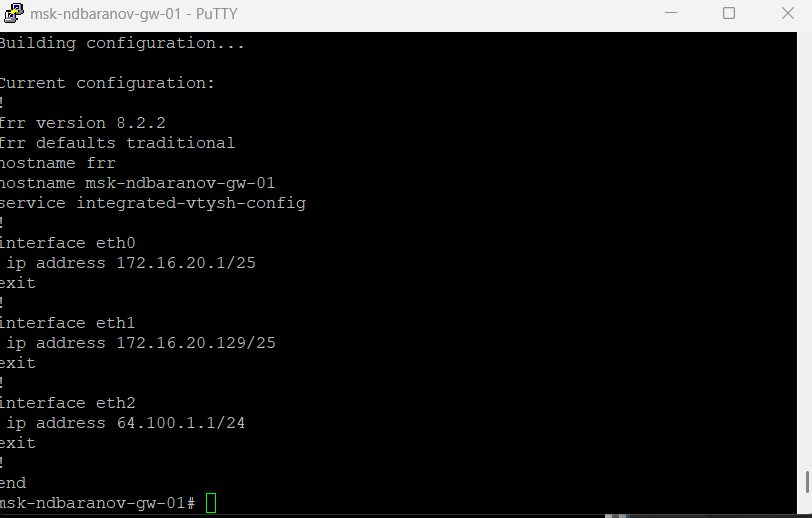{#fig-04-006 width=95%}

## В show interface brief рабочие eth0, eth1 и eth2 имеют состояние up и ожидаемые IPv4-адреса

В show interface brief рабочие eth0, eth1 и eth2 имеют состояние up и ожидаемые IPv4-адреса. Эта таблица удобна для одновременной проверки линков и адресного плана.

{#fig-04-007 width=95%}

## С PC1 проверена доступность PC2 и серверного узла

С PC1 проверена доступность PC2 и серверного узла. Ответы от адресов других подсетей проходят через FRR; traceroute показывает участие шлюза в межсетевой передаче.

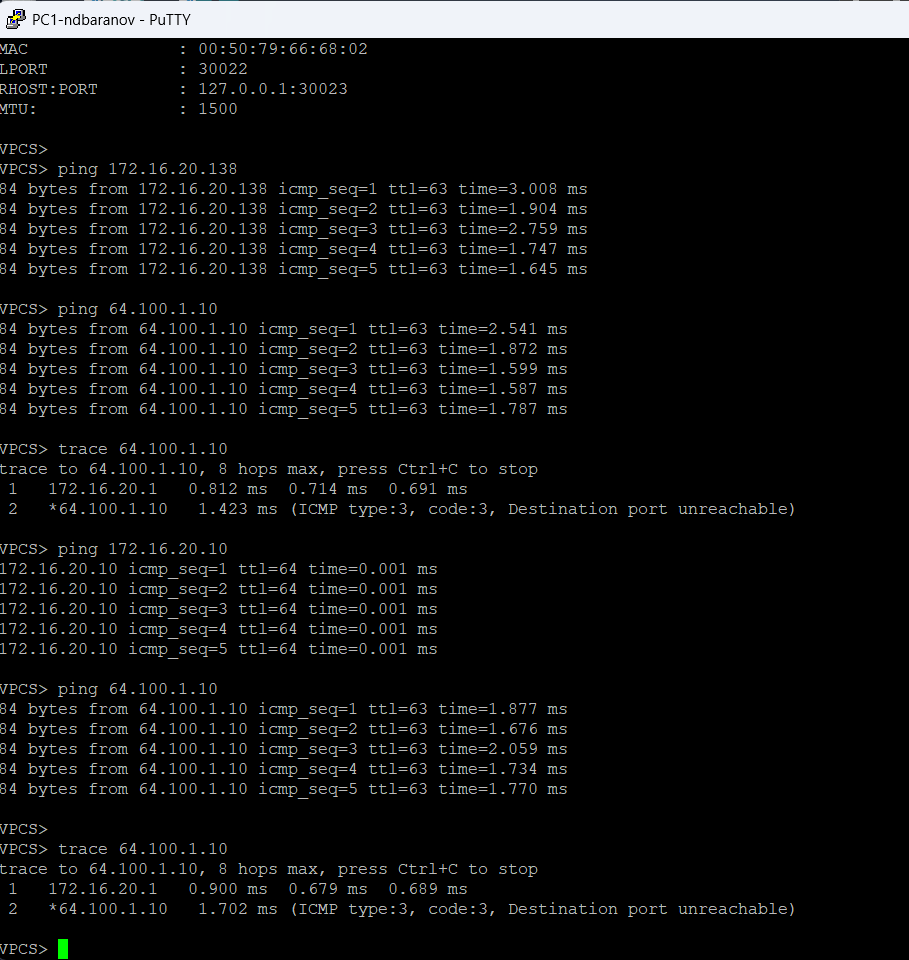{#fig-04-008 width=95%}

## До настройки самостоятельного варианта PC3 не имеет назначенного IPv4-адреса, а в IPv6 присутствует только link-local

До настройки самостоятельного варианта PC3 не имеет назначенного IPv4-адреса, а в IPv6 присутствует только link-local. Кадр фиксирует исходное состояние нового узла.

{#fig-04-009 width=95%}

## На PC4 также показано отсутствие IPv4 и наличие только локального IPv6-адреса

На PC4 также показано отсутствие IPv4 и наличие только локального IPv6-адреса. Это состояние используется как точка отсчёта перед вводом рассчитанных подсетей.

{#fig-04-010 width=95%}

## Сервер настроен адресами 64

Сервер настроен адресами 64.100.1.10/24 и 2001:db8:c0de:11::a/64. Таким образом, для этого сегмента одновременно подготовлены IPv4 и IPv6.

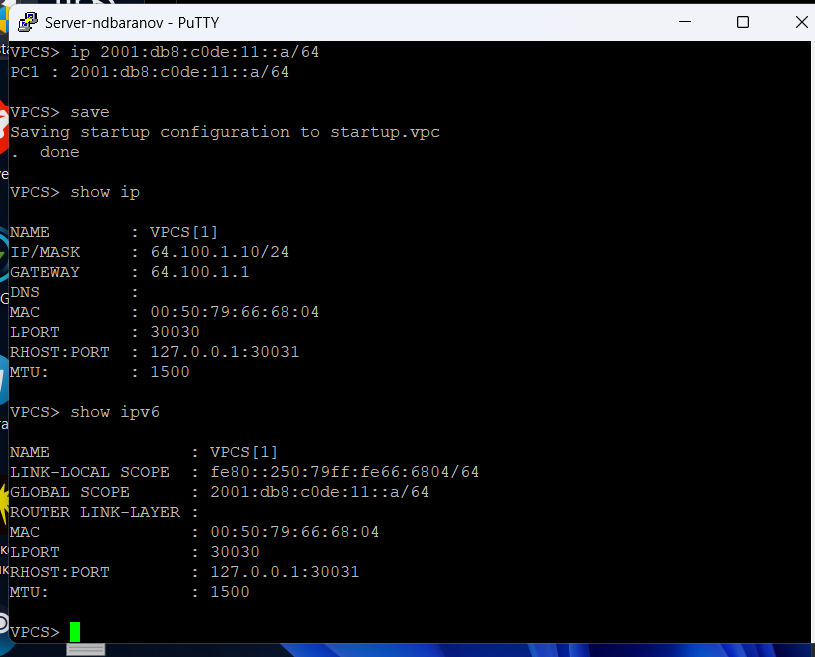{#fig-04-011 width=95%}

## В VyOS удалена автоматическая IPv4-конфигурация eth0, задано имя маршрутизатора и выполнены commit/save

В VyOS удалена автоматическая IPv4-конфигурация eth0, задано имя маршрутизатора и выполнены commit/save. На экране показано завершение базовой подготовки устройства.

{#fig-04-012 width=95%}

## Команда compare отображает добавление трёх IPv6-префиксов на eth0–eth2

Команда compare отображает добавление трёх IPv6-префиксов на eth0–eth2. Перед commit можно проверить соответствие префиксов пользовательским и серверному сегментам.

{#fig-04-013 width=95%}

## После сохранения show interfaces перечисляет IPv6-адреса на каждом Ethernet-интерфейсе VyOS

После сохранения show interfaces перечисляет IPv6-адреса на каждом Ethernet-интерфейсе VyOS. Наличие интерфейсов в состоянии up подтверждает применение конфигурации.

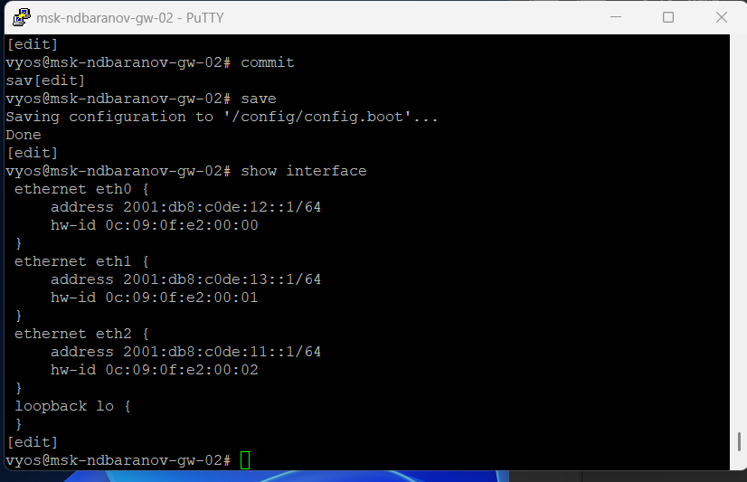{#fig-04-014 width=95%}

## В Wireshark выделен ARP-обмен в одном из IPv4-сегментов

В Wireshark выделен ARP-обмен в одном из IPv4-сегментов. Захват показывает, что перед отправкой IP-пакета узел определяет MAC-адрес следующего перехода.

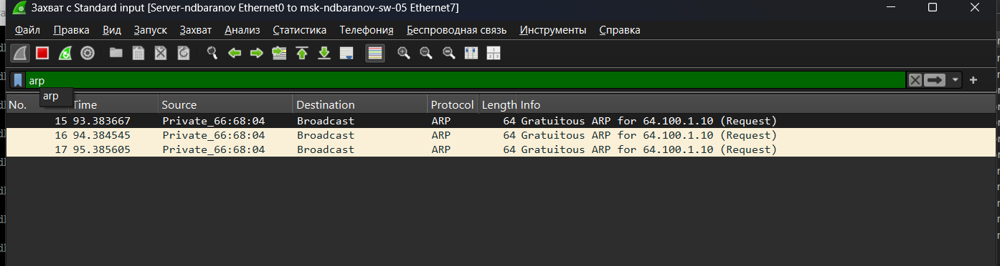{#fig-04-015 width=95%}

## Отдельный захват содержит служебные ICMPv6-сообщения: Neighbor Solicitation, Neighbor Advertisement и Router Solicitation/Advertisement

Отдельный захват содержит служебные ICMPv6-сообщения: Neighbor Solicitation, Neighbor Advertisement и Router Solicitation/Advertisement. По ним узлы обнаруживают соседей и маршрутизатор без ARP.

{#fig-04-016 width=95%}

## Для самостоятельной части построена схема с двумя коммутаторами, двумя VPCS и маршрутизатором VyOS

Для самостоятельной части построена схема с двумя коммутаторами, двумя VPCS и маршрутизатором VyOS. Центральный узел соединяет подсети 10.10.1.96/27 и 10.10.1.16/28.

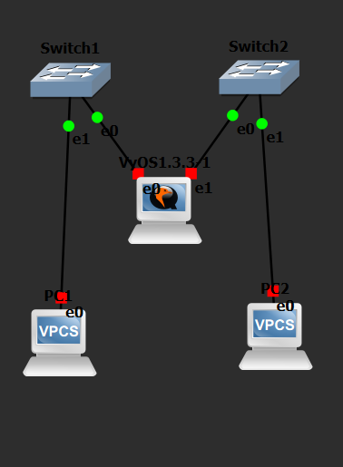{#fig-04-017 width=95%}

## PC1 получил 10

PC1 получил 10.10.1.98/27 со шлюзом 10.10.1.97 и IPv6 2001:db8:1:1::a/64. Адрес находится внутри рассчитанного диапазона .97–.126.

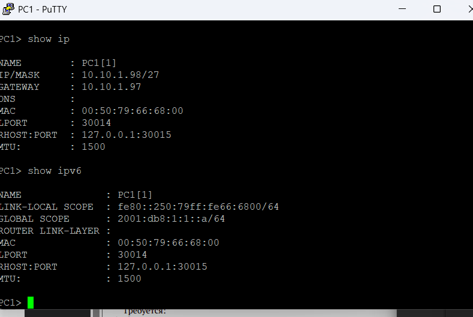{#fig-04-018 width=95%}

## PC2 настроен как 10

PC2 настроен как 10.10.1.18/28 со шлюзом 10.10.1.17 и адресом 2001:db8:1:4::a/64. Значения соответствуют второй подсети с broadcast 10.10.1.31.

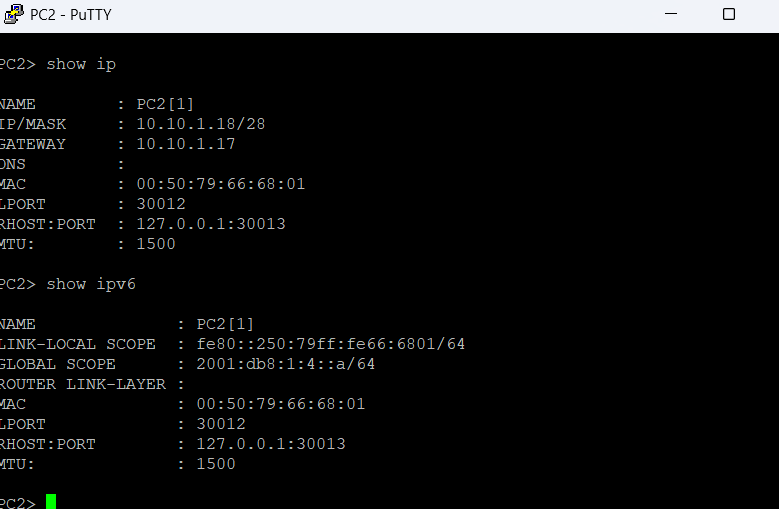{#fig-04-019 width=95%}

## Команда compare в VyOS показывает адреса шлюзов 10

Команда compare в VyOS показывает адреса шлюзов 10.10.1.97/27 и 10.10.1.17/28 вместе с двумя IPv6-префиксами. Все изменения собраны в одном наборе до commit.

{#fig-04-020 width=95%}

## После commit/save show interfaces подтверждает адреса на eth0 и eth1 и их состояние up

После commit/save show interfaces подтверждает адреса на eth0 и eth1 и их состояние up. Итоговый вывод связывает каждый пользовательский сегмент со своим шлюзом.

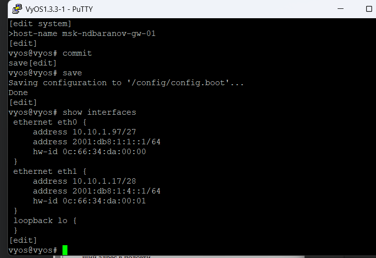{#fig-04-021 width=95%}

# Выводы

Цель работы достигнута. Распределить адресное пространство и настроить маршрутизацию IPv4/IPv6 между локальными подсетями Полученные результаты подтверждают работоспособность собранной схемы и корректность выполненной настройки.
