---
author:
  name: Баранов Никита Дмитриевич
  email: 1132242977@rudn.ru
  affiliation:
    - name: Российский университет дружбы народов им. Патриса Лумумбы
      city: Москва
      country: Российская Федерация
title: "Лабораторная работа № 5"
subtitle: "Динамическая конфигурация IPv4 и IPv6"
license: CC BY
date: today
date-format: "YYYY-MM-DD"
---

# Информация

## Докладчик

:::::::::::::: {.columns align=center}
::: {.column width="70%"}

- Баранов Никита Дмитриевич
- Студент РУДН
- [1132242977@rudn.ru](mailto:1132242977@rudn.ru)

:::
::: {.column width="30%"}

:::
::::::::::::::

# Цель и задачи

## Цель работы

- Получить навыки настройки DHCPv4 и SLAAC/DHCPv6 на сетевом оборудовании.

## Основные этапы

- Создан отдельный сегмент с клиентом и маршрутизатором VyOS.
- На VyOS настроен пул DHCPv4, шлюз 10.0.0.1, DNS и домен ndbaranov.net.
- Статистика и таблица аренд показывают выдачу клиенту адреса 10.0.0.2.
- Wireshark фиксирует последовательность Discover, Offer, Request, ACK.
- Для IPv6 включены router-advert и stateless DHCPv6.
- Клиенты получили глобальные IPv6-адреса и маршрут по умолчанию; связность проверена ping6.
- Поля ICMPv6 Router Solicitation/Advertisement и DHCPv6 рассмотрены в захвате.

# Ход работы

## На схеме PC1 соединён через коммутатор с маршрутизатором VyOS

- DHCPv4 проверяется в отдельном сегменте с одним клиентом.

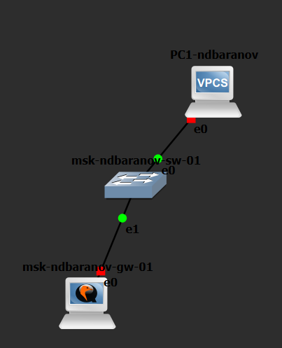{width=88%}

## В VyOS выполнен вход под рабочей учётной записью, удалён стандартный пользователь vyos и сохранена конфигурация

- На экране показан результат соответствующего этапа настройки.

{width=88%}

## Команды show dhcp server statistics и show dhcp server leases сначала показывают доступный пул и отсутствие активных аренд

- До запроса клиента список аренд пуст, а пул сервера полностью свободен.

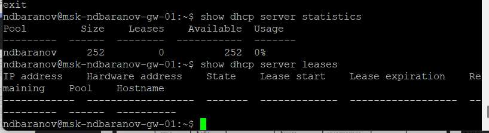{width=88%}

## В консоли PC1 видна расшифровка полученного DHCP-предложения: клиентский адрес 10

- На экране показан результат соответствующего этапа настройки.

{width=88%}

## После сохранения параметров show ip на PC1 выводит 10

- PC1 получил 10.0.0.2/24 и успешно достиг шлюза.

{width=88%}

## Повторная проверка сервера показывает одну активную аренду: адресу 10

- На экране показан результат соответствующего этапа настройки.

{width=88%}

## В системном журнале VyOS прослеживаются сообщения dhcpd о DHCPOFFER, DHCPREQUEST и DHCPACK для 10

- На экране показан результат соответствующего этапа настройки.

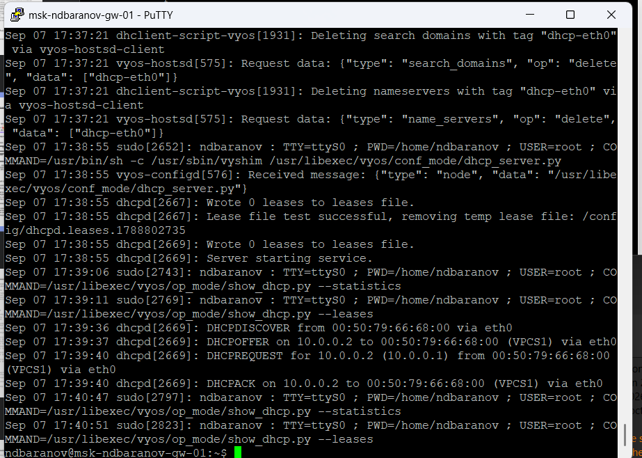{width=88%}

## Wireshark показывает широковещательные DHCP-пакеты между 0

- В захвате прослеживается полный обмен DORA.

{width=88%}

## Для IPv6 построена расширенная схема с клиентами Alpine Linux, VPCS и двумя коммутаторами

- На экране показан результат соответствующего этапа настройки.

{width=88%}

## В show interfaces VyOS одновременно видны IPv4 10

- IPv6 и IPv4 одновременно активны на интерфейсах VyOS.

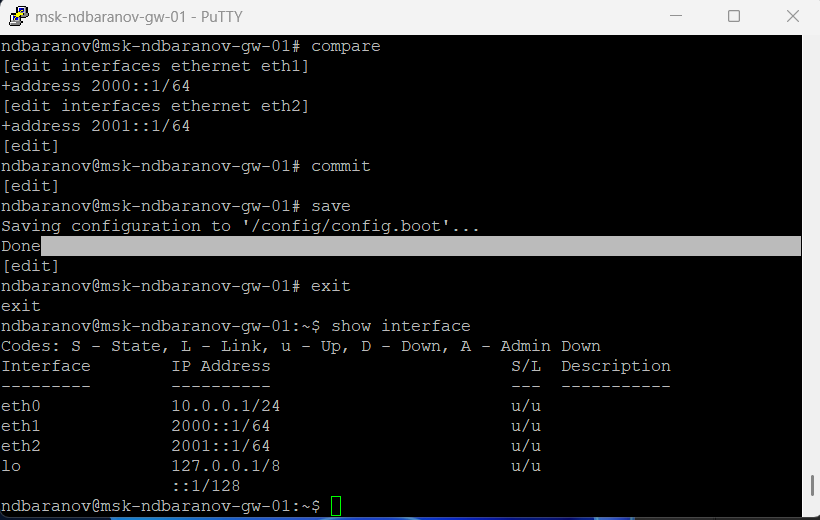{width=88%}

## В конфигурации сервиса включён stateless DHCPv6 для подсети 2000::/64, указан DNS 2000::1 и домен ndbaranov

- На экране показан результат соответствующего этапа настройки.

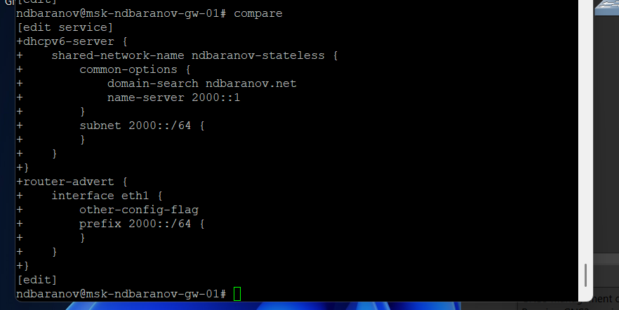{width=88%}

## На Alpine-2 команда ip address показывает глобальный адрес 2000::/64, а ip -6 route — маршрут по умолчанию через link-local адрес маршрутизатора

- Alpine получил префикс и default route через Router Advertisement.

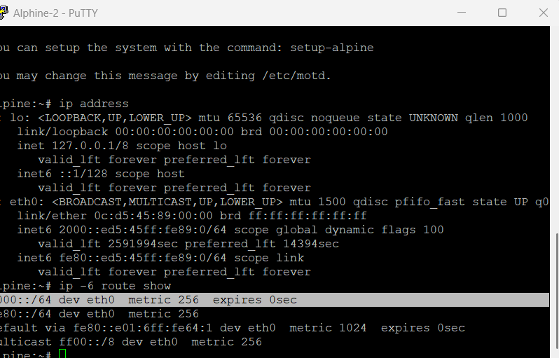{width=88%}

## С Alpine-2 выполнены ping6 до адреса маршрутизатора 2000::1 и соседнего узла

- На экране показан результат соответствующего этапа настройки.

{width=88%}

## Команда cat /etc/resolv

- Stateless DHCPv6 не создаёт адресную аренду на сервере.

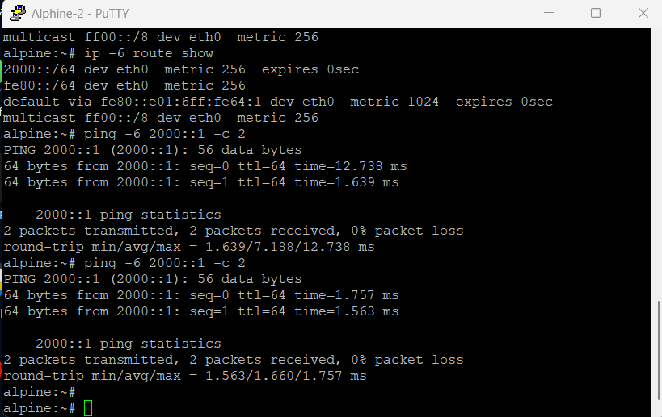{width=88%}

## На VyOS таблица DHCPv6 leases не содержит stateful-аренд, что согласуется с выбранным stateless режимом: адрес формируется через SLAAC, а сервер передаёт дополнительные параметры

- На экране показан результат соответствующего этапа настройки.

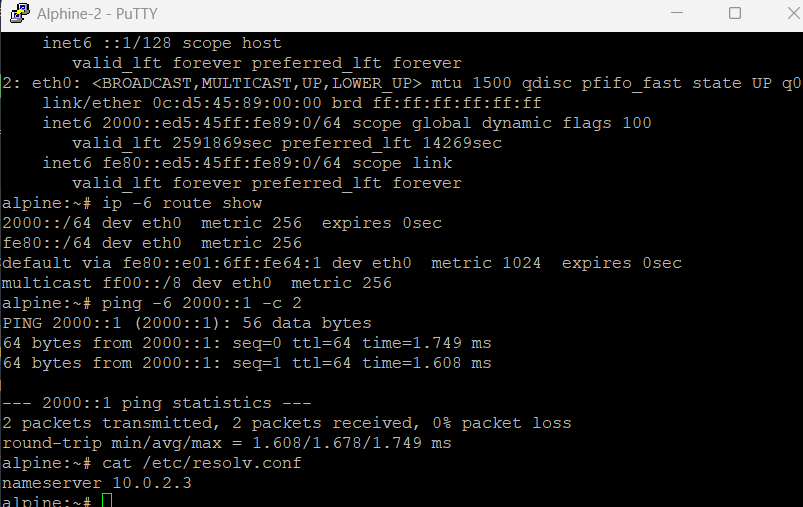{width=88%}

## На следующем Alpine-интерфейсе виден автоматически сформированный глобальный IPv6-адрес и link-local адрес

- На экране показан результат соответствующего этапа настройки.

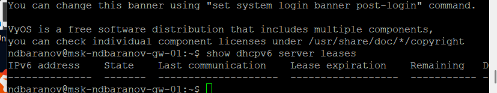{width=88%}

## Окно клиента фиксирует многократную попытку DHCPv6-обнаружения при отсутствии отдельной stateful-аренды

- Router Solicitation и Advertisement показаны в Wireshark.

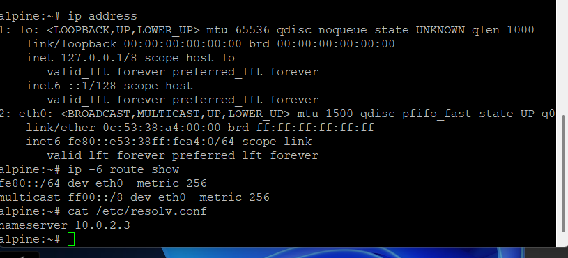{width=88%}

## В Wireshark выделены ICMPv6 Router Solicitation и Router Advertisement, а также Neighbor Solicitation/Advertisement

- На экране показан результат соответствующего этапа настройки.

{width=88%}

## В следующем фрагменте захвата раскрыт обмен DHCPv6 после объявления префикса

- ICMPv6 и DHCPv6 расположены в порядке фактического обмена.

{width=88%}

## Фильтр Wireshark объединяет ICMPv6 и DHCPv6 и показывает их порядок во времени

- На экране показан результат соответствующего этапа настройки.

{width=88%}

## Финальный захват содержит серию DHCPv6-сообщений с идентификаторами транзакций

- Финальные DHCPv6-пакеты различаются идентификаторами транзакций.

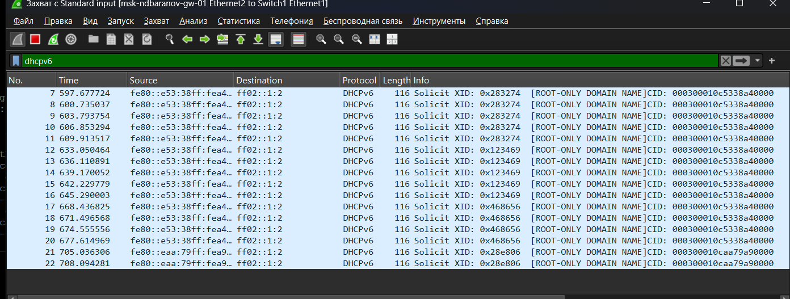{width=88%}

# Результаты

## Итоги работы

- Цель работы достигнута. Получить навыки настройки DHCPv4 и SLAAC/DHCPv6 на сетевом оборудовании Полученные результаты подтверждают работоспособность собранной схемы и корректность выполненной настройки.

## Спасибо за внимание
