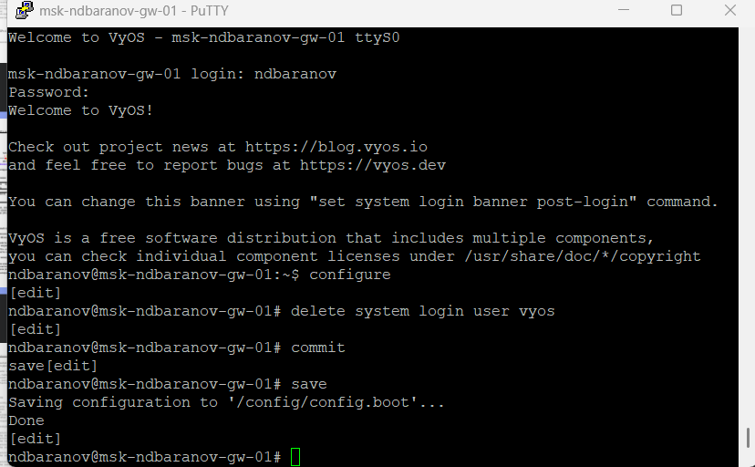
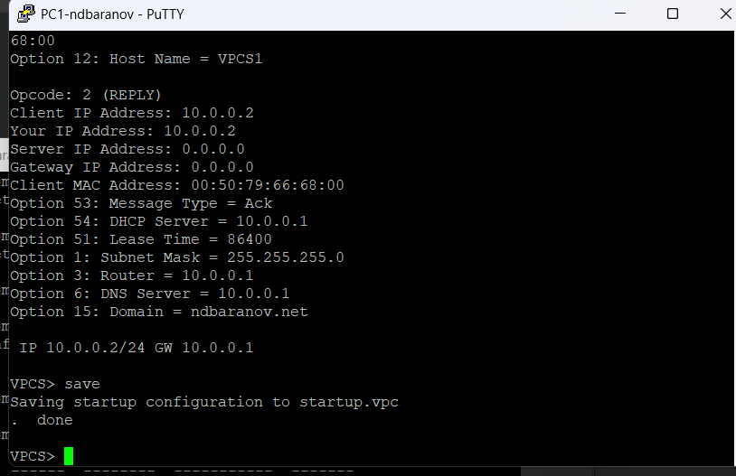
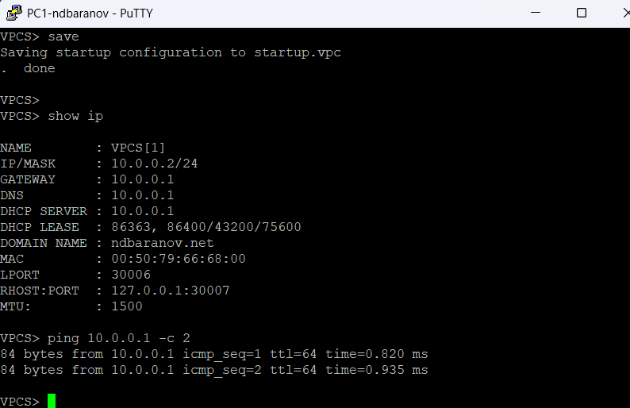
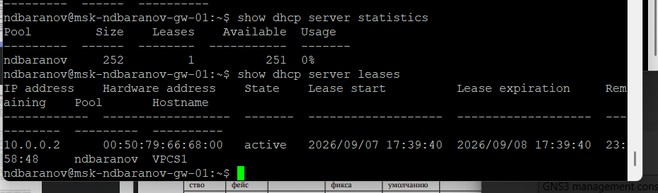
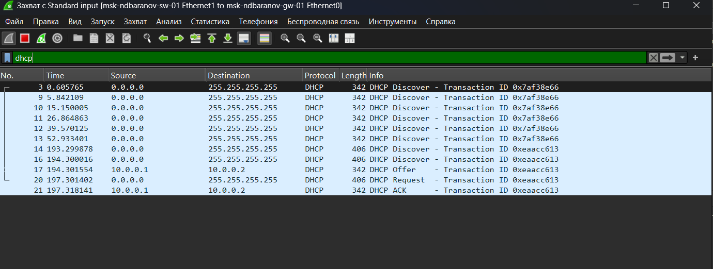
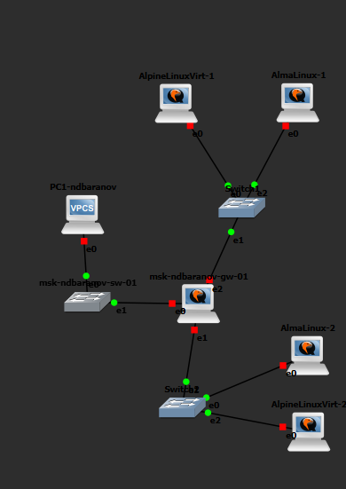
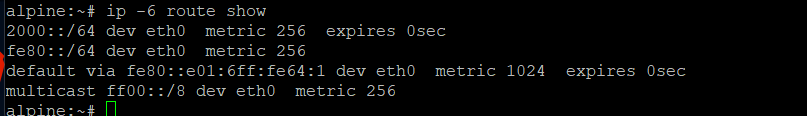
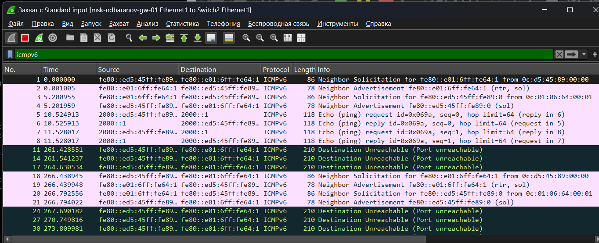
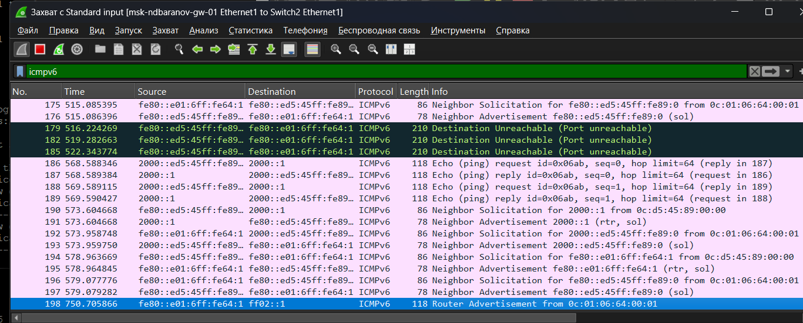
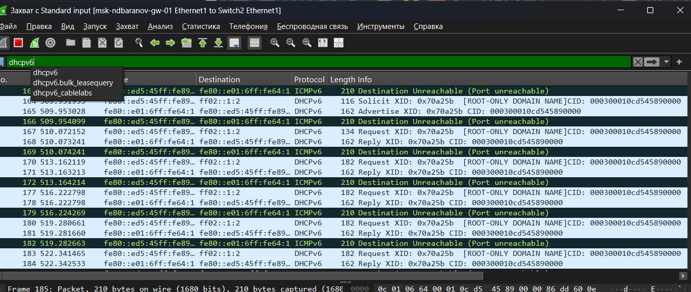

---
author:
  name: Баранов Никита Дмитриевич
  email: 1132242977@rudn.ru
  affiliation:
    - name: Российский университет дружбы народов им. Патриса Лумумбы
      city: Москва
      country: Российская Федерация
title: "Отчёт по лабораторной работе № 5"
subtitle: "Динамическая конфигурация IPv4 и IPv6"
license: CC BY
date: today
date-format: "YYYY-MM-DD"
---

# Цель работы

Получить навыки настройки DHCPv4 и SLAAC/DHCPv6 на сетевом оборудовании.

# Задание

1. Создан отдельный сегмент с клиентом и маршрутизатором VyOS.
2. На VyOS настроен пул DHCPv4, шлюз 10.0.0.1, DNS и домен ndbaranov.net.
3. Статистика и таблица аренд показывают выдачу клиенту адреса 10.0.0.2.
4. Wireshark фиксирует последовательность Discover, Offer, Request, ACK.
5. Для IPv6 включены router-advert и stateless DHCPv6.
6. Клиенты получили глобальные IPv6-адреса и маршрут по умолчанию; связность проверена ping6.
7. Поля ICMPv6 Router Solicitation/Advertisement и DHCPv6 рассмотрены в захвате.

# Теоретические сведения

Динамическая маршрутизация позволяет маршрутизаторам обмениваться сведениями о доступных сетях и автоматически перестраивать таблицы маршрутов.

# Выполнение работы

## На схеме PC1 соединён через коммутатор с маршрутизатором VyOS

На схеме PC1 соединён через коммутатор с маршрутизатором VyOS. Один клиентский сегмент специально оставлен простым, чтобы отдельно проследить процедуру выдачи параметров DHCPv4.

{#fig-05-001 width=95%}

## В VyOS выполнен вход под рабочей учётной записью, удалён стандартный пользователь vyos и сохранена конфигурация

В VyOS выполнен вход под рабочей учётной записью, удалён стандартный пользователь vyos и сохранена конфигурация. Приглашение командной строки с именем msk-ndbaranov-gw-01 подтверждает применённый hostname.

{#fig-05-002 width=95%}

## Команды show dhcp server statistics и show dhcp server leases сначала показывают доступный пул и отсутствие активных аренд

Команды show dhcp server statistics и show dhcp server leases сначала показывают доступный пул и отсутствие активных аренд. Это исходное состояние сервера до запроса клиента.

{#fig-05-003 width=95%}

## В консоли PC1 видна расшифровка полученного DHCP-предложения: клиентский адрес 10

В консоли PC1 видна расшифровка полученного DHCP-предложения: клиентский адрес 10.0.0.2, шлюз и DHCP-сервер 10.0.0.1, маска /24, DNS 10.0.0.1 и домен ndbaranov.net.

{#fig-05-004 width=95%}

## После сохранения параметров show ip на PC1 выводит 10

После сохранения параметров show ip на PC1 выводит 10.0.0.2/24 и сведения об аренде. Ниже успешный ping 10.0.0.1 подтверждает, что автоматически выданный шлюз доступен.

{#fig-05-005 width=95%}

## Повторная проверка сервера показывает одну активную аренду: адресу 10

Повторная проверка сервера показывает одну активную аренду: адресу 10.0.0.2 сопоставлены MAC клиента и имя VPCS1. В таблице также указаны начало и окончание срока аренды.

{#fig-05-006 width=95%}

## В системном журнале VyOS прослеживаются сообщения dhcpd о DHCPOFFER, DHCPREQUEST и DHCPACK для 10

В системном журнале VyOS прослеживаются сообщения dhcpd о DHCPOFFER, DHCPREQUEST и DHCPACK для 10.0.0.2. Сервер обработал полный обмен и записал аренду в служебный файл.

{#fig-05-007 width=95%}

## Wireshark показывает широковещательные DHCP-пакеты между 0

Wireshark показывает широковещательные DHCP-пакеты между 0.0.0.0 и 255.255.255.255. Последовательность сообщений соответствует Discover, Offer, Request и ACK.

{#fig-05-008 width=95%}

## Для IPv6 построена расширенная схема с клиентами Alpine Linux, VPCS и двумя коммутаторами

Для IPv6 построена расширенная схема с клиентами Alpine Linux, VPCS и двумя коммутаторами. Узлы подключены к маршрутизатору, который будет рассылать префиксы и дополнительные параметры.

{#fig-05-009 width=95%}

## В show interfaces VyOS одновременно видны IPv4 10

В show interfaces VyOS одновременно видны IPv4 10.0.0.1/24 и IPv6-префиксы на задействованных портах. Состояние u/u означает, что интерфейсы физически и административно подняты.

{#fig-05-010 width=95%}

## В конфигурации сервиса включён stateless DHCPv6 для подсети 2000::/64, указан DNS 2000::1 и домен ndbaranov

В конфигурации сервиса включён stateless DHCPv6 для подсети 2000::/64, указан DNS 2000::1 и домен ndbaranov.net. На eth1 также настроена рассылка Router Advertisement с тем же префиксом.

{#fig-05-011 width=95%}

## На Alpine-2 команда ip address показывает глобальный адрес 2000::/64, а ip -6 route — маршрут по умолчанию через link-local адрес маршрутизатора

На Alpine-2 команда ip address показывает глобальный адрес 2000::/64, а ip -6 route — маршрут по умолчанию через link-local адрес маршрутизатора. Значит, SLAAC и RA обработаны клиентом.

{#fig-05-012 width=95%}

## С Alpine-2 выполнены ping6 до адреса маршрутизатора 2000::1 и соседнего узла

С Alpine-2 выполнены ping6 до адреса маршрутизатора 2000::1 и соседнего узла. В обоих случаях приняты ответы без потерь, поэтому локальная IPv6-связность подтверждена.

{#fig-05-013 width=95%}

## Команда cat /etc/resolv

Команда cat /etc/resolv.conf показывает DNS 10.0.2.3, полученный средой клиента. Рядом в таблице маршрутов присутствуют on-link префикс и default route через маршрутизатор.

{#fig-05-014 width=95%}

## На VyOS таблица DHCPv6 leases не содержит stateful-аренд, что согласуется с выбранным stateless режимом: адрес формируется через SLAAC, а сервер передаёт дополнительные параметры

На VyOS таблица DHCPv6 leases не содержит stateful-аренд, что согласуется с выбранным stateless режимом: адрес формируется через SLAAC, а сервер передаёт дополнительные параметры.

{#fig-05-015 width=95%}

## На следующем Alpine-интерфейсе виден автоматически сформированный глобальный IPv6-адрес и link-local адрес

На следующем Alpine-интерфейсе виден автоматически сформированный глобальный IPv6-адрес и link-local адрес. Параметры интерфейса подтверждают приём объявления маршрутизатора.

{#fig-05-016 width=95%}

## Окно клиента фиксирует многократную попытку DHCPv6-обнаружения при отсутствии отдельной stateful-аренды

Окно клиента фиксирует многократную попытку DHCPv6-обнаружения при отсутствии отдельной stateful-аренды. Этот кадр показывает различие между адресом SLAAC и запросом дополнительных DHCPv6-параметров.

{#fig-05-017 width=95%}

## В Wireshark выделены ICMPv6 Router Solicitation и Router Advertisement, а также Neighbor Solicitation/Advertisement

В Wireshark выделены ICMPv6 Router Solicitation и Router Advertisement, а также Neighbor Solicitation/Advertisement. Эти сообщения обеспечивают обнаружение маршрутизатора и соседей.

{#fig-05-018 width=95%}

## В следующем фрагменте захвата раскрыт обмен DHCPv6 после объявления префикса

В следующем фрагменте захвата раскрыт обмен DHCPv6 после объявления префикса. По адресам ff02::1:2 и UDP-полям можно отличить DHCPv6 от служебных сообщений NDP.

{#fig-05-019 width=95%}

## Фильтр Wireshark объединяет ICMPv6 и DHCPv6 и показывает их порядок во времени

Фильтр Wireshark объединяет ICMPv6 и DHCPv6 и показывает их порядок во времени. Сначала клиент обнаруживает сеть, затем получает префикс и обращается за дополнительными параметрами.

{#fig-05-020 width=95%}

## Финальный захват содержит серию DHCPv6-сообщений с идентификаторами транзакций

Финальный захват содержит серию DHCPv6-сообщений с идентификаторами транзакций. Он используется для проверки того, что запросы разных клиентов различаются и корректно декодируются.

{#fig-05-021 width=95%}

# Выводы

Цель работы достигнута. Получить навыки настройки DHCPv4 и SLAAC/DHCPv6 на сетевом оборудовании Полученные результаты подтверждают работоспособность собранной схемы и корректность выполненной настройки.
