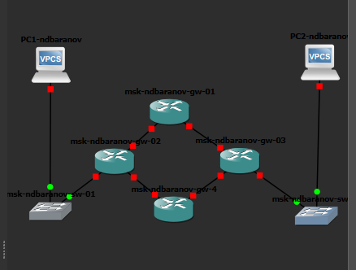
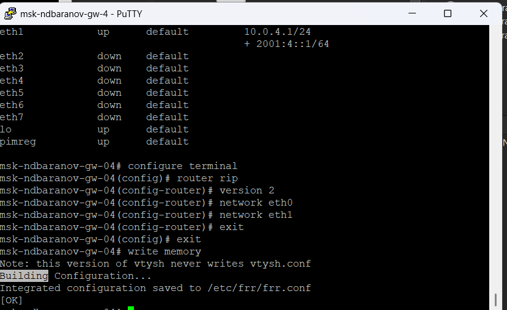
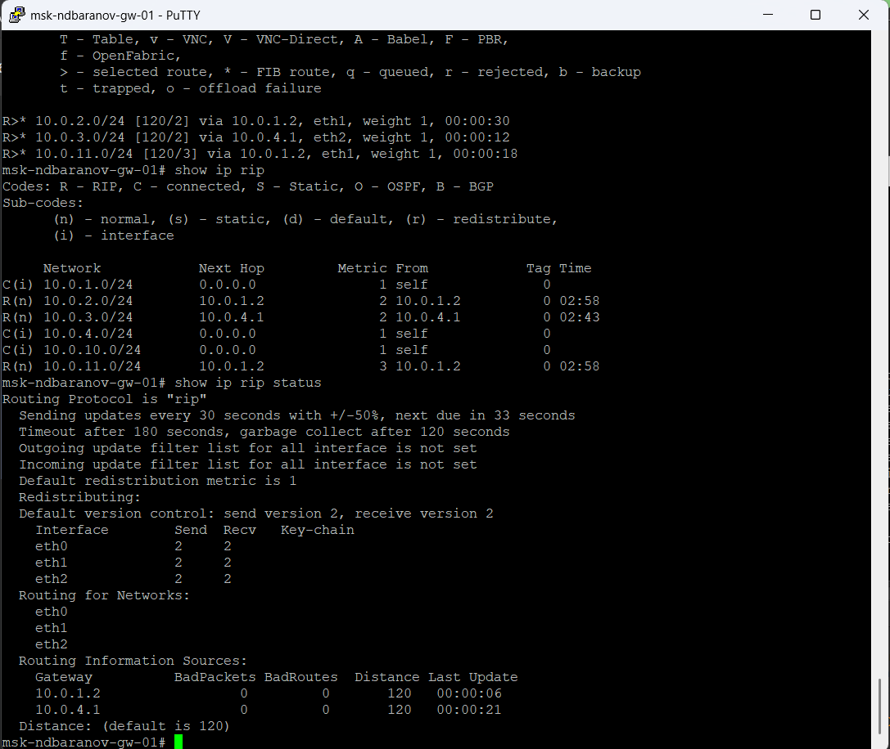
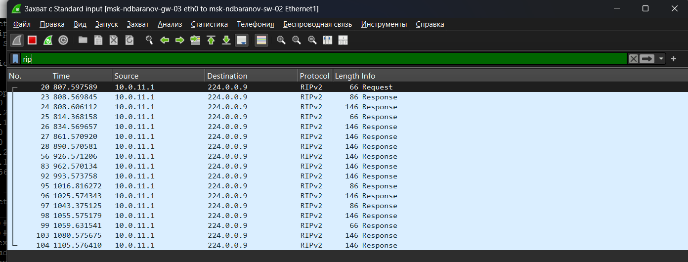
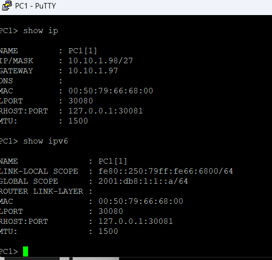
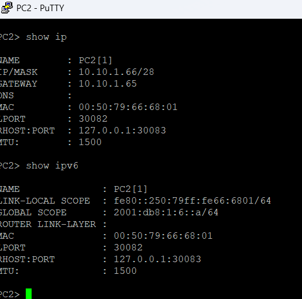
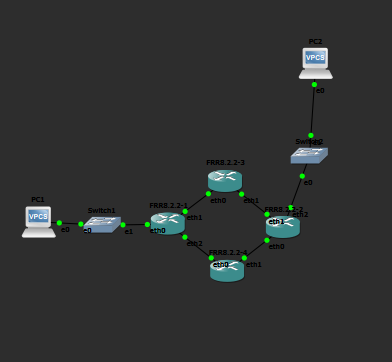
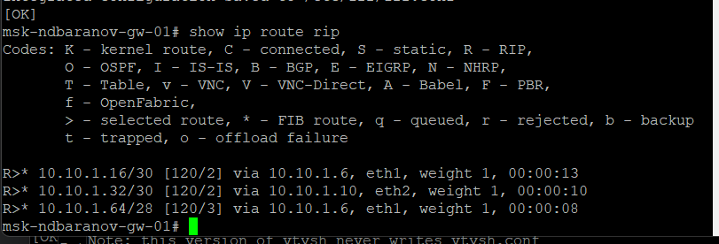

---
author:
  name: Баранов Никита Дмитриевич
  email: 1132242977@rudn.ru
  affiliation:
    - name: Российский университет дружбы народов им. Патриса Лумумбы
      city: Москва
      country: Российская Федерация
title: "Лабораторная работа № 6"
subtitle: "Динамическая маршрутизация RIP"
license: CC BY
date: today
date-format: "YYYY-MM-DD"
---

# Информация

## Докладчик

:::::::::::::: {.columns align=center}
::: {.column width="70%"}

- Баранов Никита Дмитриевич
- Студент РУДН
- [1132242977@rudn.ru](mailto:1132242977@rudn.ru)

:::
::: {.column width="30%"}

:::
::::::::::::::

# Цель и задачи

## Цель работы

- Изучить RIP/RIPng и настроить обмен маршрутами в сетях IPv4 и IPv6.

## Основные этапы

- Собрана многомаршрутизаторная топология и составлен план адресации.
- Интерфейсам четырёх маршрутизаторов назначены адреса транзитных и пользовательских сетей.
- На маршрутизаторах FRR включён router rip version 2 и объявлены подключённые интерфейсы.
- Таблица show ip route rip содержит сети, полученные от соседей.
- В Wireshark исследованы RIPv2 Response на 224.0.0.9.
- Для IPv6 включён RIPng, изучены маршруты и multicast ff02::9.
- Самостоятельная топология адресована, маршруты распространились, конечная связность проверена.

# Ход работы

## В GNS3 построено кольцо из четырёх маршрутизаторов FRR с двумя конечными сетями

- Кольцо из четырёх FRR соединяет две удалённые локальные сети.

{width=88%}

## На PC1 и PC2 заданы адреса 10

- На экране показан результат соответствующего этапа настройки.

{width=88%}

## На первом FRR интерфейсы получили адреса 10

- Первый маршрутизатор адресован сразу в трёх смежных сетях.

{width=88%}

## Второй маршрутизатор использует 10

- На экране показан результат соответствующего этапа настройки.

{width=88%}

## Четвёртый FRR настроен адресами 10

- На экране показан результат соответствующего этапа настройки.

{width=88%}

## На третьем маршрутизаторе видны сети 10

- Третий FRR связывает транзитные каналы с конечным сегментом.

{width=88%}

## Для двух VPCS дополнительно заданы IPv6-адреса 2001:db8:10::a/64 и 2001:db8:11::a/64

- На экране показан результат соответствующего этапа настройки.

{width=88%}

## На FRR-4 в краткой таблице одновременно показаны IPv4 и IPv6 на транзитных интерфейсах

- IPv4/IPv6-адреса транзитных портов видны в одной таблице.

{width=88%}

## В конфигурации FRR включён router rip version 2 и объявлены eth0 и eth1

- На экране показан результат соответствующего этапа настройки.

{width=88%}

## Команда show ip rip выводит локальные сети, соседние шлюзы, таймеры и источники информации

- На экране показан результат соответствующего этапа настройки.

{width=88%}

## Wireshark зарегистрировал RIPv2 Response от маршрутизатора к multicast 224

- RIPv2 периодически рассылает Response на 224.0.0.9.

{width=88%}

## В другом захвате видны ответы RIP от нескольких адресов транзитного сегмента

- На экране показан результат соответствующего этапа настройки.

{width=88%}

## На маршрутизаторе проверена IPv6-таблица и выполнен traceroute до удалённого префикса

- IPv6-маршрут проходит через link-local адреса соседей.

{width=88%}

## Wireshark декодирует RIPng Command Response, отправленный на ff02::9

- На экране показан результат соответствующего этапа настройки.

{width=88%}

## Следующий захват показывает периодические RIPng-ответы на другом соединении кольца

- На экране показан результат соответствующего этапа настройки.

{width=88%}

## Для самостоятельного варианта собрана топология с четырьмя FRR и двумя VPCS, где между частью маршрутизаторов существуют резервные линии

- Самостоятельный стенд содержит основные и резервные пути.

{width=88%}

## PC1 настроен адресами 10

- На экране показан результат соответствующего этапа настройки.

{width=88%}

## PC2 получил 10

- PC2 размещён в 10.10.1.64/28 и 2001:db8:1:6::/64.

{width=88%}

## На первом FRR show interface brief перечисляет пользовательский интерфейс и три транзитных канала с IPv4/IPv6

- На экране показан результат соответствующего этапа настройки.

{width=88%}

## После запуска маршрутизации рабочая схема показана с зелёными соединениями по основным и резервным путям

- На экране показан результат соответствующего этапа настройки.

{width=88%}

## С маршрутизатора выполнены ping удалённых адресов 10

- Удалённые IPv4-узлы доступны через несколько RIP-переходов.

{width=88%}

## Команда show ip route rip содержит удалённые подсети с кодом R, next hop и метрикой

- На экране показан результат соответствующего этапа настройки.

{width=88%}

## В show ipv6 ripng перечислены локальные и полученные IPv6-префиксы, интерфейсы и число переходов

- RIPng установил маршруты к удалённым IPv6-префиксам.

{width=88%}

# Результаты

## Итоги работы

- Цель работы достигнута. Изучить RIP/RIPng и настроить обмен маршрутами в сетях IPv4 и IPv6 Полученные результаты подтверждают работоспособность собранной схемы и корректность выполненной настройки.

## Спасибо за внимание
