---
author:
  name: Баранов Никита Дмитриевич
  email: 1132242977@rudn.ru
  affiliation:
    - name: Российский университет дружбы народов им. Патриса Лумумбы
      city: Москва
      country: Российская Федерация
title: "Отчёт по лабораторной работе № 6"
subtitle: "Динамическая маршрутизация RIP"
license: CC BY
date: today
date-format: "YYYY-MM-DD"
---

# Цель работы

Изучить RIP/RIPng и настроить обмен маршрутами в сетях IPv4 и IPv6.

# Задание

1. Собрана многомаршрутизаторная топология и составлен план адресации.
2. Интерфейсам четырёх маршрутизаторов назначены адреса транзитных и пользовательских сетей.
3. На маршрутизаторах FRR включён router rip version 2 и объявлены подключённые интерфейсы.
4. Таблица show ip route rip содержит сети, полученные от соседей.
5. В Wireshark исследованы RIPv2 Response на 224.0.0.9.
6. Для IPv6 включён RIPng, изучены маршруты и multicast ff02::9.
7. Самостоятельная топология адресована, маршруты распространились, конечная связность проверена.

# Теоретические сведения

DHCP выдаёт клиентам сетевые параметры. В IPv6 рассылка Router Advertisement сообщает префикс и маршрут, а DHCPv6 может передавать дополнительные параметры.

# Выполнение работы

## В GNS3 построено кольцо из четырёх маршрутизаторов FRR с двумя конечными сетями

В GNS3 построено кольцо из четырёх маршрутизаторов FRR с двумя конечными сетями. Такая связность даёт несколько направлений распространения RIP-маршрутов.

{#fig-06-001 width=95%}

## На PC1 и PC2 заданы адреса 10

На PC1 и PC2 заданы адреса 10.10.10.10/24 и 10.10.11.10/24 с соответствующими шлюзами. Два окна show ip подтверждают исходные параметры крайних подсетей.

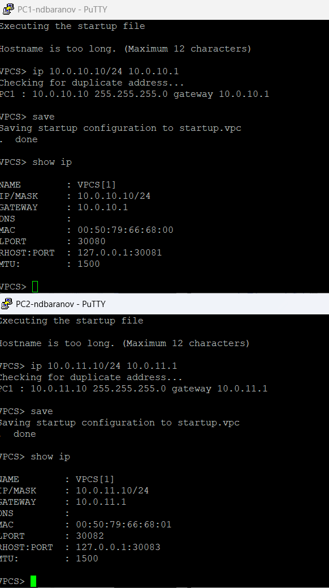{#fig-06-002 width=95%}

## На первом FRR интерфейсы получили адреса 10

На первом FRR интерфейсы получили адреса 10.0.10.1/24, 10.0.1.1/24 и 10.0.4.2/24. Таблица show interface brief показывает все три соединения в состоянии up.

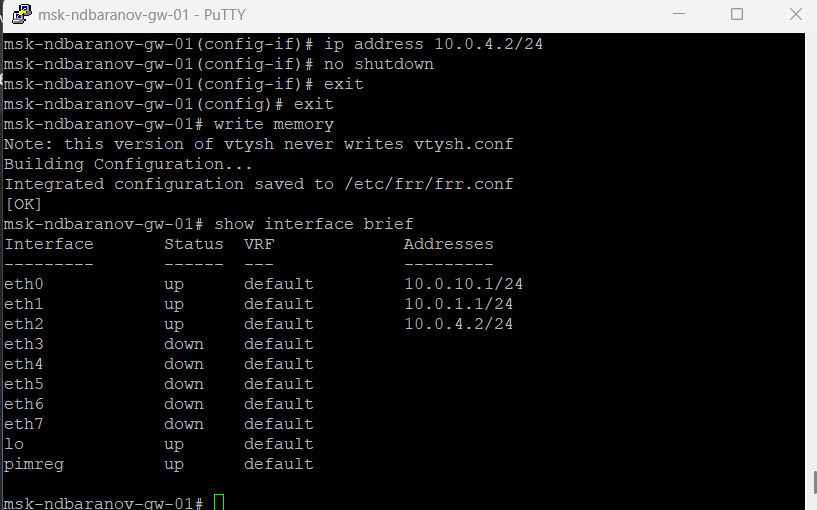{#fig-06-003 width=95%}

## Второй маршрутизатор использует 10

Второй маршрутизатор использует 10.0.1.2/24 и 10.0.2.1/24 на транзитных линиях. Сохранённый вывод фиксирует непрерывность адресного плана между соседями.

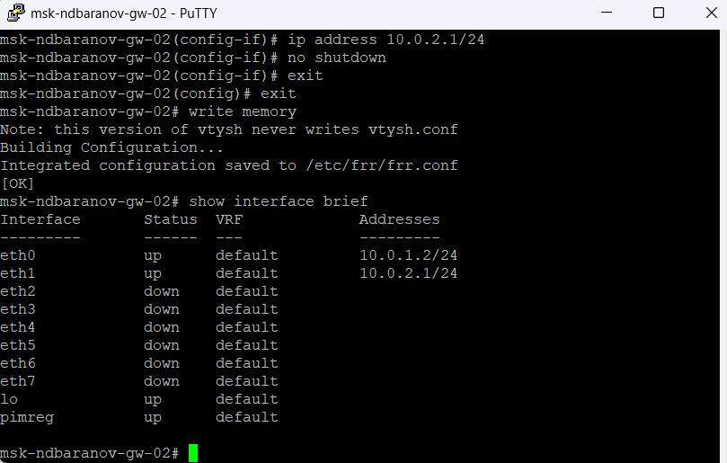{#fig-06-004 width=95%}

## Четвёртый FRR настроен адресами 10

Четвёртый FRR настроен адресами 10.0.3.2/24 и 10.0.4.1/24. Оба интерфейса подняты, поэтому нижняя ветвь кольца готова к обмену маршрутами.

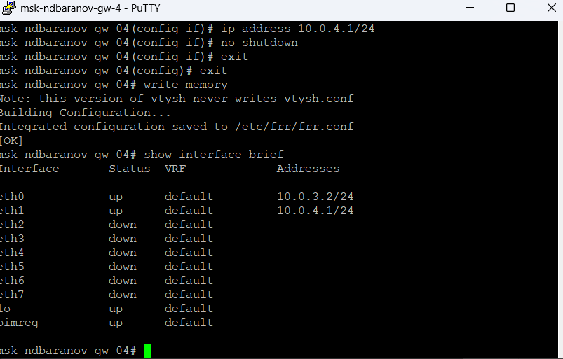{#fig-06-005 width=95%}

## На третьем маршрутизаторе видны сети 10

На третьем маршрутизаторе видны сети 10.0.2.2/24, 10.0.3.1/24 и пользовательский сегмент. Это узел, через который RIP достигает второй конечной сети.

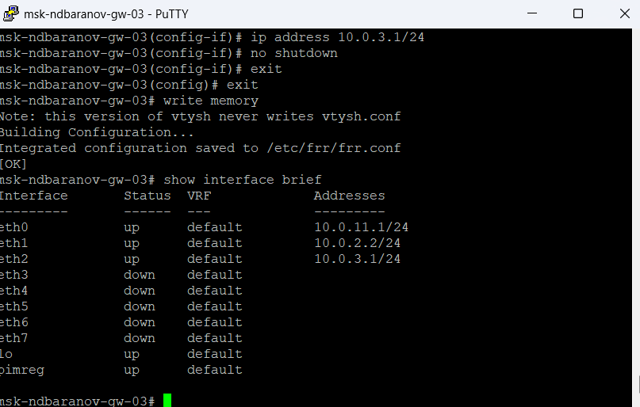{#fig-06-006 width=95%}

## Для двух VPCS дополнительно заданы IPv6-адреса 2001:db8:10::a/64 и 2001:db8:11::a/64

Для двух VPCS дополнительно заданы IPv6-адреса 2001:db8:10::a/64 и 2001:db8:11::a/64. Команда show ipv6 позволяет сверить глобальные и link-local адреса.

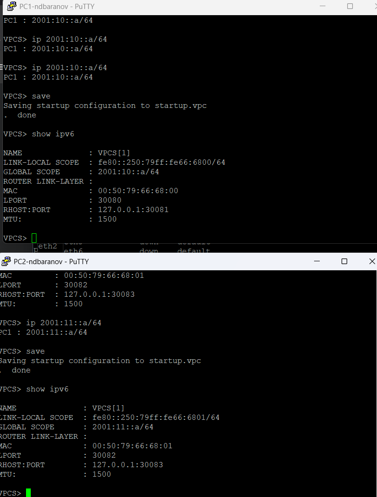{#fig-06-007 width=95%}

## На FRR-4 в краткой таблице одновременно показаны IPv4 и IPv6 на транзитных интерфейсах

На FRR-4 в краткой таблице одновременно показаны IPv4 и IPv6 на транзитных интерфейсах. Этот вывод проверяет готовность устройства к запуску RIP и RIPng.

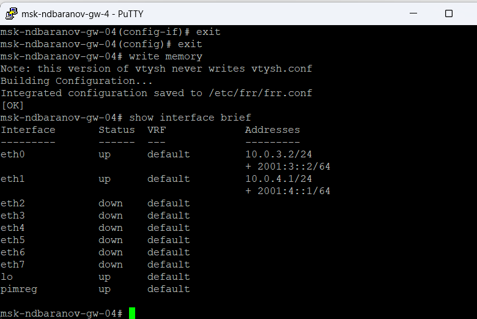{#fig-06-008 width=95%}

## В конфигурации FRR включён router rip version 2 и объявлены eth0 и eth1

В конфигурации FRR включён router rip version 2 и объявлены eth0 и eth1. Команда write memory сохраняет процесс маршрутизации и список участвующих интерфейсов.

{#fig-06-009 width=95%}

## Команда show ip rip выводит локальные сети, соседние шлюзы, таймеры и источники информации

Команда show ip rip выводит локальные сети, соседние шлюзы, таймеры и источники информации. Таблица демонстрирует, какие записи процесс RIP уже распространяет.

{#fig-06-010 width=95%}

## Wireshark зарегистрировал RIPv2 Response от маршрутизатора к multicast 224

Wireshark зарегистрировал RIPv2 Response от маршрутизатора к multicast 224.0.0.9. Повторяющиеся пакеты отражают периодическую рассылку таблицы маршрутов.

{#fig-06-011 width=95%}

## В другом захвате видны ответы RIP от нескольких адресов транзитного сегмента

В другом захвате видны ответы RIP от нескольких адресов транзитного сегмента. Это подтверждает двусторонний обмен объявлениями между соседними FRR.

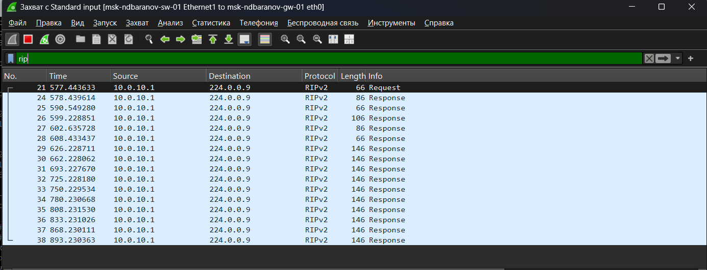{#fig-06-012 width=95%}

## На маршрутизаторе проверена IPv6-таблица и выполнен traceroute до удалённого префикса

На маршрутизаторе проверена IPv6-таблица и выполнен traceroute до удалённого префикса. В выводе отображаются промежуточные link-local адреса следующего перехода.

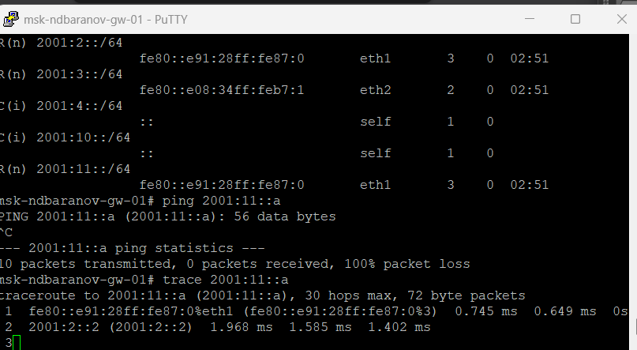{#fig-06-013 width=95%}

## Wireshark декодирует RIPng Command Response, отправленный на ff02::9

Wireshark декодирует RIPng Command Response, отправленный на ff02::9. Поля пакета содержат IPv6-префиксы и метрики, полученные от соседнего маршрутизатора.

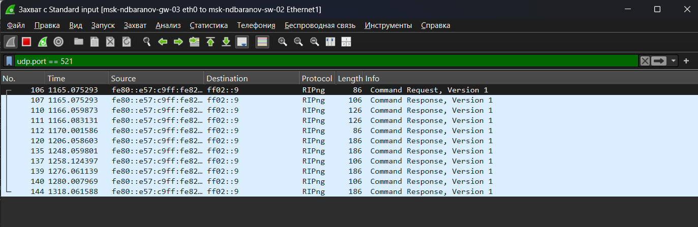{#fig-06-014 width=95%}

## Следующий захват показывает периодические RIPng-ответы на другом соединении кольца

Следующий захват показывает периодические RIPng-ответы на другом соединении кольца. Сравнение источников позволяет увидеть распространение маршрутов по топологии.

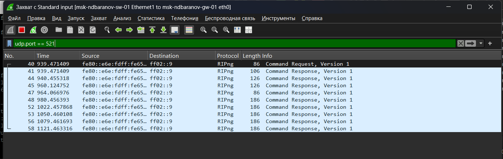{#fig-06-015 width=95%}

## Для самостоятельного варианта собрана топология с четырьмя FRR и двумя VPCS, где между частью маршрутизаторов существуют резервные линии

Для самостоятельного варианта собрана топология с четырьмя FRR и двумя VPCS, где между частью маршрутизаторов существуют резервные линии. Все активные соединения отмечены зелёным.

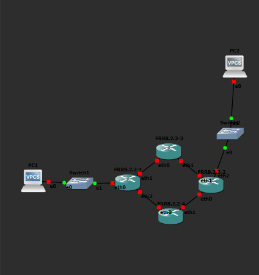{#fig-06-016 width=95%}

## PC1 настроен адресами 10

PC1 настроен адресами 10.10.1.98/27 и 2001:db8:1:1::a/64 со шлюзом 10.10.1.97. Параметры соответствуют первой пользовательской подсети варианта.

{#fig-06-017 width=95%}

## PC2 получил 10

PC2 получил 10.10.1.66/28 и 2001:db8:1:6::a/64 со шлюзом 10.10.1.65. Так конечные узлы находятся в разных IPv4- и IPv6-сегментах.

{#fig-06-018 width=95%}

## На первом FRR show interface brief перечисляет пользовательский интерфейс и три транзитных канала с IPv4/IPv6

На первом FRR show interface brief перечисляет пользовательский интерфейс и три транзитных канала с IPv4/IPv6. Все задействованные порты находятся в состоянии up.

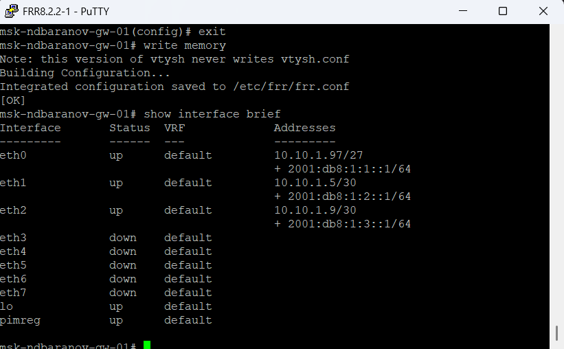{#fig-06-019 width=95%}

## После запуска маршрутизации рабочая схема показана с зелёными соединениями по основным и резервным путям

После запуска маршрутизации рабочая схема показана с зелёными соединениями по основным и резервным путям. Это итоговое состояние стенда перед проверкой доступности.

{#fig-06-020 width=95%}

## С маршрутизатора выполнены ping удалённых адресов 10

С маршрутизатора выполнены ping удалённых адресов 10.10.1.66 и 10.10.1.10; ответы приходят без потерь. Таким способом проверено прохождение IPv4 через несколько RIP-узлов.

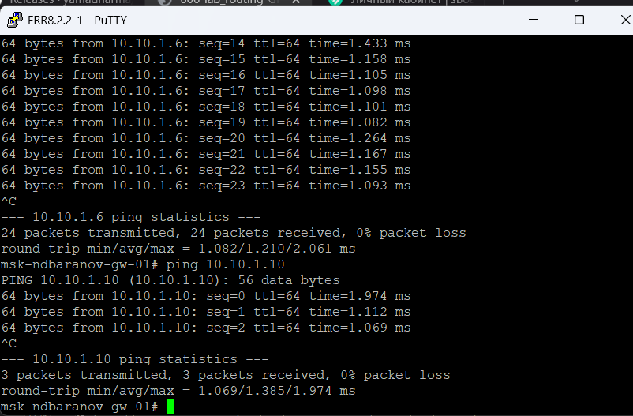{#fig-06-021 width=95%}

## Команда show ip route rip содержит удалённые подсети с кодом R, next hop и метрикой

Команда show ip route rip содержит удалённые подсети с кодом R, next hop и метрикой. Несколько путей отражают выбранные RIP-направления через транзитные сети.

{#fig-06-022 width=95%}

## В show ipv6 ripng перечислены локальные и полученные IPv6-префиксы, интерфейсы и число переходов

В show ipv6 ripng перечислены локальные и полученные IPv6-префиксы, интерфейсы и число переходов. Таблица подтверждает распространение маршрутов RIPng до крайних сегментов.

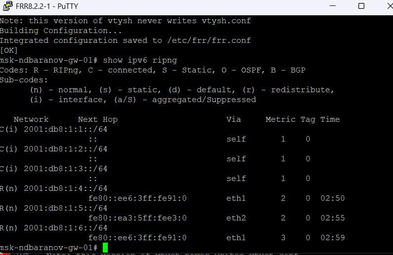{#fig-06-023 width=95%}

# Выводы

Цель работы достигнута. Изучить RIP/RIPng и настроить обмен маршрутами в сетях IPv4 и IPv6 Полученные результаты подтверждают работоспособность собранной схемы и корректность выполненной настройки.
