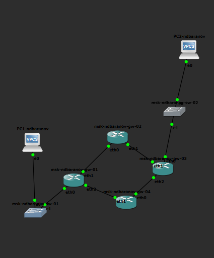
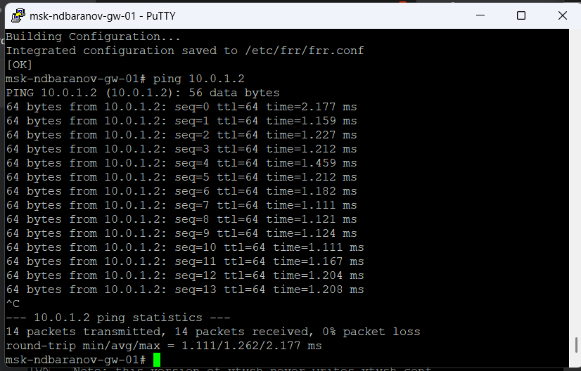
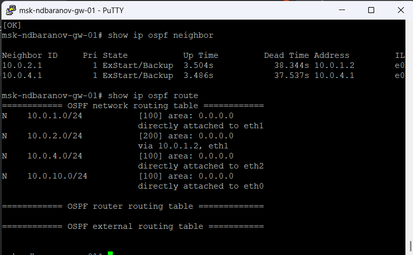
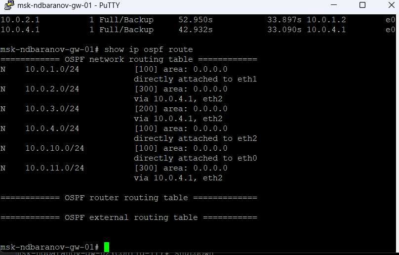
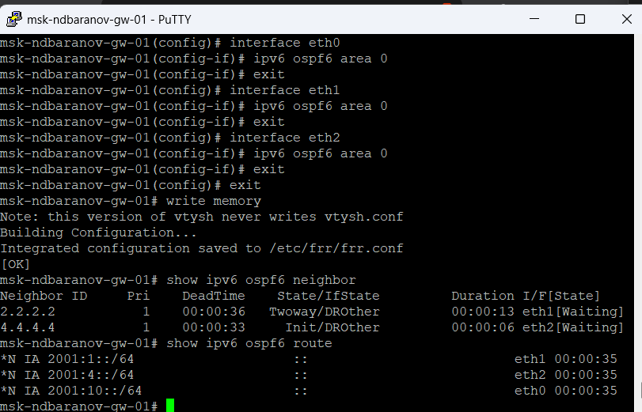

---
author:
  name: Баранов Никита Дмитриевич
  email: 1132242977@rudn.ru
  affiliation:
    - name: Российский университет дружбы народов им. Патриса Лумумбы
      city: Москва
      country: Российская Федерация
title: "Лабораторная работа № 7"
subtitle: "Динамическая маршрутизация OSPF"
license: CC BY
date: today
date-format: "YYYY-MM-DD"
---

# Информация

## Докладчик

:::::::::::::: {.columns align=center}
::: {.column width="70%"}

- Баранов Никита Дмитриевич
- Студент РУДН
- [1132242977@rudn.ru](mailto:1132242977@rudn.ru)

:::
::: {.column width="30%"}

:::
::::::::::::::

# Цель и задачи

## Цель работы

- Изучить OSPFv2/OSPFv3 и настроить динамическую маршрутизацию IPv4/IPv6.

## Основные этапы

- Собрана топология с несколькими маршрутизаторами и двумя пользовательскими сетями.
- Интерфейсы включены в OSPF area 0.
- Команда show ip ospf neighbor подтверждает соседство Full.
- В таблице OSPF присутствуют удалённые сети и рассчитанные метрики.
- Для IPv6 сформированы соседства OSPFv3 и получены межсетевые маршруты.
- Wireshark показывает Hello-пакеты OSPF на multicast-адреса.
- Проверена связность конечных узлов по обоим протоколам.

# Ход работы

## В GNS3 собрана многоузловая схема OSPF с четырьмя маршрутизаторами и двумя конечными сетями

- Стенд OSPF включает резервную связность между четырьмя FRR.

{width=88%}

## С первого маршрутизатора выполнен ping соседнего адреса 10

- Прямое соседство 10.0.1.1—10.0.1.2 проверено ping.

{width=88%}

## На другом FRR успешный ping 10

- Вторая транзитная линия также отвечает без потерь.

{width=88%}

## Команда show ip ospf neighbor показывает соседей 10

- Два соседа перешли в Full, а маршруты появились в OSPF-таблице.

{width=88%}

## Расширенный вывод маршрутов OSPF включает сети 10

- Для удалённых сетей отображаются next hop и стоимость пути.

{width=88%}

## На интерфейсах FRR включён ipv6 ospf6 area 0, после чего show ipv6 ospf6 neighbor отображает соседей в состояниях Twoway/DROther и Init

- OSPFv3 формирует соседства и маршруты для IPv6.

{width=88%}

## Wireshark показывает OSPF Hello для IPv4, отправляемые на 224

- Hello OSPFv2 передаются на multicast 224.0.0.5.

{width=88%}

## Отдельный захват содержит Hello-пакеты OSPFv3 к ff02::5

- OSPFv3 Hello используют ff02::5 и link-local источники.

{width=88%}

# Результаты

## Итоги работы

- Цель работы достигнута. Изучить OSPFv2/OSPFv3 и настроить динамическую маршрутизацию IPv4/IPv6 Полученные результаты подтверждают работоспособность собранной схемы и корректность выполненной настройки.

## Спасибо за внимание
