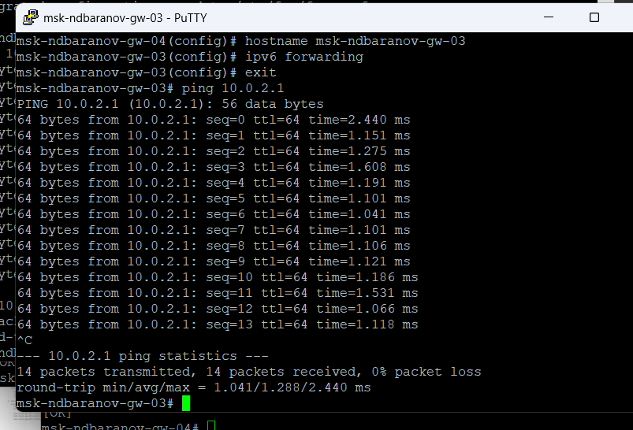
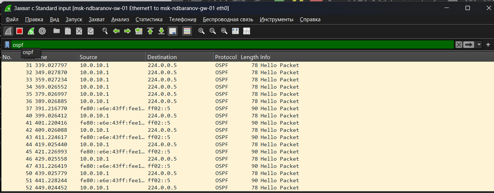
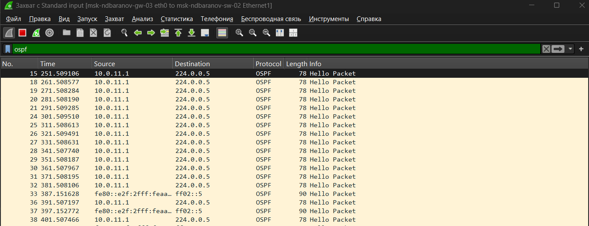

---
author:
  name: Баранов Никита Дмитриевич
  email: 1132242977@rudn.ru
  affiliation:
    - name: Российский университет дружбы народов им. Патриса Лумумбы
      city: Москва
      country: Российская Федерация
title: "Отчёт по лабораторной работе № 7"
subtitle: "Динамическая маршрутизация OSPF"
license: CC BY
date: today
date-format: "YYYY-MM-DD"
---

# Цель работы

Изучить OSPFv2/OSPFv3 и настроить динамическую маршрутизацию IPv4/IPv6.

# Задание

1. Собрана топология с несколькими маршрутизаторами и двумя пользовательскими сетями.
2. Интерфейсы включены в OSPF area 0.
3. Команда show ip ospf neighbor подтверждает соседство Full.
4. В таблице OSPF присутствуют удалённые сети и рассчитанные метрики.
5. Для IPv6 сформированы соседства OSPFv3 и получены межсетевые маршруты.
6. Wireshark показывает Hello-пакеты OSPF на multicast-адреса.
7. Проверена связность конечных узлов по обоим протоколам.

# Теоретические сведения

Ethernet инкапсулирует сетевые пакеты в кадры и адресует узлы по MAC-адресам. ARP связывает IPv4-адрес с MAC-адресом в локальном сегменте.

# Выполнение работы

## В GNS3 собрана многоузловая схема OSPF с четырьмя маршрутизаторами и двумя конечными сетями

В GNS3 собрана многоузловая схема OSPF с четырьмя маршрутизаторами и двумя конечными сетями. Замкнутый фрагмент между маршрутизаторами позволяет протоколу выбрать путь по стоимости.

{#fig-07-001 width=95%}

## С первого маршрутизатора выполнен ping соседнего адреса 10

С первого маршрутизатора выполнен ping соседнего адреса 10.0.1.2; все ответы получены. Это проверяет транзитное соединение до формирования OSPF-соседства.

{#fig-07-002 width=95%}

## На другом FRR успешный ping 10

На другом FRR успешный ping 10.0.2.1 подтверждает следующую транзитную линию. Проверка прямых соседей исключает ошибку адресации как причину проблем OSPF.

{#fig-07-003 width=95%}

## Команда show ip ospf neighbor показывает соседей 10

Команда show ip ospf neighbor показывает соседей 10.0.2.1 и 10.0.4.1 в состоянии Full/Backup. Ниже таблица OSPF содержит подключённые и изученные сети с рассчитанной стоимостью.

{#fig-07-004 width=95%}

## Расширенный вывод маршрутов OSPF включает сети 10

Расширенный вывод маршрутов OSPF включает сети 10.0.1.0/24–10.0.4.0/24 и конечные подсети. Для удалённых записей указаны адрес следующего перехода и выходной интерфейс.

{#fig-07-005 width=95%}

## На интерфейсах FRR включён ipv6 ospf6 area 0, после чего show ipv6 ospf6 neighbor отображает соседей в состояниях Twoway/DROther и Init

На интерфейсах FRR включён ipv6 ospf6 area 0, после чего show ipv6 ospf6 neighbor отображает соседей в состояниях Twoway/DROther и Init. В таблице уже появляются IPv6-маршруты области.

{#fig-07-006 width=95%}

## Wireshark показывает OSPF Hello для IPv4, отправляемые на 224

Wireshark показывает OSPF Hello для IPv4, отправляемые на 224.0.0.5. В списке кадров видны периодические объявления от разных маршрутизаторов сегмента.

{#fig-07-007 width=95%}

## Отдельный захват содержит Hello-пакеты OSPFv3 к ff02::5

Отдельный захват содержит Hello-пакеты OSPFv3 к ff02::5. IPv6-версия протокола использует link-local источники, что заметно в колонках Source и Destination.

{#fig-07-008 width=95%}

# Выводы

Цель работы достигнута. Изучить OSPFv2/OSPFv3 и настроить динамическую маршрутизацию IPv4/IPv6 Полученные результаты подтверждают работоспособность собранной схемы и корректность выполненной настройки.
