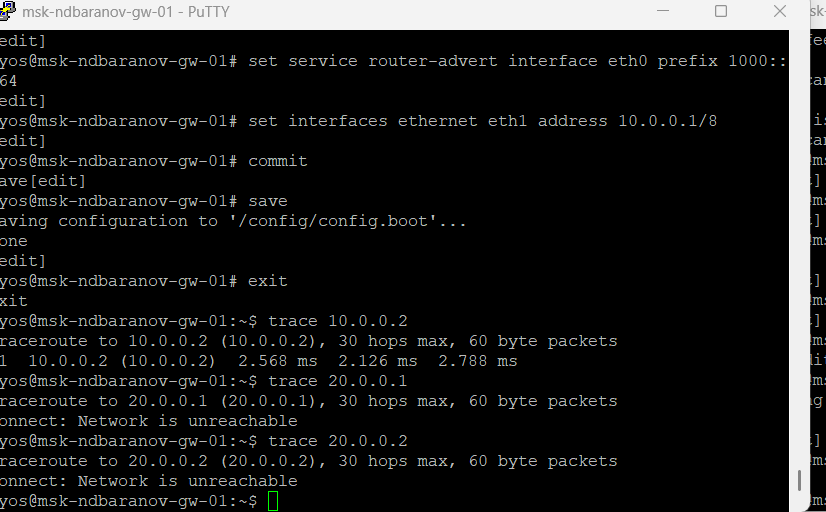
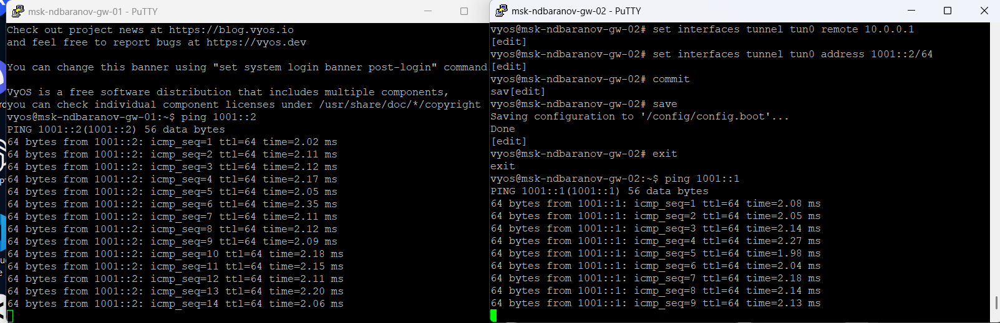
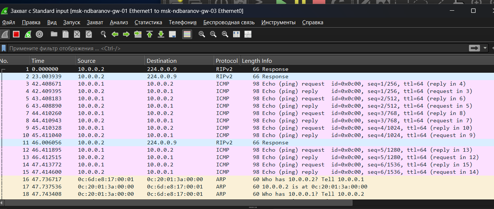

---
author:
  name: Баранов Никита Дмитриевич
  email: 1132242977@rudn.ru
  affiliation:
    - name: Российский университет дружбы народов им. Патриса Лумумбы
      city: Москва
      country: Российская Федерация
title: "Лабораторная работа № 8"
subtitle: "Туннелирование IPv6 через IPv4"
license: CC BY
date: today
date-format: "YYYY-MM-DD"
---

# Информация

## Докладчик

:::::::::::::: {.columns align=center}
::: {.column width="70%"}

- Баранов Никита Дмитриевич
- Студент РУДН
- [1132242977@rudn.ru](mailto:1132242977@rudn.ru)

:::
::: {.column width="30%"}

:::
::::::::::::::

# Цель и задачи

## Цель работы

- Настроить туннель между IPv6-сегментами через IPv4-инфраструктуру и исследовать инкапсуляцию.

## Основные этапы

- Собрана топология из двух IPv6-сетей и промежуточного IPv4-канала.
- Конечным узлам назначены IPv6-адреса и шлюзы.
- На граничных маршрутизаторах настроены IPv4-адреса транзитной сети.
- Создан tunnel-интерфейс с локальной и удалённой IPv4-точками.
- В таблицы маршрутизации добавлены пути к удалённым IPv6-префиксам через туннель.
- traceroute и ping6 показывают прохождение трафика между IPv6-сетями.
- Wireshark подтверждает инкапсуляцию пакета IPv6 внутрь IPv4.

# Ход работы

## На схеме два IPv6-сегмента соединены парой маршрутизаторов VyOS, между которыми используется IPv4-транзит

- IPv6-острова связаны через промежуточную IPv4-сеть.

{width=88%}

## PC1 и PC2 получили IPv6-адреса 1000::a/64 и 2000::a/64

- Крайние VPCS адресованы префиксами 1000::/64 и 2000::/64.

{width=88%}

## В нескольких консолях заданы адреса пользовательских интерфейсов и IPv4 10

- Граничные VyOS получили пользовательские и транзитные адреса.

{width=88%}

## На VyOS выполнен traceroute до IPv4-соседа и попытка обращения к удалённой IPv6-сети до завершения туннеля

- До создания туннеля доступен только IPv4-транспорт.

{width=88%}

## Повторный traceroute проходит до 10

- Один IPv4-переход соединяет локальную и удалённую точки туннеля.

{width=88%}

## В двух окнах VyOS проверены таблицы маршрутизации и связность после настройки tunnel-интерфейсов

- Маршруты к чужим IPv6-префиксам направлены в tunnel-интерфейс.

{width=88%}

## Финальная консольная проверка содержит ping и traceroute между 1000::/64 и 2000::/64

- После настройки IPv6 проходит между удалёнными сегментами.

{width=88%}

## В Wireshark рядом с ICMPv6 Echo видны IPv4-пакеты с инкапсулированной нагрузкой IPv6

- Wireshark показывает исходный IPv6-пакет внутри IPv4.

{width=88%}

# Результаты

## Итоги работы

- Цель работы достигнута. Настроить туннель между IPv6-сегментами через IPv4-инфраструктуру и исследовать инкапсуляцию Полученные результаты подтверждают работоспособность собранной схемы и корректность выполненной настройки.

## Спасибо за внимание
