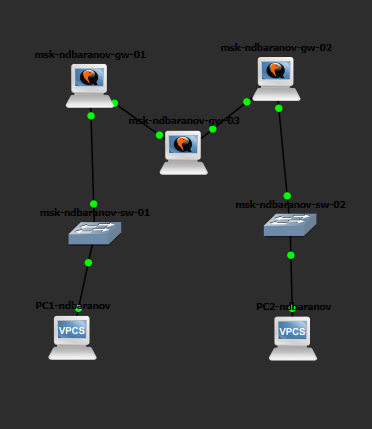
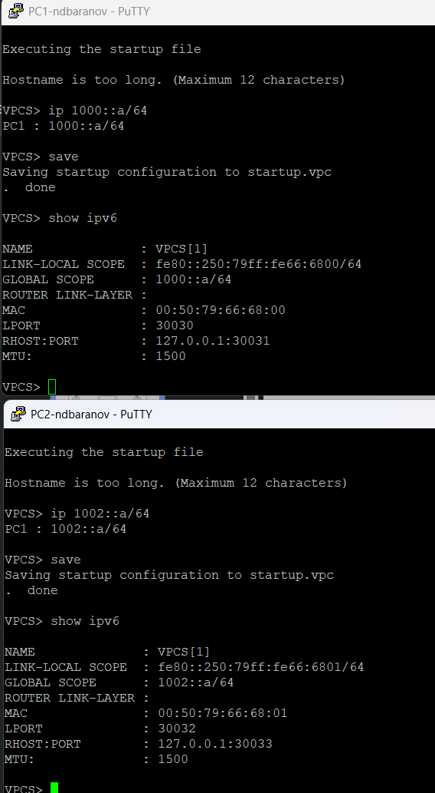
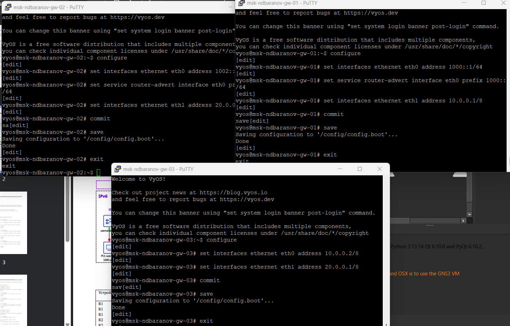
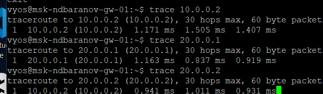
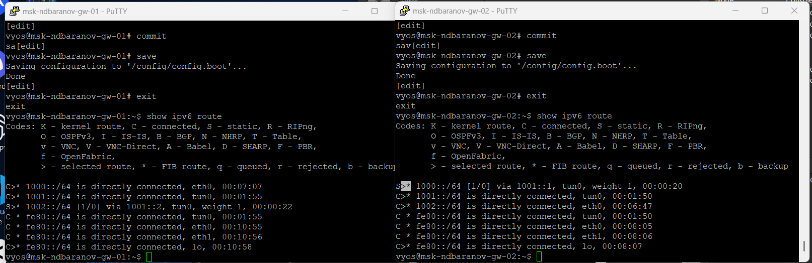

---
author:
  name: Баранов Никита Дмитриевич
  email: 1132242977@rudn.ru
  affiliation:
    - name: Российский университет дружбы народов им. Патриса Лумумбы
      city: Москва
      country: Российская Федерация
title: "Отчёт по лабораторной работе № 8"
subtitle: "Туннелирование IPv6 через IPv4"
license: CC BY
date: today
date-format: "YYYY-MM-DD"
---

# Цель работы

Настроить туннель между IPv6-сегментами через IPv4-инфраструктуру и исследовать инкапсуляцию.

# Задание

1. Собрана топология из двух IPv6-сетей и промежуточного IPv4-канала.
2. Конечным узлам назначены IPv6-адреса и шлюзы.
3. На граничных маршрутизаторах настроены IPv4-адреса транзитной сети.
4. Создан tunnel-интерфейс с локальной и удалённой IPv4-точками.
5. В таблицы маршрутизации добавлены пути к удалённым IPv6-префиксам через туннель.
6. traceroute и ping6 показывают прохождение трафика между IPv6-сетями.
7. Wireshark подтверждает инкапсуляцию пакета IPv6 внутрь IPv4.

# Теоретические сведения

Коммутатор изучает MAC-адреса источников и передаёт кадры через порт, за которым обнаружен адрес назначения.

# Выполнение работы

## На схеме два IPv6-сегмента соединены парой маршрутизаторов VyOS, между которыми используется IPv4-транзит

На схеме два IPv6-сегмента соединены парой маршрутизаторов VyOS, между которыми используется IPv4-транзит. Конечные VPCS подключены через отдельные коммутаторы.

{#fig-08-001 width=95%}

## PC1 и PC2 получили IPv6-адреса 1000::a/64 и 2000::a/64

PC1 и PC2 получили IPv6-адреса 1000::a/64 и 2000::a/64. Команда show ipv6 также показывает link-local адреса, необходимые для работы соседства в локальном сегменте.

{#fig-08-002 width=95%}

## В нескольких консолях заданы адреса пользовательских интерфейсов и IPv4 10

В нескольких консолях заданы адреса пользовательских интерфейсов и IPv4 10.0.0.1/8–10.0.0.2/8 на межмаршрутизаторной линии. После commit/save базовая связность граничных узлов подготовлена.

{#fig-08-003 width=95%}

## На VyOS выполнен traceroute до IPv4-соседа и попытка обращения к удалённой IPv6-сети до завершения туннеля

На VyOS выполнен traceroute до IPv4-соседа и попытка обращения к удалённой IPv6-сети до завершения туннеля. Вывод отделяет доступность транспортной IPv4-сети от маршрутизации IPv6.

{#fig-08-004 width=95%}

## Повторный traceroute проходит до 10

Повторный traceroute проходит до 10.0.0.2 и показывает один промежуточный переход. Таким образом, адреса локальной и удалённой точек будущего туннеля взаимно достижимы.

{#fig-08-005 width=95%}

## В двух окнах VyOS проверены таблицы маршрутизации и связность после настройки tunnel-интерфейсов

В двух окнах VyOS проверены таблицы маршрутизации и связность после настройки tunnel-интерфейсов. Появившиеся пути направляют удалённые IPv6-префиксы через логический канал.

{#fig-08-006 width=95%}

## Финальная консольная проверка содержит ping и traceroute между 1000::/64 и 2000::/64

Финальная консольная проверка содержит ping и traceroute между 1000::/64 и 2000::/64. Маршрут проходит через граничные маршрутизаторы, хотя промежуточная сеть использует IPv4.

{#fig-08-007 width=95%}

## В Wireshark рядом с ICMPv6 Echo видны IPv4-пакеты с инкапсулированной нагрузкой IPv6

В Wireshark рядом с ICMPv6 Echo видны IPv4-пакеты с инкапсулированной нагрузкой IPv6. Совпадение обменов по времени подтверждает перенос исходного IPv6-пакета внутри IPv4.

{#fig-08-008 width=95%}

# Выводы

Цель работы достигнута. Настроить туннель между IPv6-сегментами через IPv4-инфраструктуру и исследовать инкапсуляцию Полученные результаты подтверждают работоспособность собранной схемы и корректность выполненной настройки.
