---
author:
  name: Баранов Никита Дмитриевич
  email: 1132242977@rudn.ru
  affiliation:
    - name: Российский университет дружбы народов им. Патриса Лумумбы
      city: Москва
      country: Российская Федерация
title: "Лабораторная работа № 9"
subtitle: "Методы кодирования и модуляция сигналов"
license: CC BY
date: today
date-format: "YYYY-MM-DD"
---

# Информация

## Докладчик

:::::::::::::: {.columns align=center}
::: {.column width="70%"}

- Баранов Никита Дмитриевич
- Студент РУДН
- [1132242977@rudn.ru](mailto:1132242977@rudn.ru)

:::
::: {.column width="30%"}

:::
::::::::::::::

# Цель и задачи

## Цель работы

- Исследовать спектр, линейное кодирование, амплитудную модуляцию и самосинхронизацию в Octave.

## Основные этапы

- Сформирован периодический сигнал и исследовано приближение рядом Фурье.
- Сравнены спектры исходного и модифицированного сигналов.
- Построен амплитудно-модулированный сигнал и его спектр с боковыми составляющими.
- Реализованы unipolar, AMI, bipolar NRZ/RZ, Manchester и Differential Manchester.
- Для каждого кода построены временная диаграмма и спектр.
- Самосинхронизация оценена по количеству гарантированных переходов уровня.

# Ход работы

## График сигнала и результат расчёта

- AMI чередует полярность ненулевых импульсов.

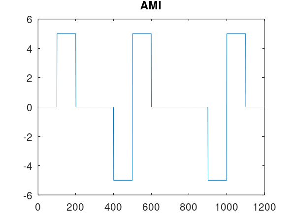{width=88%}

## График сигнала и результат расчёта

- График используется для сравнения формы и частотных свойств сигнала.

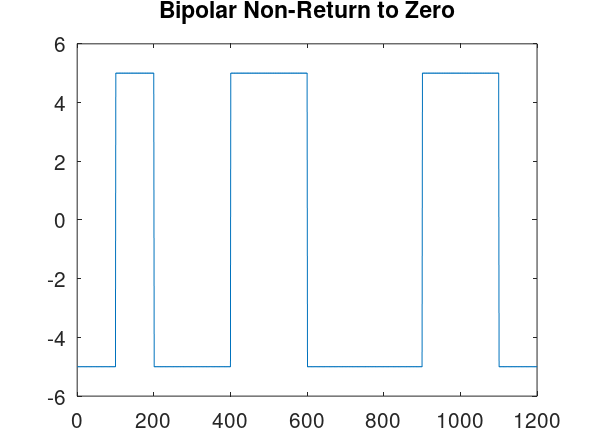{width=88%}

## График сигнала и результат расчёта

- График используется для сравнения формы и частотных свойств сигнала.

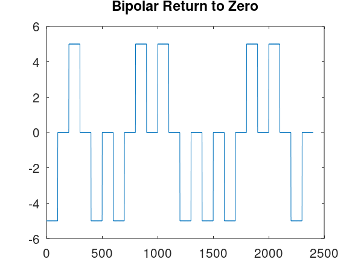{width=88%}

## График сигнала и результат расчёта

- В Differential Manchester информация задаётся расположением переходов.

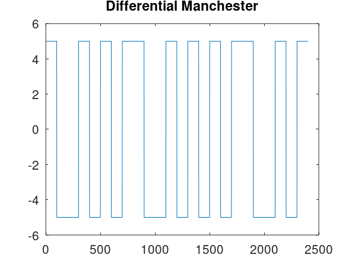{width=88%}

## График сигнала и результат расчёта

- График используется для сравнения формы и частотных свойств сигнала.

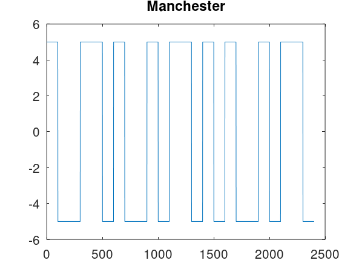{width=88%}

## Спектральное представление линейного кода

- График используется для сравнения формы и частотных свойств сигнала.

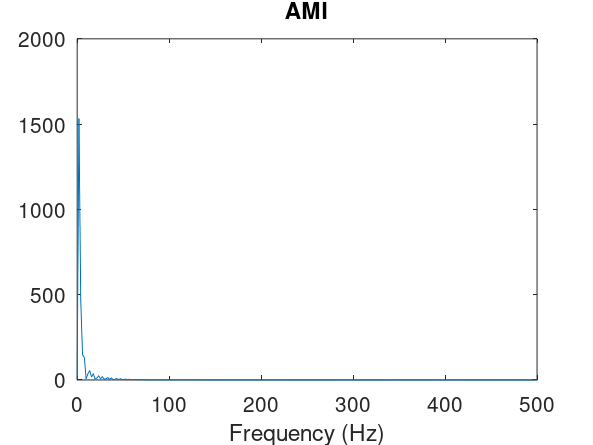{width=88%}

## Спектральное представление линейного кода

- Спектр bipolar NRZ сосредоточен преимущественно у низких частот.

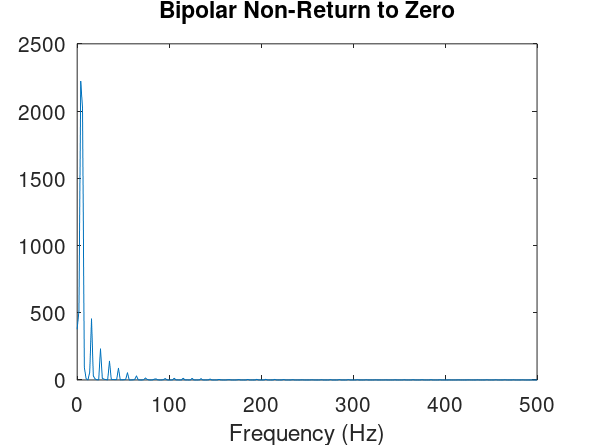{width=88%}

## Спектральное представление линейного кода

- График используется для сравнения формы и частотных свойств сигнала.

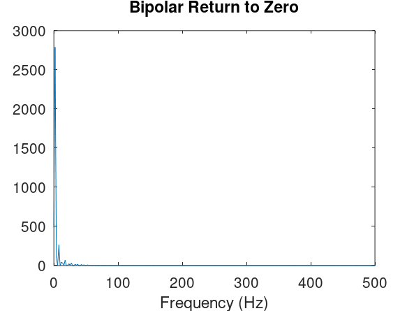{width=88%}

## Спектральное представление линейного кода

- График используется для сравнения формы и частотных свойств сигнала.

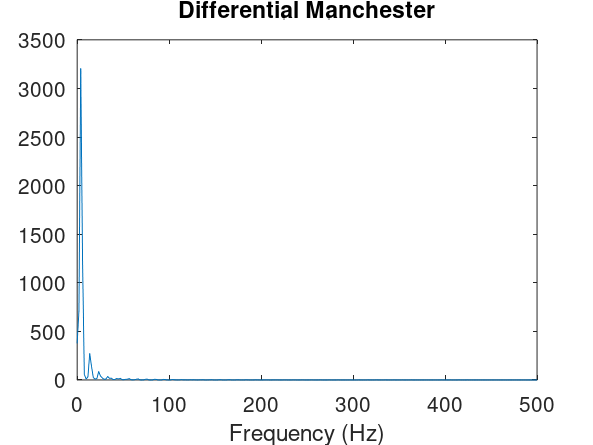{width=88%}

## Спектральное представление линейного кода

- Спектр Manchester отражает частые переходы сигнала.

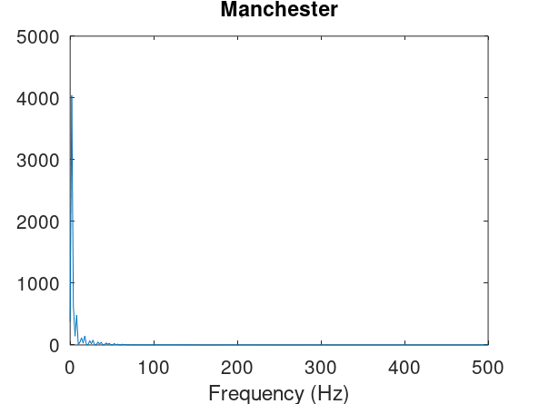{width=88%}

## Спектральное представление линейного кода

- График используется для сравнения формы и частотных свойств сигнала.

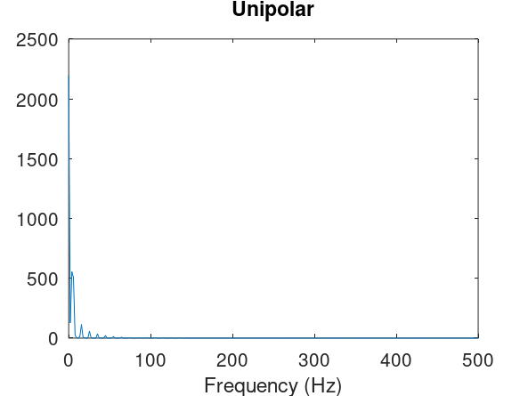{width=88%}

## Проверка самосинхронизации

- График используется для сравнения формы и частотных свойств сигнала.

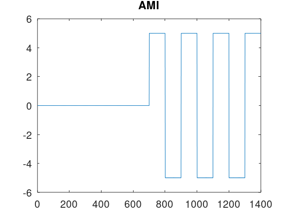{width=88%}

## Проверка самосинхронизации

- В bipolar NRZ длинные серии уменьшают число тактовых переходов.

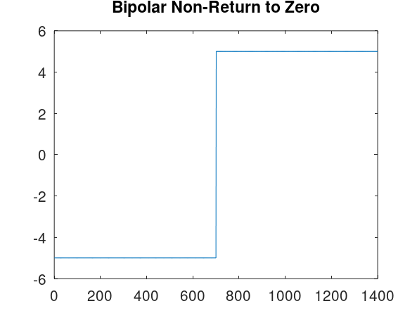{width=88%}

## Проверка самосинхронизации

- График используется для сравнения формы и частотных свойств сигнала.

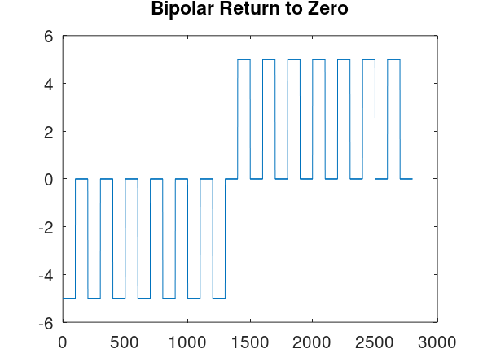{width=88%}

## Проверка самосинхронизации

- График используется для сравнения формы и частотных свойств сигнала.

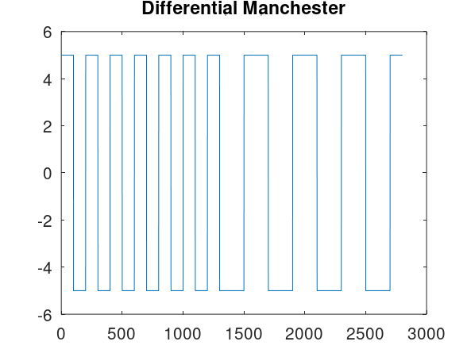{width=88%}

## Проверка самосинхронизации

- Manchester гарантирует переход внутри каждого бита.

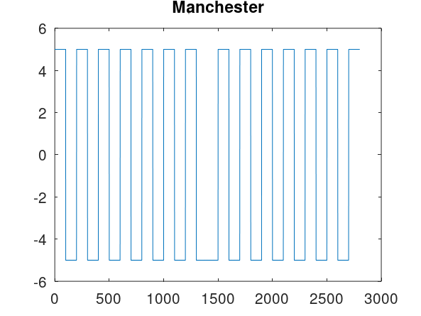{width=88%}

## Проверка самосинхронизации

- График используется для сравнения формы и частотных свойств сигнала.

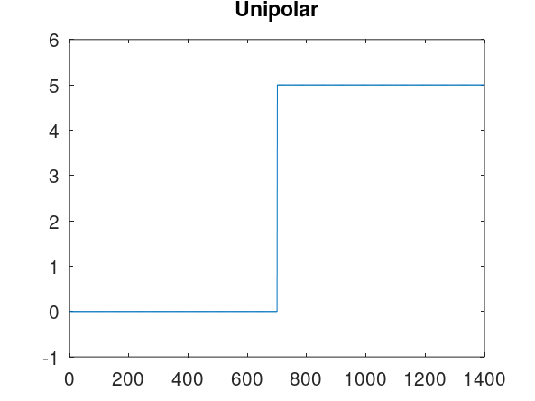{width=88%}

## График сигнала и результат расчёта

- График используется для сравнения формы и частотных свойств сигнала.

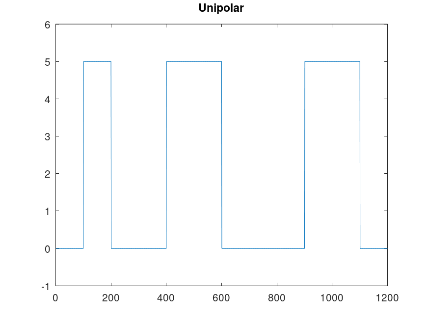{width=88%}

## График сигнала и результат расчёта

- На исходном графике отмечены дискретные отсчёты y1.

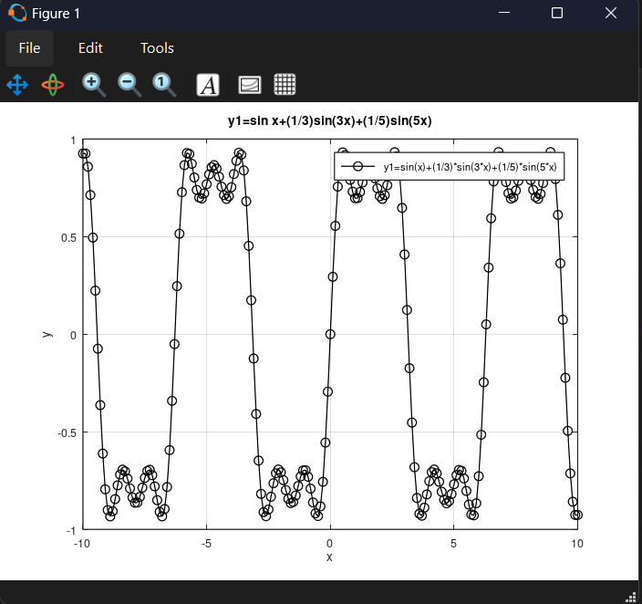{width=88%}

## График сигнала и результат расчёта

- График используется для сравнения формы и частотных свойств сигнала.

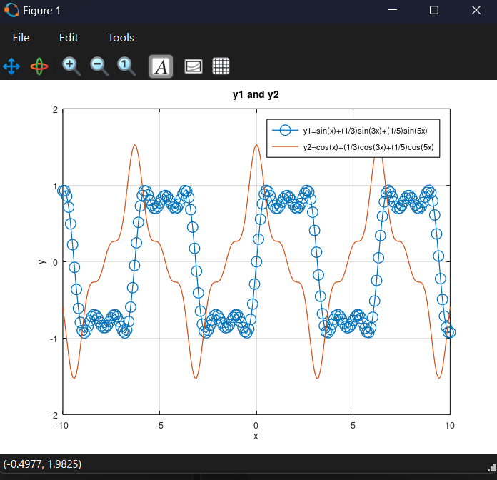{width=88%}

## График сигнала и результат расчёта

- График используется для сравнения формы и частотных свойств сигнала.

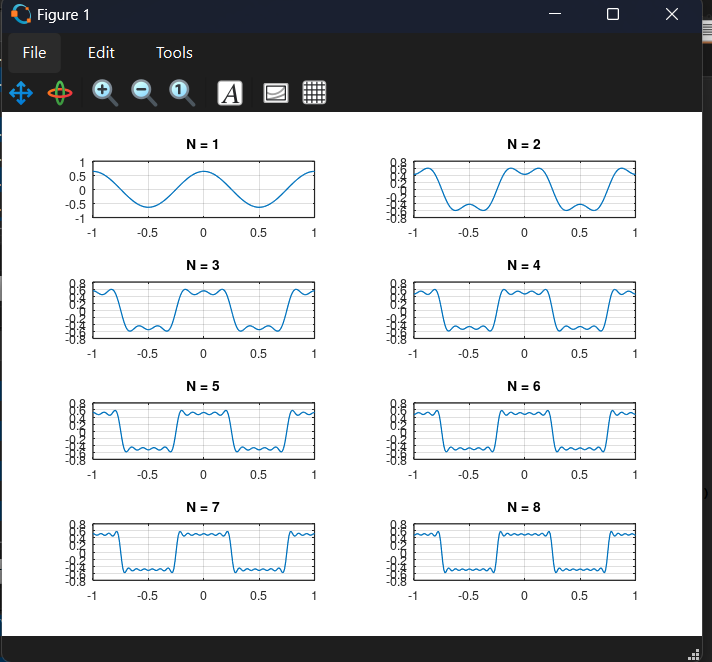{width=88%}

## График сигнала и результат расчёта

- Второй набор N=1…8 уточняет приближение рядом Фурье.

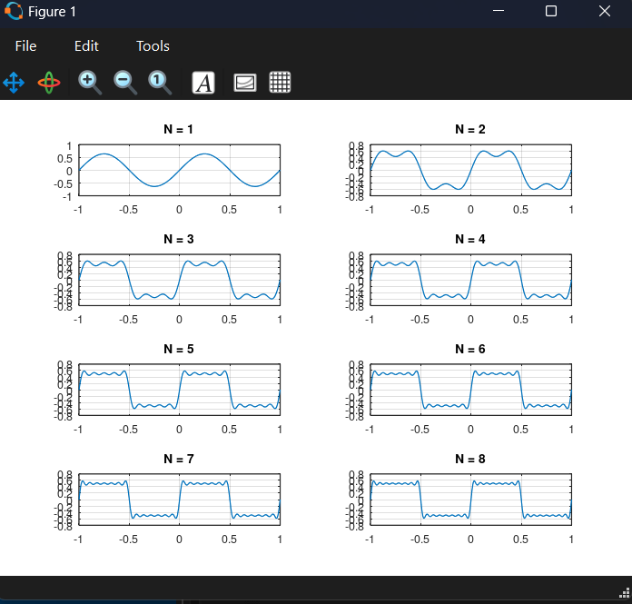{width=88%}

## График сигнала и результат расчёта

- График используется для сравнения формы и частотных свойств сигнала.

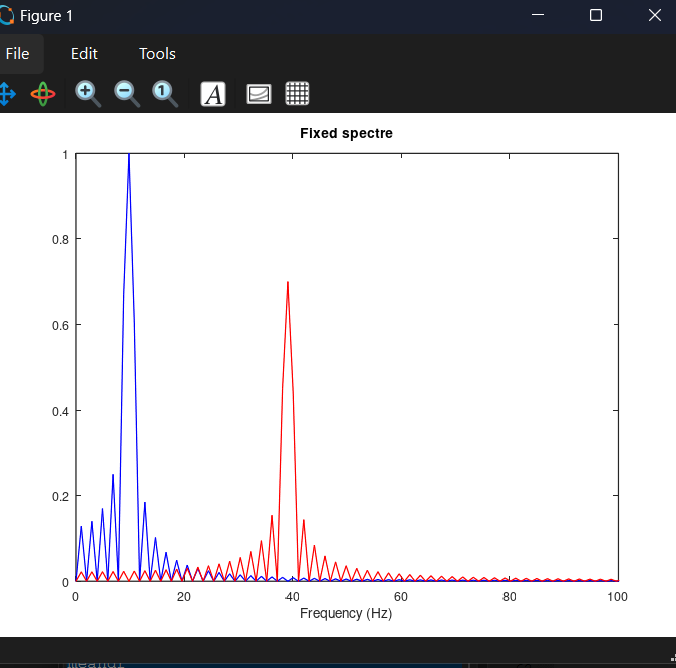{width=88%}

## График сигнала и результат расчёта

- График используется для сравнения формы и частотных свойств сигнала.

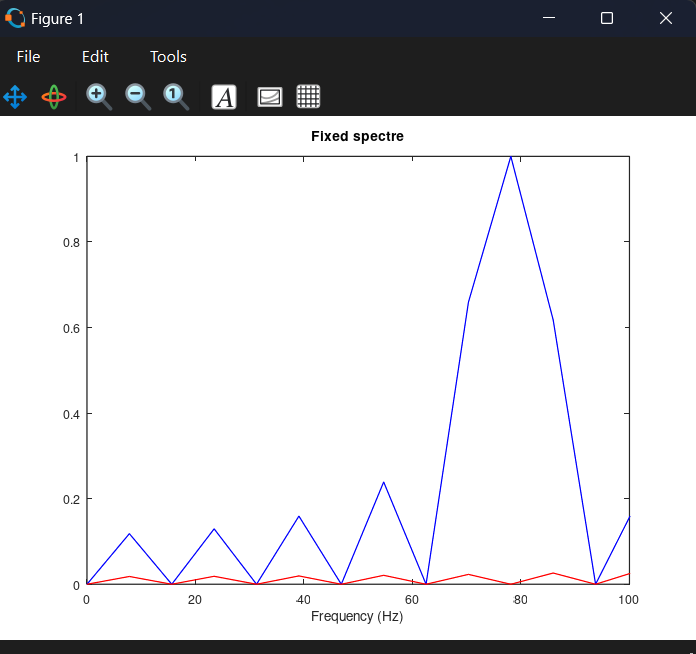{width=88%}

## График сигнала и результат расчёта

- Два главных спектральных пика соответствуют компонентам 10 и 40 Гц.

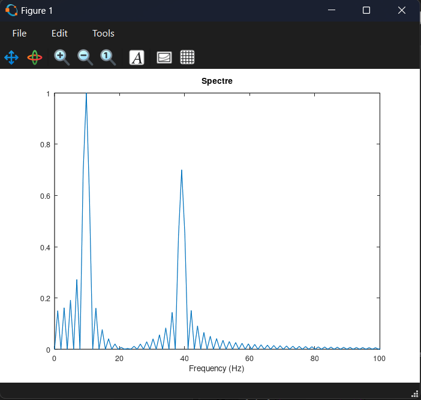{width=88%}

## График сигнала и результат расчёта

- График используется для сравнения формы и частотных свойств сигнала.

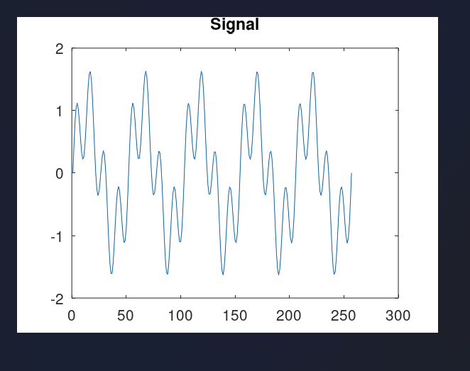{width=88%}

## График сигнала и результат расчёта

- График используется для сравнения формы и частотных свойств сигнала.

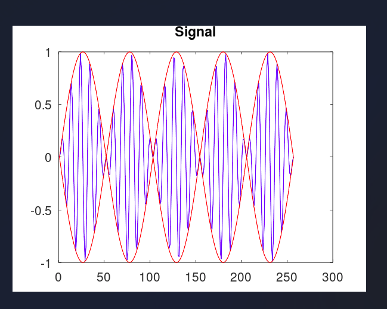{width=88%}

## График сигнала и результат расчёта

- AM-спектр содержит симметричные боковые полосы.

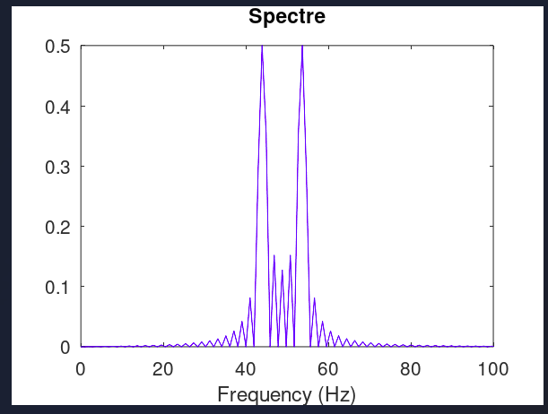{width=88%}

# Результаты

## Итоги работы

- Цель работы достигнута. Исследовать спектр, линейное кодирование, амплитудную модуляцию и самосинхронизацию в Octave Полученные результаты подтверждают работоспособность собранной схемы и корректность выполненной настройки.

## Спасибо за внимание
