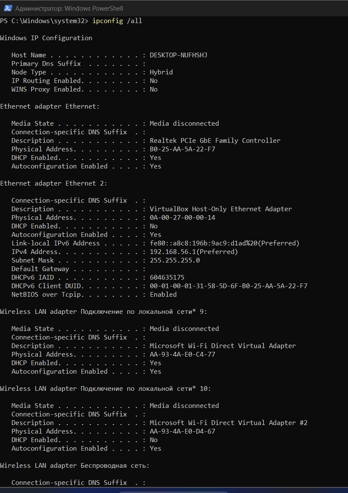
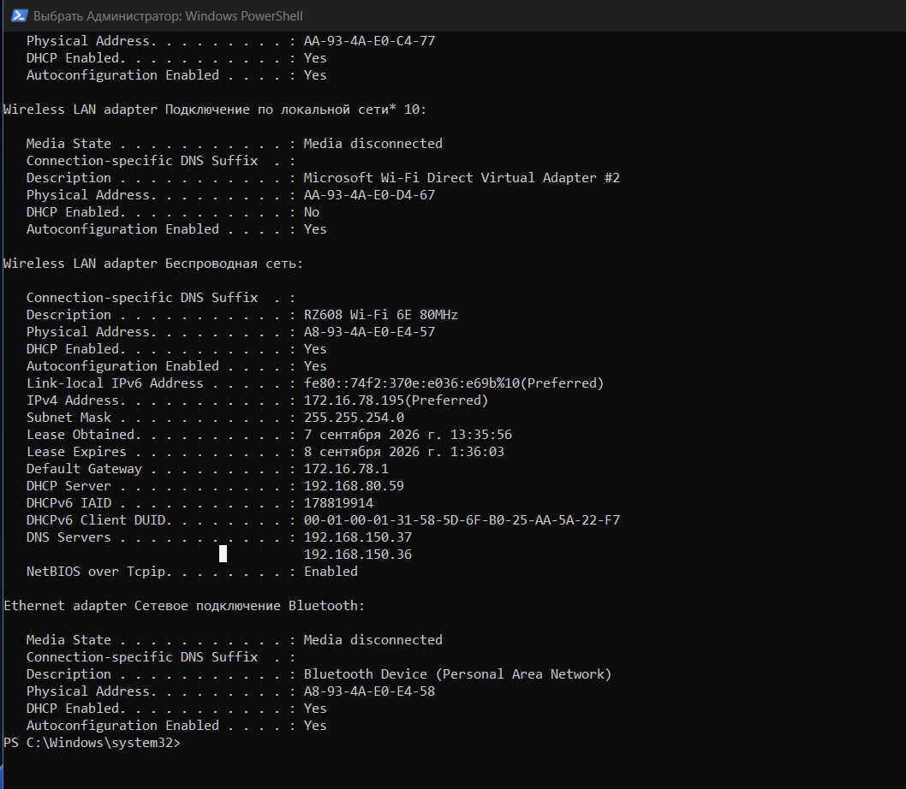
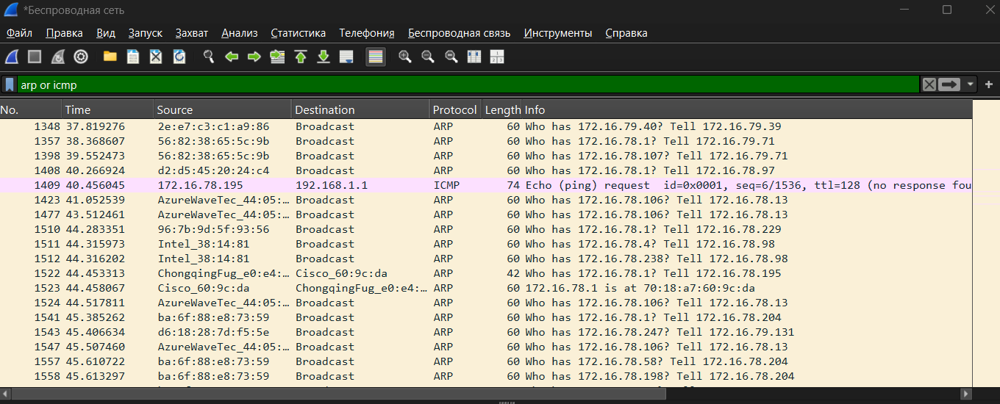
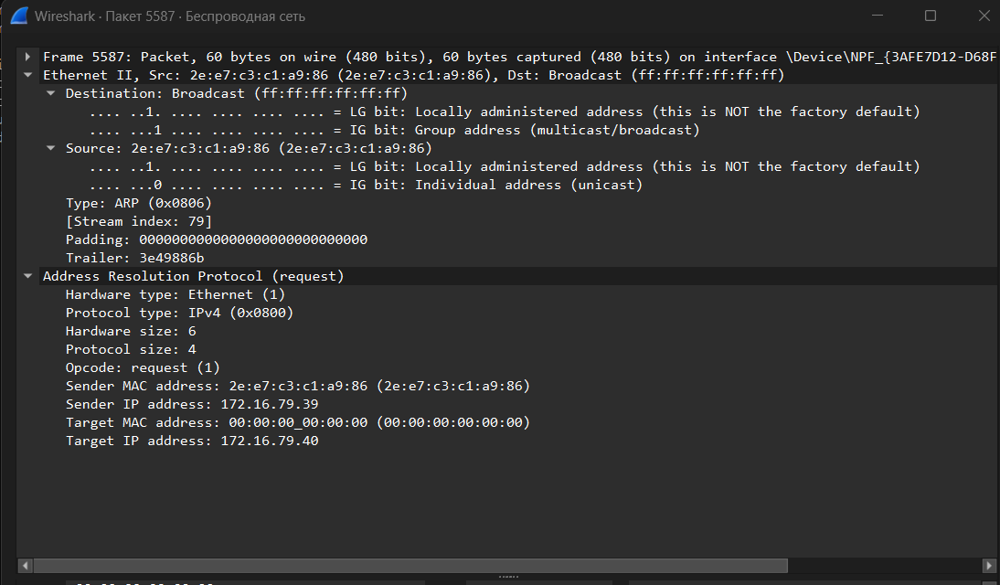
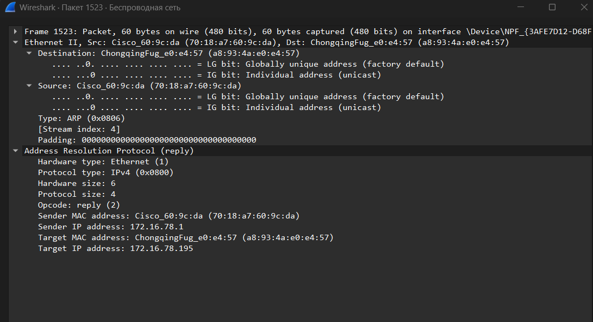
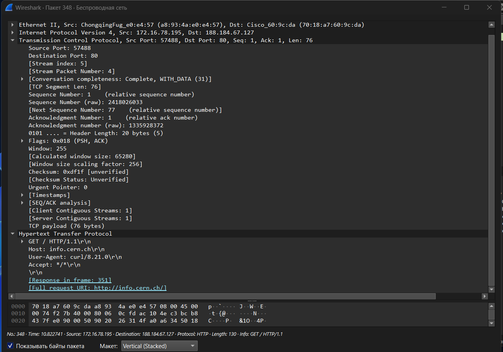
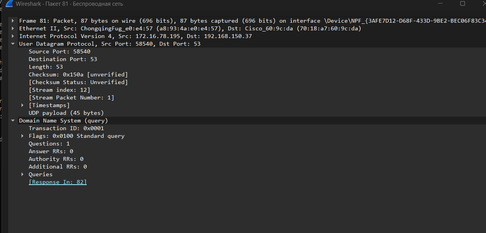
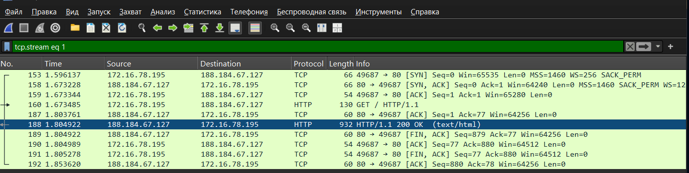

---
author:
  name: Баранов Никита Дмитриевич
  email: 1132242977@rudn.ru
  affiliation:
    - name: Российский университет дружбы народов им. Патриса Лумумбы
      city: Москва
      country: Российская Федерация
title: "Лабораторная работа № 11"
subtitle: "Анализ трафика в Wireshark"
license: CC BY
date: today
date-format: "YYYY-MM-DD"
---

# Информация

## Докладчик

:::::::::::::: {.columns align=center}
::: {.column width="70%"}

- Баранов Никита Дмитриевич
- Студент РУДН
- [1132242977@rudn.ru](mailto:1132242977@rudn.ru)

:::
::: {.column width="30%"}

:::
::::::::::::::

# Цель и задачи

## Цель работы

- Исследовать кадры Ethernet и PDU сетевого, транспортного и прикладного уровней TCP/IP.

## Основные этапы

- Командой ipconfig получены параметры активных интерфейсов Windows.
- Команда getmac сопоставила интерфейсы и MAC-адреса.
- В Wireshark выделены ARP-запросы и ответы; разобраны поля Ethernet II и ARP.
- Исследованы ICMP Echo Request/Reply и вложенные заголовки Ethernet/IP/ICMP.
- Для TCP рассмотрены трёхэтапное рукопожатие, номера последовательности и флаги.
- Для DNS разобраны запрос, ответ, идентификатор транзакции и ресурсные записи.
- Диаграмма потоков показала порядок обмена прикладными данными.

# Ход работы

## Команда ipconfig /all выводит параметры сетевых адаптеров Windows, включая IPv4, IPv6, маску и шлюз

- Для анализа выбран активный адаптер из полного вывода ipconfig.

{width=88%}

## Продолжение ipconfig показывает VirtualBox Host-Only Adapter с адресом 192

- Host-Only сеть VirtualBox отделена от рабочего Wi‑Fi интерфейса.

{width=88%}

## В разделе беспроводного адаптера указаны IPv4 172

- На экране показан результат соответствующего этапа настройки.

{width=88%}

## Команда getmac сопоставляет названия транспортов Windows и физические MAC-адреса Ethernet, Wi-Fi и VirtualBox

- getmac связывает имена подключений с физическими адресами.

{width=88%}

## Фильтр ARP выводит широковещательные запросы и одноадресные ответы в локальной сети

- ARP-запросы и ответы отобраны отдельным фильтром.

{width=88%}

## В выбранном ARP-запросе раскрыт Ethernet II: адрес назначения широковещательный, а источником является локальный интерфейс

- На экране показан результат соответствующего этапа настройки.

{width=88%}

## Для ARP-ответа назначение уже одноадресное

- Развёрнутый ICMP-кадр содержит Ethernet, IPv4 и Echo Request.

{width=88%}

## Детали ARP Request содержат opcode request, sender MAC/IP и target IP при нулевом target MAC

- Поля Echo Reply позволяют сопоставить ответ с исходным запросом.

{width=88%}

## В ARP Reply opcode изменён на reply, а поля sender содержат найденное соответствие IPv4 и MAC

- На экране показан результат соответствующего этапа настройки.

{width=88%}

## В ICMP Echo Request раскрыты Ethernet II, IPv4 и ICMP

- В TCP-сегменте видны порты, номера и управляющие флаги.

{width=88%}

## ICMP Echo Reply содержит type 0 и тот же идентификатор обмена

- DNS-запрос раскрыт до идентификатора и имени ресурса.

{width=88%}

## Фильтр ICMP оставил пару Echo Request/Reply между 172

- На экране показан результат соответствующего этапа настройки.

{width=88%}

## В списке TCP-пакетов видны SYN, SYN/ACK и ACK, после которых передаются данные HTTP

- TCP-сеанс включает рукопожатие и последующую передачу HTTP.

{width=88%}

## Диаграмма потоков Wireshark отображает TCP-сеанс между локальным и удалённым адресами в хронологическом порядке

- Диаграмма потоков показывает направление каждого TCP-сегмента.

{width=88%}

# Результаты

## Итоги работы

- Цель работы достигнута. Исследовать кадры Ethernet и PDU сетевого, транспортного и прикладного уровней TCP/IP Полученные результаты подтверждают работоспособность собранной схемы и корректность выполненной настройки.

## Спасибо за внимание
