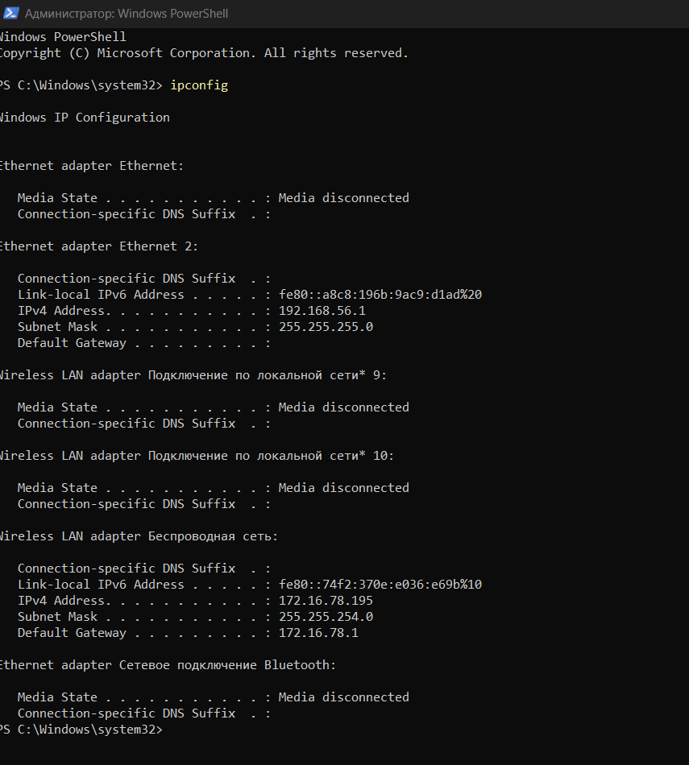
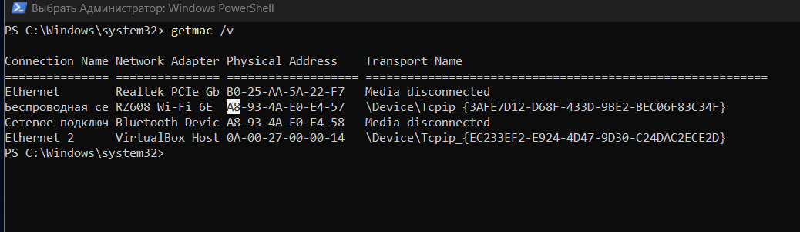
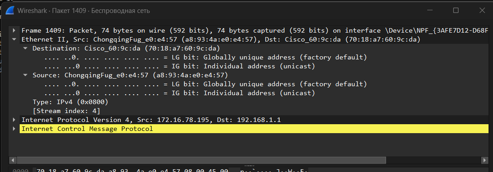
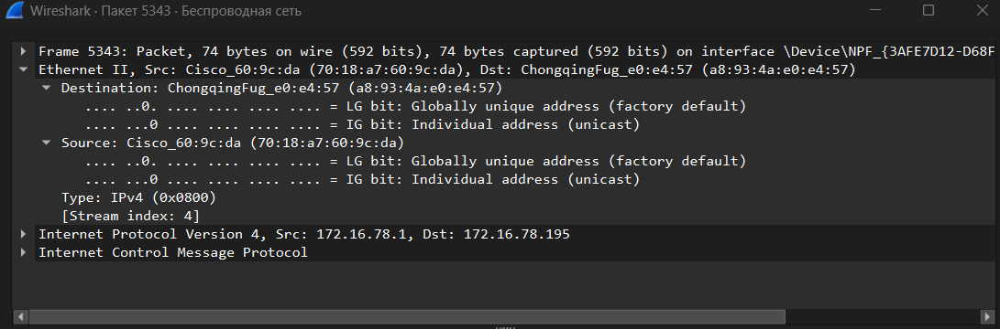
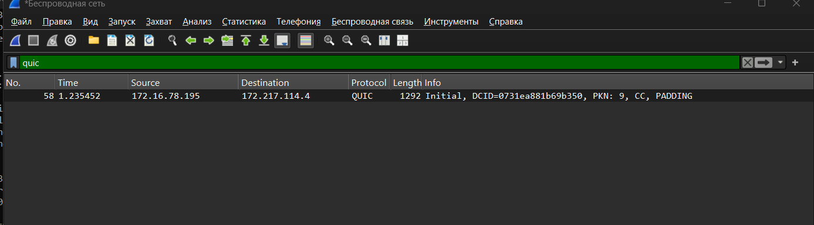
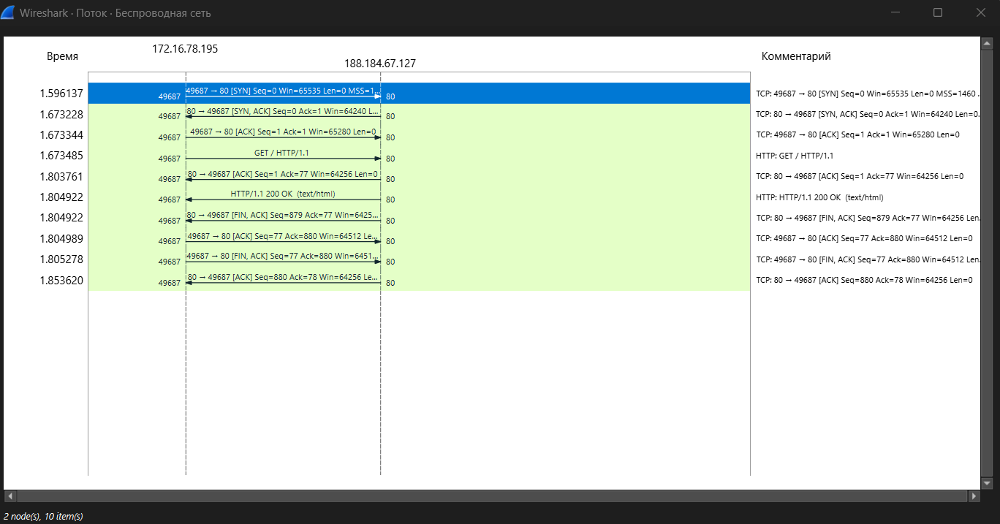

---
author:
  name: Баранов Никита Дмитриевич
  email: 1132242977@rudn.ru
  affiliation:
    - name: Российский университет дружбы народов им. Патриса Лумумбы
      city: Москва
      country: Российская Федерация
title: "Отчёт по лабораторной работе № 11"
subtitle: "Анализ трафика в Wireshark"
license: CC BY
date: today
date-format: "YYYY-MM-DD"
---

# Цель работы

Исследовать кадры Ethernet и PDU сетевого, транспортного и прикладного уровней TCP/IP.

# Задание

1. Командой ipconfig получены параметры активных интерфейсов Windows.
2. Команда getmac сопоставила интерфейсы и MAC-адреса.
3. В Wireshark выделены ARP-запросы и ответы; разобраны поля Ethernet II и ARP.
4. Исследованы ICMP Echo Request/Reply и вложенные заголовки Ethernet/IP/ICMP.
5. Для TCP рассмотрены трёхэтапное рукопожатие, номера последовательности и флаги.
6. Для DNS разобраны запрос, ответ, идентификатор транзакции и ресурсные записи.
7. Диаграмма потоков показала порядок обмена прикладными данными.

# Теоретические сведения

Wireshark перехватывает кадры канального уровня и позволяет сопоставить поля Ethernet, ARP и сетевых протоколов с фактическим обменом между узлами.

# Выполнение работы

## Команда ipconfig /all выводит параметры сетевых адаптеров Windows, включая IPv4, IPv6, маску и шлюз

Команда ipconfig /all выводит параметры сетевых адаптеров Windows, включая IPv4, IPv6, маску и шлюз. Для анализа выбран активный интерфейс, а отключённые подключения отделены по Media disconnected.

{#fig-11-001 width=95%}

## Продолжение ipconfig показывает VirtualBox Host-Only Adapter с адресом 192

Продолжение ipconfig показывает VirtualBox Host-Only Adapter с адресом 192.168.56.1/24 и другие виртуальные интерфейсы. Эти сети необходимо отличать от реального Wi-Fi при выборе источника захвата.

{#fig-11-002 width=95%}

## В разделе беспроводного адаптера указаны IPv4 172

В разделе беспроводного адаптера указаны IPv4 172.16.78.195, маска 255.255.254.0, шлюз/DHCP 172.16.78.1 и физический адрес. Именно эти значения затем находятся в пакетах Wireshark.

{#fig-11-003 width=95%}

## Команда getmac сопоставляет названия транспортов Windows и физические MAC-адреса Ethernet, Wi-Fi и VirtualBox

Команда getmac сопоставляет названия транспортов Windows и физические MAC-адреса Ethernet, Wi-Fi и VirtualBox. Полученное соответствие позволяет определить локальный интерфейс в заголовке Ethernet II.

{#fig-11-004 width=95%}

## Фильтр ARP выводит широковещательные запросы и одноадресные ответы в локальной сети

Фильтр ARP выводит широковещательные запросы и одноадресные ответы в локальной сети. В колонке Info видны формулировки Who has и is at, связывающие IPv4 с MAC.

{#fig-11-005 width=95%}

## В выбранном ARP-запросе раскрыт Ethernet II: адрес назначения широковещательный, а источником является локальный интерфейс

В выбранном ARP-запросе раскрыт Ethernet II: адрес назначения широковещательный, а источником является локальный интерфейс. Поле EtherType 0x0806 указывает на ARP.

{#fig-11-006 width=95%}

## Для ARP-ответа назначение уже одноадресное

Для ARP-ответа назначение уже одноадресное. В заголовке можно сопоставить MAC маршрутизатора с его IPv4 172.16.78.1 и увидеть возврат данных запрашивающему узлу.

{#fig-11-007 width=95%}

## Детали ARP Request содержат opcode request, sender MAC/IP и target IP при нулевом target MAC

Детали ARP Request содержат opcode request, sender MAC/IP и target IP при нулевом target MAC. Именно так узел формулирует запрос аппаратного адреса шлюза.

{#fig-11-008 width=95%}

## В ARP Reply opcode изменён на reply, а поля sender содержат найденное соответствие IPv4 и MAC

В ARP Reply opcode изменён на reply, а поля sender содержат найденное соответствие IPv4 и MAC. Ответ адресован непосредственно инициатору запроса.

{#fig-11-009 width=95%}

## В ICMP Echo Request раскрыты Ethernet II, IPv4 и ICMP

В ICMP Echo Request раскрыты Ethernet II, IPv4 и ICMP. В ICMP видны type 8, checksum, identifier и sequence number, по которым запрос связывается с ответом.

{#fig-11-010 width=95%}

## ICMP Echo Reply содержит type 0 и тот же идентификатор обмена

ICMP Echo Reply содержит type 0 и тот же идентификатор обмена. Обратные адреса Ethernet и IPv4 подтверждают, что пакет вернулся от проверяемого узла.

{#fig-11-011 width=95%}

## Фильтр ICMP оставил пару Echo Request/Reply между 172

Фильтр ICMP оставил пару Echo Request/Reply между 172.16.78.195 и удалённым адресом. Временная близость кадров позволяет оценить порядок и задержку ответа.

{#fig-11-012 width=95%}

## В списке TCP-пакетов видны SYN, SYN/ACK и ACK, после которых передаются данные HTTP

В списке TCP-пакетов видны SYN, SYN/ACK и ACK, после которых передаются данные HTTP. Номера портов, флаги и подтверждения показывают установление соединения до прикладного обмена.

{#fig-11-013 width=95%}

## Диаграмма потоков Wireshark отображает TCP-сеанс между локальным и удалённым адресами в хронологическом порядке

Диаграмма потоков Wireshark отображает TCP-сеанс между локальным и удалённым адресами в хронологическом порядке. Стрелками отделены рукопожатие, передача сегментов и подтверждения.

{#fig-11-014 width=95%}

# Выводы

Цель работы достигнута. Исследовать кадры Ethernet и PDU сетевого, транспортного и прикладного уровней TCP/IP Полученные результаты подтверждают работоспособность собранной схемы и корректность выполненной настройки.
